# Starlet: 소프트웨어 설계 명세서 (SDS)

## 4. Sequence Diagram

이 장에서는 STARLET 서비스의 주요 기능별 Sequence Diagram과 그에 대한 설명을 제공한다.  
각 다이어그램은 해당 기능의 Use Case 시나리오 에 따라 설계되었으며,  
시스템 내 객체 간의 상호작용과 데이터 흐름을 시간 순서에 따라 시각적으로 표현한다.

본 장의 목적은 기능 단위의 동적 행위를 명확히 정의함으로써,  
시스템 구현 시 컴포넌트 간 연계 구조와 메시지 교환 절차를 명확히 파악하는 데 있다.

---

### 작성 및 고려 사항

1. **모든 Sequence Diagram은 특정 Use Case와 1:1 대응된다.**  
   각 Diagram은 SRS 문서의 기능 명세와 직접적으로 연결되며, Use Case를 기준으로 구성하였다.  
   예를 들어, “회원가입”의 경우 정상 플로우와 형식 검증 실패를 별도의 Diagram으로 세분화하여 표현하였다.

2. **모든 Sequence Diagram은 실제 API 흐름과 동일한 순서를 따른다.**  
   각 Diagram의 메시지 흐름은 Controller → Service → Repository → Domain 구조를 기준으로,  
   실제 소스코드의 로직 호출 순서 및 트랜잭션 범위와 일치하도록 설계하였다.  
   외부 연동이 포함될 경우, 해당 객체를 Lifeline으로 추가하여 상호 메시지 교환 과정을 명시하였다.

3. **메시지를 주고받는 모든 클래스는 Class Diagram에서 정의된 관계를 기반으로 한다.**  
   Sequence Diagram의 참여자는 [3. Class Diagram]에 명시된 컴포넌트, 엔티티(Entity), 서비스(Service), 외부 모듈 등의 인스턴스로 구성되며,  
   각 메시지는 그 관계에 따라 정방향으로 표현된다.

4. **Diagram은 Use Case의 시간적 순서와 논리적 일관성을 유지한다.**  
   메시지 호출의 순서, 조건 분기, 병렬 흐름 등은 UML 표준 표기법을 따른다.  
   또한 Transaction 범위는 `critical` 블록으로 구분하여 명시하였다.

5. **흐름 묘사는 단순 시각적 표현에 그치지 않고, 텍스트 설명과 병행한다.**  
   각 Diagram은 시나리오 이해를 돕기 위한 글 형태의 기술과 함께 제시되며,  
   Sequence Diagram만으로 이해되지 않는 비즈니스 로직, 예외처리 조건, 외부 연계 동작 등은 설명 단락에서 보완적으로 작성하였다.

6. **공통 모듈은 별도의 공용 Sequence Diagram으로 분리하여 표현하였다.**  
   JWT 인증, 예외 처리, Validation, S3 업로드 등은 여러 기능에서 공통적으로 호출되는 흐름이므로  
   개별 Diagram으로 정의하였다. 이를 통해 중복을 제거하고 시스템 전체의 구조적 일관성을 유지하였다.

7. **각 Diagram은 SDS 내 식별자(SD-4.x.x)로 관리된다.**  
   예시:
   - SD-4.1.1 회원가입  
   - SD-4.1.2 로그인  

   각 기능 단위로 고유 번호를 부여하여 추적성과 관리 용이성을 확보하였다.

---

### 구성 체계

본 장의 Sequence Diagram은 **도메인별로 구분**되며,  
각 도메인 내에서 API 단위 또는 세부 시나리오 단위로 세분화하였다.

| 구분 | 도메인 | 주요 내용 |
|------|---------|-----------|
| **SD-4.1** | User | 회원가입, 로그인, 로그아웃, 탈퇴 등의 사용자 관리 기능 |
| **SD-4.2** | Email | 인증 메일 발송, 확인, 비밀번호 재설정 |
| **SD-4.3** | Verify | 이메일 인증 검증 및 비밀번호 재설정 절차 |
| **SD-4.4** | Diary | 감정 일기 작성, 수정, 조회 및 별 생성 연계 |
| **SD-4.5** | Star | 별 생성, 조회, 좌표 수정, 삭제 |
| **SD-4.6** | Constellation | 별자리 생성, 수정, 아카이브, 대표 설정 |
| **SD-4.7** | S3 | 프로필 이미지 업로드, Presigned URL 발급, 최종 이미지 확정 |
| **SD-4.8** | MyPage | 사용자 요약 정보, 감정별 통계, 대표 별자리 조회 등 |
| **SD-4.9** | Friend | 친구 검색, 친구 요청/수락/거절, 친구/요청 목록 조회, 친구 삭제 및 만료 요청 정리 배치 등 |


---

## 4.1 User Sequence diagram
### SD-4.1.1 회원가입(입력 검증)
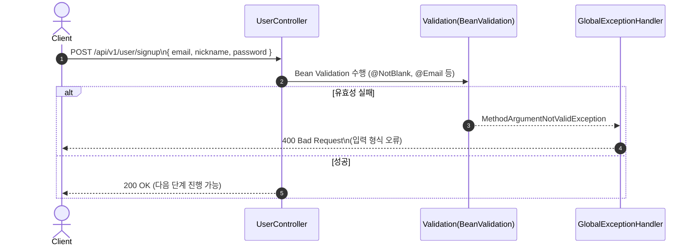

SD-4.1.1은 회원가입 요청에서 가장 처음 수행되는 단계로,
DB 조회나 비즈니스 로직 없이 오직 입력 형식 검증만 이루어지는 단계다.
서버는 DTO에 선언된
- @NotBlank
- @Email
- @Length
등의 Bean Validation을 수행하며,
형식이 틀리면 컨트롤러 로직 실행 전 예외가 발생한다.
예외는 GlobalExceptionHandler에 의해 가로채져
400 Bad Request + Validation 메시지가 반환된다.
정상적으로 통과하면 서버는 회원가입 로직(SD-4.1.2)으로 넘어갈 수 있음을 의미한다.


**흐름 요약**
1. **Client → UserController** : `POST /api/v1/user/signup` 요청 (SignUpDto)
2. **Controller → Bean Validation** : DTO의 유효성 검사 수행
3. **유효성 실패 시** → GlobalExceptionHandler
- MethodArgumentNotValidException 발생
- 400 Bad Request 반환
4. **검증 통과 시**
- 본격 회원가입 처리 과정인 SD-4.1.2로 이어짐
<br>

### SD-4.1.2 회원가입(이메일 인증 포함)
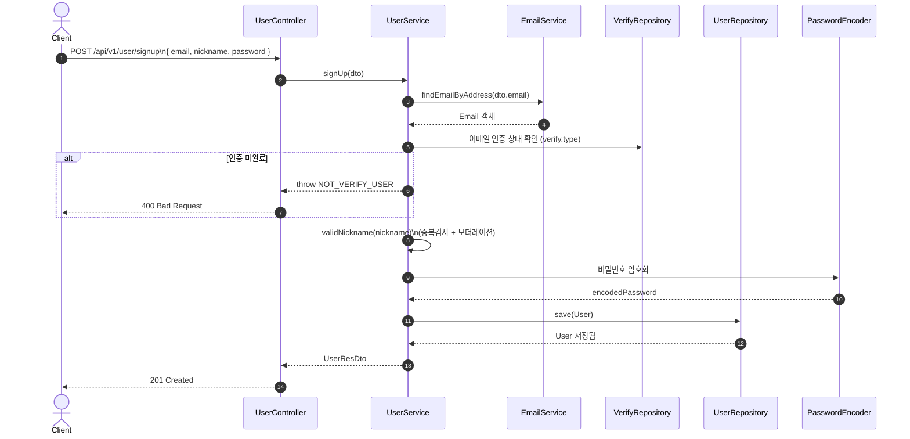

사용자가 이메일 인증을 마친 상태에서 최종 회원가입 요청을 보내면, 서버는 먼저 EmailService.findEmailByAddress()로 해당 이메일 엔티티를 조회하고, 그 안에 연결된 Verify의 타입이 VERIFY인지 확인한다. 인증 상태가 VERIFY가 아니면 NOT_VERIFY_USER 예외를 던져 400 응답을 돌려준다. 인증이 완료된 경우에는 validNickname()으로 닉네임 중복과 OpenAI 모더레이션 검사를 수행하고, 문제가 없으면 비밀번호를 암호화한 뒤 UserRepository.save()로 새 유저를 저장한다. 저장이 성공하면 201 Created와 함께 사용자 정보를 응답한다.

**흐름 요약**
1. **Client → UserController** : `POST /api/v1/user/signup`
2. **UserController → UserService** : `signUp(dto)` 호출
3. **UserService → EmailService** : `findEmailByAddress(email)`  
   - 이메일 존재 확인
4. **UserService 내부** : email.getVerify().getType()이 VERIFY인지 검사
- 아니면 NOT_VERIFY_USER → 400 반환
5. **UserService → validNickname(nickname)** : 닉네임 중복 및 유해성(모더레이션) 검사
6. **UserService → PasswordEncoder** : 비밀번호 암호화
7. **UserService → UserRepository** : save(User)로 새 유저 저장
8. **UserController → Client** : 201 Created + 생성된 사용자 정보(or 최소 식별자) 응답
<br>

### SD-4.1.3 닉네임 중복 확인
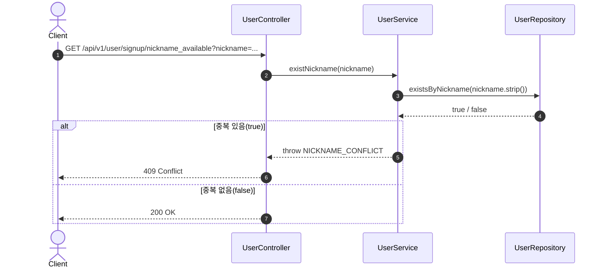

회원가입 화면에서 사용자가 닉네임을 입력했을 때, 해당 닉네임이 이미 다른 유저가 사용 중인지 사전에 확인하는 API이다. 컨트롤러는 UserService.existNickname()을 호출하고, 서비스에서는 전달받은 닉네임을 strip()으로 공백 제거한 뒤 UserRepository.existsByNickname()으로 DB에 존재하는지 확인한다. 존재할 경우 NICKNAME_CONFLICT 예외를 던져 409를 반환하고, 존재하지 않으면 200 OK로 “사용 가능” 상태를 알려준다.

**흐름요약**
1. **Client → UserController** : `GET /api/v1/user/signup/nickname_available?nickname={nickname}`
2. **UserController → UserService** : `existNickname(nickname)` 호출
3. **UserService 내부** : nickname.strip()으로 공백 제거
4. **UserService → UserRepository** : `existsByNickname(nickname)` 실행
5. **UserRepository → UserService** : `true`(중복) / `false`(미중복)
6. **중복 시** : `CustomException(NICKNAME_CONFLICT)` → `409 CONFLICT`
7. **중복이 아닐 시** : `ResponseEntity.ok().build()` → `200 OK`
<br>

### SD-4.1.4 이메일 중복 확인
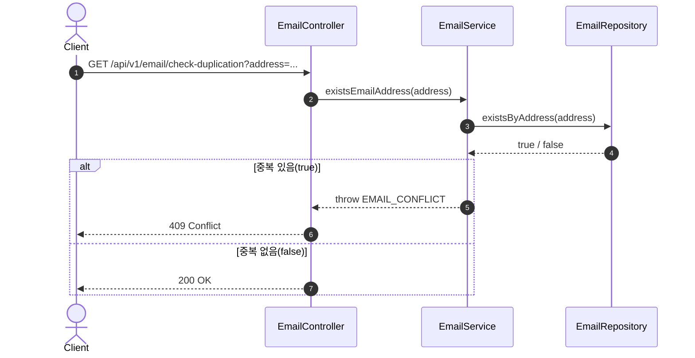

이메일 중복 확인 API는 회원가입 전에 사용자가 입력한 이메일이 이미 시스템에 등록되어 있는지를 체크하는 역할을 한다. EmailController에서 EmailService.existsEmailAddress()를 호출하고, 서비스는 EmailRepository.existsByAddress()로 이메일 존재 여부를 판단한다. 이미 사용 중인 이메일이면 EMAIL_CONFLICT 예외를 발생시켜 409를 반환하고, 사용 가능한 이메일일 경우 별도의 본문 없이 200 OK를 돌려준다.

**흐름요약**
1. **Client → EmailController** : `GET /api/v1/email/check-duplication?address={email}`
2. **EmailController → EmailService** : `existsEmailAddress(address)` 호출
3. **EmailService → EmailRepository** : `existsByAddress(address)` 실행
4. **EmailRepository → EmailService** : `true`(중복) / `false`(미중복)
5. **중복 시** : `CustomException(EMAIL_CONFLICT)` → `409 CONFLICT`
6. **중복이 아닐 시** : `ResponseEntity.ok().build()` → `200 OK`
<br>

---

## 4.2 Email Sequence diagram
### SD-4.2.1 이메일 인증 상태 조회


이메일 주소를 기반으로 현재 인증 상태(가입 인증, 비밀번호 재설정 요청, 인증 완료 등)를 조회하는 기능이다.  
`EmailController.getVerificationStatus()`가 `EmailService.getVerificationStatus()`를 호출하며,  
이 서비스는 내부적으로 `findEmailByAddress()`를 통해 이메일 객체를 조회하고,  
해당 이메일과 연결된 `Verify` 객체의 인증 타입(`VerifyType`) 및 만료 시간(`expireTime`)을 반환한다.  

해당 이메일이 존재하지 않을 경우 `CustomException(ErrorCode.EMAIL_NOT_FOUND)`가 발생하여  
`404 NOT_FOUND` 응답을 반환한다.  
정상 조회 시에는 `EmailInfoDto`(`emailId`, `emailAddress`, `verifyType`, `verifyExpireAt`)를 포함한  
`200 OK` 응답을 반환한다.

**흐름요약**
1. **Client → EmailController** : `GET /api/v1/email/verification-status?address={email}`
2. **EmailController → EmailService** : `getVerificationStatus(address)` 호출
3. **EmailService → EmailRepository** : `findByAddress(address)` 실행
4. **EmailRepository → EmailService** : `Email` 객체 반환
5. **EmailService → Verify(연관객체)** : `getType(), getExpireTime()` 조회
6. **EmailService → EmailInfoDto** : 이메일 상태 정보 매핑
7. **정상 응답 시** : `200 OK` + 인증 상태 정보 반환
8. **이메일 미존재 시** : `CustomException(EMAIL_NOT_FOUND)` → `404 NOT_FOUND`
<br>

### SD-4.2.2 초기 이메일 인증 전송


사용 가능한 이메일 주소에 대해 **가입 인증 메일을 최초 발송 또는 재전송**하는 기능이다.  
`EmailController.initEmail()`이 `EmailService.initEmail(dto)`를 호출하며, 이메일 존재 여부에 따라 분기한다.  
이미 해당 이메일로 **가입된 사용자**가 존재하면 `USER_ALREADY_EXIST` 예외로 방어하고,  
이메일은 존재하지만 가입이 완료되지 않은 경우에는 기존 `Verify`를 조회하여 **토큰/만료시간(8시간)** 을 갱신한 뒤 메일을 재전송한다.  
처음 시도하는 이메일이면 `VerifyService.createVerify()`로 인증 객체를 생성하고, `createEmail(address, verify)`로 이메일 엔티티를 만든 후 인증 메일을 발송한다.  
정상 처리 시 `200 OK`를 반환한다.

**흐름요약**
1. **Client → EmailController** : `POST /api/v1/email/init` (Body: `EmailAddressDto{ email }`)
2. **EmailController → EmailService** : `initEmail(dto)` 호출
3. **EmailService → EmailRepository** : `existsByAddress(email)` 실행
4. **[분기 A: 이메일 존재]**
   - **EmailService → UserRepository** : `existsByEmailAddress(email)` → 존재 시 `USER_ALREADY_EXIST`
   - **EmailService → VerifyRepository** : `findByEmail_Address(email)` → 없으면 `VERIFY_NOT_FOUND`
   - **EmailService** : `verify.updateStatus(verifyService.createToken(), EMAIL_VERIFICATION, now+8h)`
   - **EmailService → VerifyRepository** : `save(verify)`
   - **EmailService** : `findEmailByAddress(email)` 로 `Email` 조회
   - **EmailService** : `sendVerificationEmail(email, verify.token)` (실패 시 `EMAIL_SEND_FAILED`)
5. **[분기 B: 이메일 최초]**
   - **EmailService → VerifyService** : `createVerify()` (type=EMAIL_VERIFICATION, expire=now+8h)
   - **EmailService** : `createEmail(address, verify)` 저장
   - **EmailService** : `sendVerificationEmail(email, verify.token)` (실패 시 `EMAIL_SEND_FAILED`)
6. **정상 응답** : `200 OK`
<br>

### SD-4.2.3 이메일 인증 확인


사용자가 이메일로 받은 인증 링크를 클릭하면, 해당 링크에 포함된 `token`을 통해 인증을 완료하는 기능이다.  
`VerifyService.emailVerification(token)`이 호출되어 토큰의 유효성과 타입을 검증한 뒤,  
인증 상태(`VerifyType.VERIFY`)로 업데이트한다.  
토큰이 존재하지 않거나(만료 정리 배치에 의해 삭제된 경우 포함) 타입이 일치하지 않으면 각각 VERIFY_NOT_FOUND, VERIFY_TYPE_NOT_MATCHED 예외가 발생한다. 
정상적으로 인증이 완료되면 사용자의 이메일이 “인증 완료 상태”로 전환되며, 프론트엔드에서 완료 페이지를 표시한다.

**흐름요약**
1. **Client → VerifyController (또는 View 요청)** : `GET /view/v1/verify/init?token={token}`
2. **Controller → VerifyService** : `emailVerification(token)` 호출
3. **VerifyService → VerifyRepository** : `findByToken(token)` 실행
4. **토큰 없음** : `VERIFY_NOT_FOUND` → `404 NOT_FOUND`
5. **타입 불일치** : `VERIFY_TYPE_NOT_MATCHED` → `400 BAD_REQUEST`
6. **정상 흐름**
   - `verify.updateStatus(null, VERIFY, null)`  
   - `verifyRepository.save(verify)`
7. **정상 응답** : `200 OK`
<br>

### SD-4.2.4 비밀번호 재설정 요청  


사용자가 비밀번호를 잊은 경우, 가입된 이메일로 비밀번호 재설정 링크를 전송하는 기능이다.  
`EmailController.requestPasswordReset()`이 `EmailService.requestPasswordReset(dto)`를 호출하며,  
서비스는 (1) 가입 사용자 존재 여부를 `UserRepository.findByEmailAddress()`로 확인하고,  
(2) 이메일 엔티티를 `findEmailByAddress()`로 조회한다.  
이후 `VerifyService.passwordResetRequestStatus(email)`에서 인증 상태를  
`REQUEST_PASSWORD_RESET`으로 전환하고(토큰 재발급 + 24시간 만료 설정),  
`sendPasswordResetEmail(email, token)`으로 메일을 발송한다.  
가입 사용자가 없으면 `USER_NOT_FOUND`, Email 엔티티가 없으면 `EMAIL_NOT_FOUND`,  
인증 상태가 가입 미완(EMAIL_VERIFICATION)일 경우 `VERIFY_TYPE_NOT_MATCHED` 예외가 발생한다.  
정상 처리 시 `200 OK`를 반환한다.

**흐름요약**  
1. **Client → EmailController** : `POST /api/v1/email/password-reset/request` (EmailAddressDto{ email })  
2. **EmailController → EmailService** : `requestPasswordReset(dto)` 호출  
3. **EmailService → UserRepository** : `findByEmailAddress(email)` → 없으면 `USER_NOT_FOUND`  
4. **EmailService → EmailRepository** : `findByAddress(email)` → 없으면 `EMAIL_NOT_FOUND`  
5. **EmailService → VerifyService** : `passwordResetRequestStatus(email)`  
   - 상태 검증 (가입 미완이면 `VERIFY_TYPE_NOT_MATCHED`)  
   - `token=UUID`, `type=REQUEST_PASSWORD_RESET`, `expire=now+24h` 로 업데이트 및 저장  
6. **EmailService → JavaMailSender** : `sendPasswordResetEmail(email, token)` 실행  
7. **정상 응답** : `200 OK`  
<br>

### SD-4.2.5 비밀번호 재설정 완료  


사용자가 비밀번호 재설정 허용 링크를 통해 페이지에 진입한 뒤,  
새로운 비밀번호를 입력하면 서버는 해당 계정의 비밀번호를 암호화하여 저장하고  
인증 상태를 정상(`VERIFY`)으로 되돌린다.  

`VerifyController.confirmChangePassword()`가  
`VerifyService.updatePassword(dto)`를 호출하며,  
서비스는 다음 순서로 로직을 수행한다.  
1. `EmailRepository.findByAddress()`로 이메일 존재 여부 확인  
2. `email.verify.type == CHANGING_PASSWORD` 검증  
3. `UserRepository.findByEmailAddress()`로 사용자 존재 여부 확인  
4. `PasswordEncoder`로 새 비밀번호 암호화 후 저장  
5. 인증정보(`Verify`)를 `VERIFY` 상태로 복원  
모든 절차가 완료되면 `200 OK`를 반환한다.  

예외 상황:
- 이메일이 없으면 `EMAIL_NOT_FOUND`  
- 인증 상태가 `CHANGING_PASSWORD`가 아니면 `VERIFY_TYPE_NOT_MATCHED`  
- 사용자가 없으면 `USER_NOT_FOUND`

**흐름요약**  
1. **Client → VerifyController** : `POST /api/v1/verify/password-reset/new-password` (PasswordResetConfirmDto{ email, newPassword })  
2. **VerifyController → VerifyService** : `updatePassword(dto)` 호출  
3. **VerifyService → EmailRepository** : `findByAddress(dto.email)` → 없으면 `EMAIL_NOT_FOUND`  
4. **VerifyService** : `email.verify.type == CHANGING_PASSWORD` 검증 → 아니면 `VERIFY_TYPE_NOT_MATCHED`  
5. **VerifyService → UserRepository** : `findByEmailAddress(dto.email)` → 없으면 `USER_NOT_FOUND`  
6. **VerifyService** : `PasswordEncoder.encode(newPassword)` → `user.changePassword(encoded)` → 저장  
7. **VerifyService** : `verify.updateStatus(null, VERIFY, null)` → 저장  
8. **정상 응답** : `200 OK`  
<br>

---

## 4.3 Verify Sequence diagram
### SD-4.3.1 인증 링크 확인  


회원가입 시 사용자에게 발송된 인증 링크(`GET /view/v1/verify/init?token={token}`)를 사용자가 클릭하면,  
`VerifyViewController.emailVerification(token)`이 `VerifyService.emailVerification(token)`을 호출하여  
해당 **토큰의 존재 여부와 타입 일치 여부**를 검증한다.  

인증 객체가 존재하고 타입이 `EMAIL_VERIFICATION`일 경우,  
인증 상태를 `VERIFY`로 전환하여 최종 인증 완료 처리를 수행한다.  

성공 시 `verification-success` 템플릿을 반환하고,  
예외(`VERIFY_NOT_FOUND`, `VERIFY_TYPE_NOT_MATCHED`) 발생 시  
에러 메시지를 담아 `verification-error` 템플릿을 반환한다.  

**흐름요약**  
1. **Client → VerifyViewController** : `GET /view/v1/verify/init?token={token}`  
2. **VerifyViewController → VerifyService** : `emailVerification(token)` 호출  
3. **VerifyService → VerifyRepository** : `findByToken(token)` → 없으면 `VERIFY_NOT_FOUND`  
4. **VerifyService** : `verify.type == EMAIL_VERIFICATION` 검증 → 아니면 `VERIFY_TYPE_NOT_MATCHED`  
5. **VerifyService** : `verify.updateStatus(null, VERIFY, null)` → `verifyRepository.save(verify)`  
6. **성공 시** : `model.addAttribute(title, message)` → `verification-success.html` 반환  
7. **실패 시** : `CustomException` catch → `model.addAttribute(message)` → `verification-error.html` 반환  
<br>

### SD-4.3.2 인증 성공 처리  


이 기능은 이메일 인증 완료 후 내부적으로 인증 객체(`Verify`)의 상태를  
최종적으로 `VERIFY`로 업데이트하는 과정이다.  

`VerifyService.emailVerification(token)`이 호출되면  
`validateToken(token, EMAIL_VERIFICATION)`을 통해 토큰 유효성 검증을 수행하고,  
성공 시 `verify.updateStatus(null, VERIFY, null)`로 상태를 갱신한 뒤 DB에 반영한다.  

컨트롤러 단에서 JSON 응답 대신 **200 OK**만 반환하며,  
이 로직은 뷰 렌더링(`SD-4.3.1`)에서도 동일하게 내부적으로 호출되어  
인증 완료 처리를 담당한다.  

**흐름요약**  
1. **Client → VerifyController** : `POST /api/v1/verify/email-confirm?token={token}` (가정 경로)  
2. **VerifyController → VerifyService** : `emailVerification(token)` 호출  
3. **VerifyService → VerifyRepository** : `findByToken(token)`  
4. **VerifyService** : `verify.type == EMAIL_VERIFICATION` 검증  
5. **VerifyService** : `verify.updateStatus(null, VERIFY, null)`  
6. **VerifyRepository → DB** : `save(verify)`  
7. **성공 시** : `ResponseEntity.ok().build()` (200 OK)  
8. **실패 시** : `CustomException` → GlobalExceptionHandler 변환 후 404/400 응답  
<br>

### SD-4.3.3 비밀번호 재설정 링크 검증  


비밀번호 재설정 이메일을 받은 사용자가 링크(`GET /view/v1/verify/password-reset/confirm?token={token}`)를 클릭하면,  
`VerifyViewController.passwordResetVerification(token)`이 호출되어  
`VerifyService.passwordResetVerification(token)`을 통해 토큰의 유효성을 검증하고,  
정상적인 요청일 경우 인증 상태를 `CHANGING_PASSWORD`로 변경한다.  

이 과정을 통해 사용자는 새 비밀번호를 입력할 수 있는 상태로 전환되며,  
성공 시 `password-reset-success` 뷰가 렌더링되고,  
토큰이 유효하지 않거나 이미 정리되어 조회할 수 없는 경우(만료 정리 이후 포함) `verification-error` 페이지로 이동한다.

**흐름요약**  
1. **Client → VerifyViewController** : `GET /view/v1/verify/password-reset/confirm?token={token}`  
2. **VerifyViewController → VerifyService** : `passwordResetVerification(token)` 호출  
3. **VerifyService → VerifyRepository** : `findByToken(token)` 수행  
4. **토큰 없음** → `VERIFY_NOT_FOUND` 예외 발생  
5. **타입 불일치 (`type != REQUEST_PASSWORD_RESET`)** → `VERIFY_TYPE_NOT_MATCHED` 예외 발생  
6. **정상 토큰** → `verify.updateStatus(null, CHANGING_PASSWORD, null)`  
7. **VerifyRepository → DB** : `save(verify)`  
8. **성공 시** : `password-reset-success.html` 반환  
9. **실패 시** : `verification-error.html` 반환  
<br>

### SD-4.3.4 비밀번호 변경 완료  


사용자가 새 비밀번호를 제출하면  
`VerifyController.confirmChangePassword()`가 `VerifyService.updatePassword(dto)`를 호출하여  
해당 이메일의 인증 상태가 `CHANGING_PASSWORD`인지 확인한 뒤,  
`PasswordEncoder`로 새 비밀번호를 암호화해 저장하고 인증 상태를 `VERIFY`로 복원한다.  

예외 상황:  
- `EMAIL_NOT_FOUND` : 이메일 엔티티가 없음  
- `VERIFY_TYPE_NOT_MATCHED` : 인증 상태가 `CHANGING_PASSWORD`가 아님  
- `USER_NOT_FOUND` : 이메일에 해당하는 사용자가 없음  

**흐름요약**  
1. **Client → VerifyController** : `POST /api/v1/verify/password-reset/new-password` (PasswordResetConfirmDto{ email, newPassword })  
2. **VerifyController → VerifyService** : `updatePassword(dto)` 호출  
3. **VerifyService → EmailRepository** : `findByAddress(dto.email)` → 없으면 `EMAIL_NOT_FOUND`  
4. **VerifyService** : `email.verify.type == CHANGING_PASSWORD` 검증 → 아니면 `VERIFY_TYPE_NOT_MATCHED`  
5. **VerifyService → UserRepository** : `findByEmailAddress(dto.email)` → 없으면 `USER_NOT_FOUND`  
6. **VerifyService** : `PasswordEncoder.encode(newPassword)` → `user.changePassword(encoded)` → `userRepository.save(user)`  
7. **VerifyService** : `verify.updateStatus(null, VERIFY, null)` → `verifyRepository.save(verify)`  
8. **정상 응답** : `200 OK`  
<br>

---

## SD-4.4 Diary Sequence diagram
### SD-4.4.1 일기 생성 단계
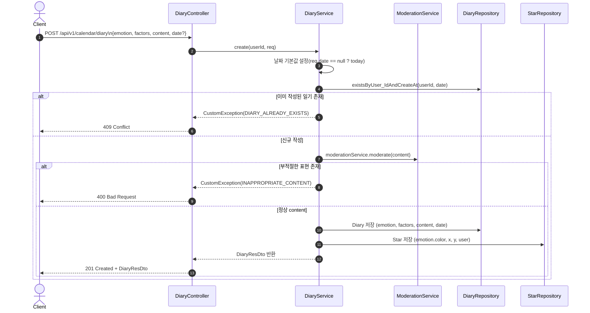
이 단계는 사용자가 새로운 감정 일기를 생성하는 단계이다.
사용자는 감정(emotion), 요인 리스트(factors), 메모(content), 날짜(date)를 포함하여
POST /api/v1/calendar/diary 로 요청을 보낸다.

DiaryService.create() 내부에서는
1. findByUser_IdAndCreateAt(userId, date) 로 해당 날짜의 일기 존재 여부를 조회하고
2. 이미 존재한다면 CustomException(ErrorCode.DIARY_ALREADY_EXISTS) 를 발생시키며
3. 존재하지 않는 경우 새로운 Diary 엔티티를 생성하고 필요한 값들을 설정한 뒤
4. JPA save() 를 통해 DB에 저장한다.
5. 이후 저장된 Diary를 DiaryResDto 로 변환하여 응답한다.

**흐름요약** <br>
해당 시퀀스는 감정 일기 생성의 실제 실행 흐름을 나타낸다.
1. Client → DiaryController : POST /api/v1/calendar/diary 요청 (emotion, factors, content, date)
2. DiaryController → DiaryService : create(userId, req) 호출
3. DiaryService → DiaryRepository :  findByUser_IdAndCreateAt(userId, date) 조회
4. 일기 이미 존재 시 : CustomException(ErrorCode.DIARY_ALREADY_EXISTS) → 409 CONFLICT
5. 일기 미존재 시 : Diary 생성 후 저장
6. Controller → Client : DiaryResDto 반환 (201 Created)00

### SD-4.4.2 일기 수정 단계  
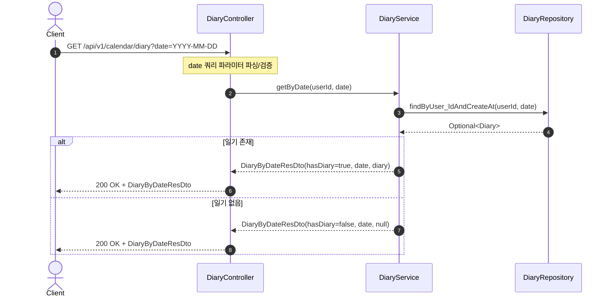
이 단계는 이미 작성된 감정 일기를 수정하는 단계이다.
수정 가능한 항목은 content(메모)이며, 감정(emotion)과 요인(factors)은 변경되지 않는다.
프론트엔드에서는 수정할 일기의 날짜와 새 내용을 포함한 요청을
PATCH /api/v1/calendar/diary 로 전송한다.

DiaryService.update() 내부에서는

1. findByUser_IdAndCreateAt(userId, date) 로 해당 사용자의 일기를 조회하고
2. 존재하지 않으면 CustomException(ErrorCode.DIARY_NOT_FOUND) 발생
3. content가 null이 아닌 경우에만 수정 로직을 수행하며
4. 수정 요청한 content 내용이 있을 경우, 먼저 ModerationService 를 통해 부적절한 표현이 있는지 검사한다
5. 부적절한 표현이 발견되면 CustomException(ErrorCode.INAPPROPRIATE_CONTENT) 예외 발생
6. 문제가 없으면 diary.updateContent(req.getContent()) 호출로 내용 수정
7. 수정된 Diary는 JPA dirty checking으로 자동 반영된다

**흐름요약** <br>
1. Client → DiaryController : PATCH /api/v1/calendar/diary 요청 (date, content)
2. DiaryController → DiaryService : update(userId, req) 호출
3. DiaryService → DiaryRepository : findByUser_IdAndCreateAt() 조회
4. 일기 미존재 시 : CustomException(ErrorCode.DIARY_NOT_FOUND) → 404 응답
5. content 존재 시 : ModerationService 로 부적절 표현 검사, 정상일 경우 updateContent() 수행, 부적절 표현 발견 시 CustomException(INAPPROPRIATE_CONTENT) → 400 응답
6. content가 null인 경우 : 수정 없이 기존 내용 유지
7. Controller → Client : DiaryResDto 반환 (200 OK)

<br>

### SD-4.4.3 일기 조회(특정 날짜)


사용자가 특정 날짜의 감정 일기를 **조회**하는 단계이다.  
클라이언트는 date(YYYY-MM-DD) 쿼리 파라미터를 포함해
GET /api/v1/calendar/diary API를 호출한다.
DiaryService.getByDate()는 내부적으로
findByUser_IdAndCreateAt(userId, date) 메서드를 통해 해당 날짜의 일기를 조회한다.

- 일기 존재 시
서비스는 DiaryByDateResDto.of(diary) 를 반환하며 hasDiary = true 와 함께 일기 내용을 포함한다.

- 일기 미존재 시
DiaryByDateResDto.empty(date) 를 생성하여 hasDiary = false 와 함께 diary = null 을 반환한다.

일기 존재 여부와 관계없이 HTTP 응답 코드는 200 OK 이며, 클라이언트는 응답의 hasDiary 필드를 확인하여 일기 존재 여부를 판단한다.

**흐름요약**  
1. **Client → DiaryController** : `GET /api/v1/calendar/diary?date=YYYY-MM-DD`  
2. **DiaryController → DiaryService** : `getByDate(userId, date)`  
3. **DiaryService → DiaryRepository** : `findByUser_IdAndCreateAt(userId, date)`  
4. **일기 미존재 시** : `DiaryByDateResDto(hasDiary=false, date, null)` 생성
5. **일기 존재 시** : `DiaryByDateResDto(hasDiary=true, date, diary)` 생성

<br>

### SD-4.4.4 월별 별 조회 단계  

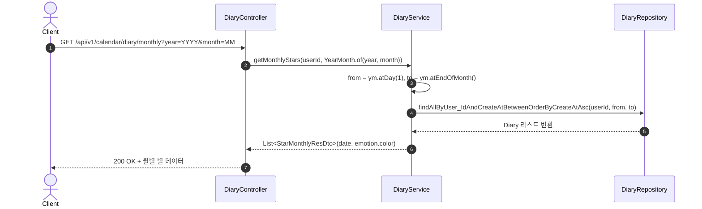

이 단계는 사용자가 특정 월의 **별(star)** 정보를 조회하는 과정이다.  
클라이언트는 연도와 월을 쿼리 파라미터로 전달하여  
`GET /api/v1/calendar/diary/monthly?year=YYYY&month=MM` 요청을 보낸다.  

`DiaryService.getMonthlyStars()`는  
1. `YearMonth` 객체를 생성하여 조회 범위를 계산 (`from = 1일`, `to = 말일`)  
2. `DiaryRepository.findAllByUser_IdAndCreateAtBetweenOrderByCreateAtAsc()` 호출로 해당 월 데이터 조회  
3. 각 Diary의 `emotion`을 기반으로 `color` 값을 추출해 `StarMonthlyResDto` 리스트로 변환한다.  

**흐름요약**  
1. **Client → DiaryController** : `/api/v1/calendar/diary/monthly?year&month` 요청  
2. **DiaryController → DiaryService** : `getMonthlyStars(userId, YearMonth ym)` 호출  
3. **DiaryService → DiaryRepository** : 월 범위(`from ~ to`) Diary 조회  
4. **Service 내부** : `emotion.color` 매핑 → `StarMonthlyResDto` 리스트 생성  
5. **Controller → Client** : 200 OK + 월별 별 정보 반환  

<br>

---

## SD-4.5 Star Sequence diagram

### SD-4.5.1 별 생성 (Diary 완료 시 자동 생성)

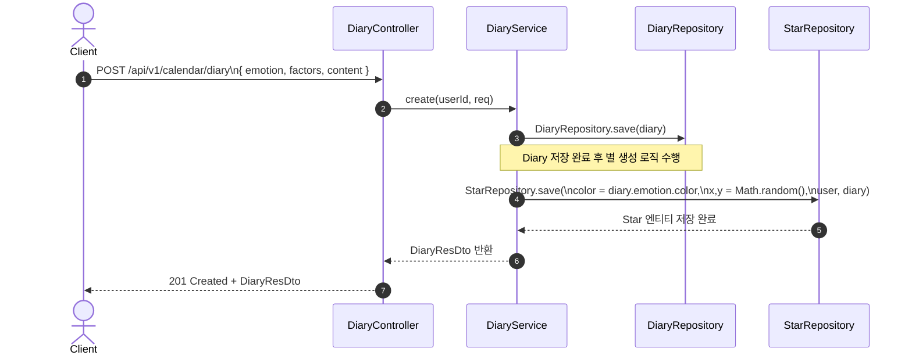
이 단계는 사용자가 일기를 작성 완료하면 **자동으로 Star 엔티티가 생성**되는 과정이다.  
별 생성 요청은 클라이언트에서 직접 일어나지 않고,  
`DiaryService.create()` 내부 로직을 통해 자동으로 실행된다.  

서버는 다음 과정을 거친다:
1. 일기(`Diary`)가 `DiaryRepository.save()`로 저장된다.  
2. 저장된 Diary의 감정(`Emotion`)을 기반으로 색상(`Color`) 결정.  
3. 별의 좌표는 0.05 ~ 0.95 범위 안에서만 랜덤하게 생성되도록 <br>
- x = (0.95 - 0.05) * Math.random() + 0.05,
- y = (0.95 - 0.05) * Math.random() + 0.05 형태로 계산한다. 
4. `StarRepository.save()`로 Star 엔티티를 저장.  
5. 별과 일기가 연결(`@OneToOne`)되며, 결과로 `DiaryResDto` 반환.  

**흐름요약**  
1. **Client → DiaryController** : `/api/v1/calendar/diary` POST 요청 (emotion, factors, content)  
2. **DiaryController → DiaryService** : `create(userId, req)`  
3. **DiaryService → DiaryRepository** : `Diary` 저장  
4. **DiaryService → StarRepository** : `Star` 자동 생성 및 저장  
5. **DiaryService → DiaryController** : `DiaryResDto` 반환  
6. **Controller → Client** : 201 Created + Diary 정보 반환  

<br>

### SD-4.5.2 별 상세 조회  
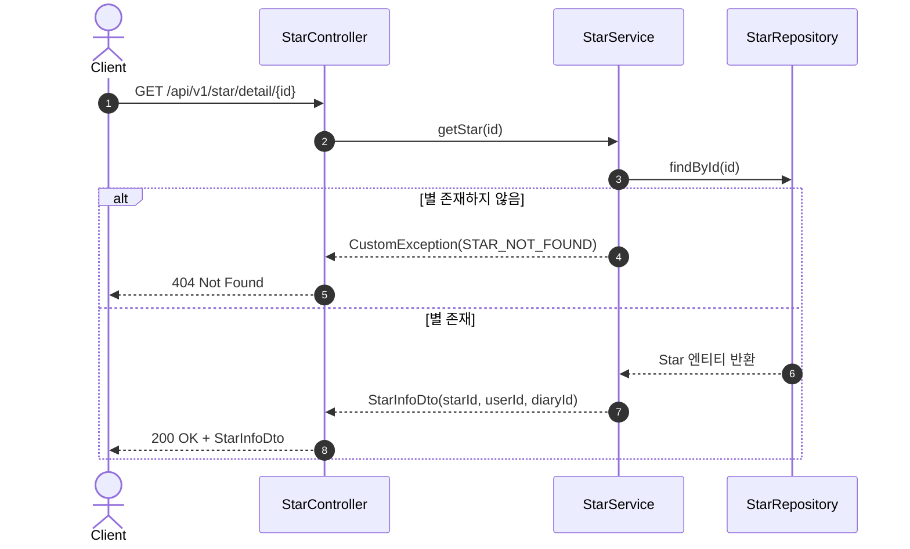
이 단계는 사용자가 특정 별을 클릭했을 때,  
해당 별의 **기본 정보(별 ID, 사용자 ID, 일기 ID)** 를 조회하는 단계이다.  

요청은 `GET /api/v1/star/detail/{id}` 이며,  
컨트롤러는 `StarService.getStar(id)` 를 호출해 Star 엔티티를 조회한다.  
`StarRepository.findById()` 결과가 없으면 `CustomException(ErrorCode.STAR_NOT_FOUND)` 가 발생한다.  

서버 처리 흐름은 다음과 같다.
1. `StarController.getStar()` → `StarService.getStar(id)` 호출  
2. `StarRepository.findById(id)` 로 Star 검색  
3. 존재하지 않으면 404 반환  
4. 존재하면 `StarInfoDto` 로 변환하여 응답  

**흐름요약**  
1. **Client → StarController** : `GET /api/v1/star/detail/{id}` 요청  
2. **StarController → StarService** : `getStar(id)` 호출  
3. **StarService → StarRepository** : `findById(id)`  
4. **미존재 시** : `CustomException(STAR_NOT_FOUND)` → 404 응답  
5. **존재 시** : `StarInfoDto` 생성 후 200 OK 응답  

<br>

### SD-4.5.3 날짜별 별 리스트 조회  
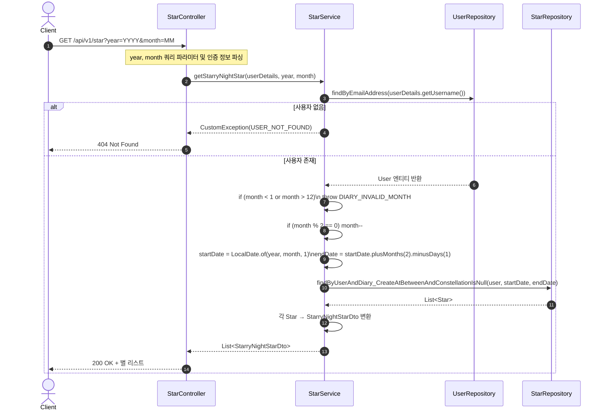
이 단계는 **밤하늘 페이지** 진입 시 사용자의 별 데이터를 불러오는 단계이다.  
별자리에 속하지 않은 별들 중, 요청된 **2개월 범위 내의 별**을 조회한다.  

요청은 `GET /api/v1/star?year={YYYY}&month={MM}` 이며,  
StarController → StarService → StarRepository 순으로 처리된다.  

서버 흐름은 다음과 같다:
- 사용자 검증 (`UserRepository.findByEmailAddress()`)  
   - 존재하지 않으면 `USER_NOT_FOUND` 예외  
- 월(month) 유효성 검사 (`1 ≤ month ≤ 12`)  
   - 범위 초과 시 `DIARY_INVALID_MONTH` 발생  
- `startDate`, `endDate` 계산 (해당 월부터 2개월 범위)
- 짝수 달(MM % 2 == 0)인 경우 내부적으로 month-- 하여 앞 달부터 조회
- `findByUserAndDiary_CreateAtBetweenAndConstellationIsNull()` 호출  
   - 별자리에 속하지 않은 Star만 조회  
- 결과를 `StarryNightStarDto` 리스트로 변환 후 반환  

**흐름요약**  
1. **Client → StarController** : `/api/v1/star?year&month` 요청  
2. **StarController → StarService** : `getStarryNightStar(userDetails, year, month)` 호출  
3. **StarService → UserRepository** : 사용자 검증  
4. **StarService → StarRepository** : 기간 내 별 조회 (별자리 소속 제외)  
5. **Service 내부** : Star → StarryNightStarDto 변환  
6. **Controller → Client** : 200 OK + 별 리스트 응답  

<br>

### SD-4.5.4 별 좌표 변경  

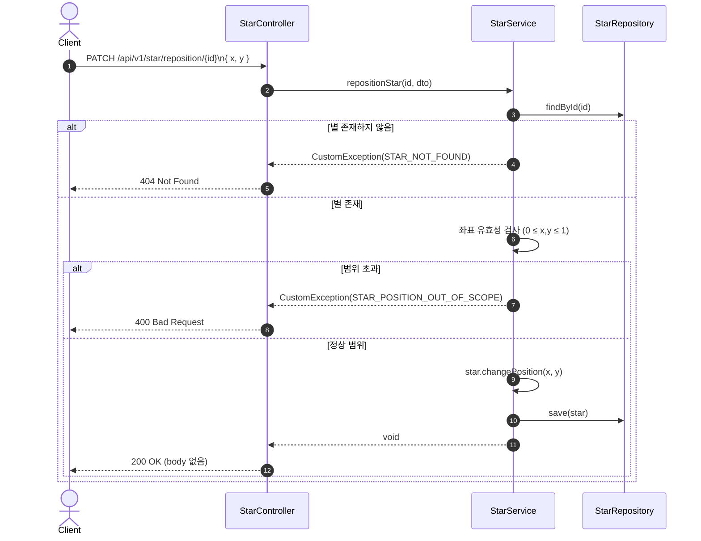
이 단계는 밤하늘에서 사용자가 별을 **드래그하여 좌표를 변경**했을 때 호출되는 API의 흐름이다.  
요청은 `PATCH /api/v1/star/reposition/{id}` 이며,  
`StarPositionDto`에는 `x`, `y` 좌표값이 포함된다.  

서버의 처리 순서:  
1. `StarRepository.findById(id)` 로 별 존재 여부 확인  
   - 없으면 `STAR_NOT_FOUND` 예외  
2. 좌표 유효성 검사 (`0 ≤ x,y ≤ 1`)  
   - 벗어나면 `STAR_POSITION_OUT_OF_SCOPE` 예외  
3. 정상일 경우 `star.changePosition()` 호출  
4. 변경된 Star를 `save()`  
5. 반환은 `ResponseEntity.ok().build()` (본문 없음)  

**흐름요약**  
1. **Client → StarController** : `PATCH /api/v1/star/reposition/{id}` 요청 (`x`, `y`)  
2. **StarController → StarService** : `repositionStar(id, dto)` 호출  
3. **StarService → StarRepository** : `findById(id)` 로 별 조회  
4. **미존재 시** : `STAR_NOT_FOUND` → 404 응답  
5. **좌표 유효성 검사 실패 시** : `STAR_POSITION_OUT_OF_SCOPE` → 400 응답  
6. **정상 시** : `changePosition()` 후 `save()`  
7. **Controller → Client** : 200 OK + Body 없음  

<br>

---

## SD-4.6 Constellation Sequence diagram

### SD-4.6.1 밤하늘 진입  

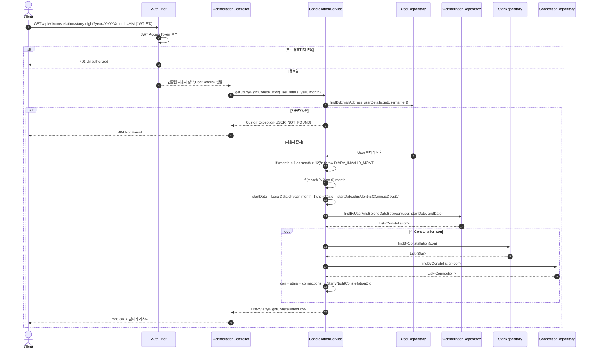

이 단계는 사용자가 밤하늘 페이지에 진입했을 때,
화면에 표시할 별자리 목록과 각 별자리의 구성 정보를 조회하는 과정이다.
요청은 GET /api/v1/constellation/starry-night?year={YYYY}&month={MM} 이며,
JWT 인증을 통해 사용자를 확인한 뒤, 해당 사용자의 **요청 분기(2개월 단위)**에 속하는 별자리들을 조회한다.

서버의 처리 순서:  
1. `AuthFilter` 에서 JWT AccessToken 검증  
   - 유효하지 않으면 `401 Unauthorized` 반환  
   - 유효하면 `userId` 주입  
2. `ConstellationController.getStarryNightConstellation(userDetails, year, month)` 호출  
3. `ConstellationRepository.findByUserAndBelongDateBetween(user, startDate, endDate)` 호출로 요청 분기(2개월) 내 별자리 목록 조회  
4. 각 별자리에 대해 Star / Connection 정보를 조회하여 `StarryNightConstellationDto` 리스트로 변환 
5. 결과 병합 후 Client로 반환  

**흐름요약**  
1. **Client → AuthFilter** : JWT 검증  
2. **AuthFilter → ConstellationController** : userId 주입  
3. **ConstellationController → ConstellationService** : `getStarryNightConstellation(userDetails, year, month)` 호출  
4. **ConstellationService → ConstellationRepository** : 요청 분기(2개월) 내 별자리 목록 조회   
5. **Service 내부** : 각 별자리에 대해 Star / Connection 조회 → `StarryNightConstellationDto` 리스트로 변환  
6. **Controller → Client** : 200 OK + **`StarryNightConstellationDto` 리스트** 응답  

<br>

### SD-4.6.2 별자리 생성 요청  

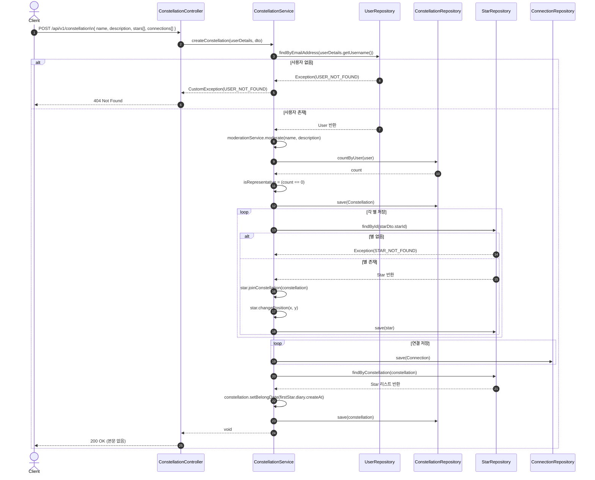

이 단계는 사용자가 밤하늘에서 **7~14개의 별을 선택**하고,  
별자리 이름·설명과 함께 **새로운 Constellation을 생성**하는 과정이다.  
요청은 `POST /api/v1/constellation` 으로, `CreateConstellationDto`를 전달한다.  
(`name`, `description`, `stars`, `connections` 필드 포함)

서버의 처리 순서는 다음과 같다:  
- `UserRepository.findByEmailAddress()` 로 사용자 검증  
   - 없으면 `USER_NOT_FOUND` 예외
- ModerationService.moderate() 로 name, description에 대한 유해성 검사 수행. 부적절한 내용이 감지되면 INAPPROPRIATE_CONTENT 예외
- 해당 사용자가 생성한 별자리가 하나도 없으면 isRepresentative = true 로 설정하여 최초 별자리를 대표별자리로 지정
- 새 `Constellation` 엔티티 생성 및 `save()`  
- `StarRepository.findById()` 로 각 별 검증 및 소속 설정 (`joinConstellation`)  
   - 이미 별자리에 속해 있다면 `ALREADY_BELONG_TO_CONSTELLATION` 예외  
   - 위치(`x`, `y`) 갱신 후 `save()`  
- `ConnectionRepository.save()` 로 선(Connection) 정보 저장  
- 별자리의 `belongDate` 설정 (`Star.diary.createAt`)  
- `ConstellationRepository.save()` 로 최종 반영  
- 응답은 `200 OK` (본문 없음)

**흐름요약**  
1. **Client → ConstellationController** : `POST /api/v1/constellation` 요청  
2. **Controller → ConstellationService** : `createConstellation(userDetails, dto)` 호출  
3. **Service → UserRepository** : 사용자 검증 (`USER_NOT_FOUND`)  
4. **Service 내부** : name, description에 대한 유해성 검사 → 부적절 시 INAPPROPRIATE_CONTENT 예외 발생  
5. **Service → ConstellationRepository** : 최초 별자리인 경우 isRepresentative = true 로 설정하여 새 별자리 생성 및 저장
6. **Service → StarRepository** : 별 존재 및 소속 검증 (STAR_NOT_FOUND, ALREADY_BELONG_TO_CONSTELLATION)
7. **Service → ConnectionRepository** : 별 간 연결 저장
8. **Service → ConstellationRepository** : `belongDate` 설정 후 저장  
9. **Controller → Client** : 200 OK 응답  

<br>

### SD-4.6.3 별자리 저장  

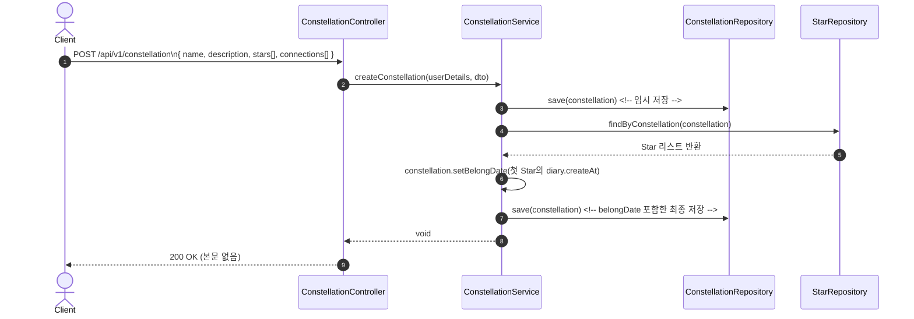

사용자가 새로 만든 별자리를 **DB에 저장**하는 단계이다.  
이 과정은 `createConstellation()` 내부의 마지막 부분으로,  
첫 번째 save() 는 Constellation 엔티티를 먼저 생성·등록하기 위한 임시 저장이며
마지막 save() 는 별자리의 belongDate(첫 Star의 diary.createAt) 를 세팅한 뒤 수행하는 최종 저장이다. 
요청은 `POST /api/v1/constellation` 로 수행되며, `CreateConstellationDto` 의 데이터를 기반으로 한다.  

**서버 측 흐름은 다음과 같다.**  
- **Service → ConstellationRepository** : 생성된 `Constellation`을 임시 저장  
- **Service → StarRepository** : `findByConstellation(constellation)` 로 별 리스트 조회  
- **Service 내부** : 첫 번째 Star의 `diary.createAt` 값을 사용해 `belongDate` 설정  
- **Service → ConstellationRepository** : `save(constellation)` 으로 최종 반영  
- **Controller → Client** : 200 OK 응답 (본문 없음)  

**흐름요약**  
1. **Client → ConstellationController** : `POST /api/v1/constellation` 요청  
2. **Controller → Service** : `createConstellation(userDetails, dto)` 호출  
3. **Service → ConstellationRepository** : 새 별자리 임시 저장  
4. **Service → StarRepository** : 별 리스트 조회  
5. **Service 내부** : `belongDate` 설정  
6. **Service → ConstellationRepository** : 최종 저장  
7. **Controller → Client** : 200 OK 응답  

<br>

### SD-4.6.4 별자리 수정  

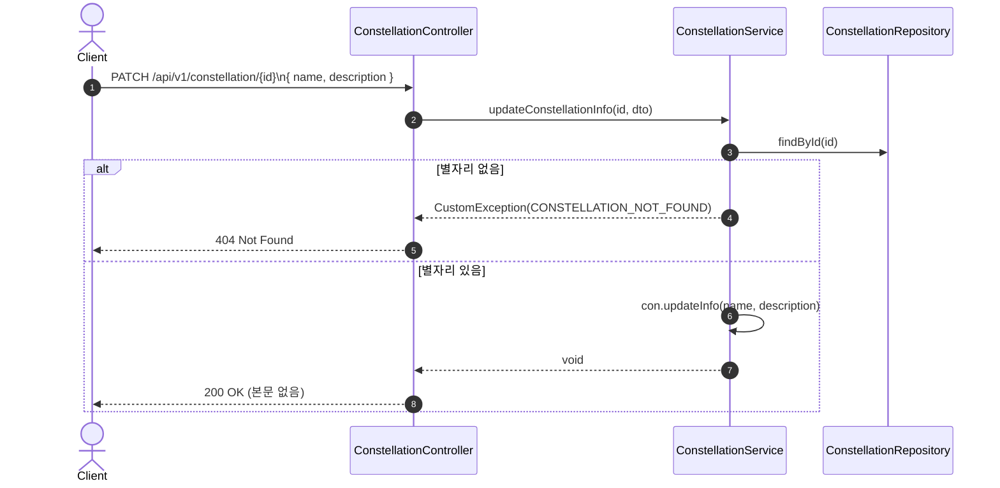

사용자가 **아카이브 화면에서 별자리의 이름과 설명을 수정**하는 단계이다.  
요청은 `PATCH /api/v1/constellation/{id}` 이며, `UpdateConstellationInfo { name, description }` 를 전달한다.  
서비스는 대상 별자리를 조회하고(`findById`), 없으면 `CustomException(CONSTELLATION_NOT_FOUND)` 를 던진다.  
존재할 경우 전달된 name과 description 값을 그대로 적용한다.

서버 측 흐름은 다음과 같다:
- **Controller → Service** : `updateConstellationInfo(id, dto)` 호출  
- **Service → Repository** : `findById(id)` 조회  
- **미존재 시** : `CustomException(CONSTELLATION_NOT_FOUND)` → 404 응답  
- **존재 시** : `con.updateInfo(name, description)` 
- **Controller → Client** : 200 OK (본문 없음)  

**흐름요약**  
1. **Client → ConstellationController** : `PATCH /api/v1/constellation/{id}` (`name`, `description`)  
2. **ConstellationController → ConstellationService** : `updateConstellationInfo(id, dto)`  
3. **ConstellationService → ConstellationRepository** : `findById(id)`  
4. **미존재 시** : `CONSTELLATION_NOT_FOUND` → 404  
5. **존재 시** : `updateInfo(name, description)` 적용
6. **Controller → Client** : 200 OK (본문 없음)  

<br>

### SD-4.6.6 별자리 아카이브 목록 조회  


사용자가 자신의 **별자리 아카이브 목록을 조회**하는 단계이다.  
요청은 `GET /api/v1/constellation/archive` 로,  
로그인된 사용자의 모든 별자리(`Constellation`)와 해당 별(`Star`), 연결(`Connection`) 정보를 함께 반환한다.  
응답은 `List<ArchiveDto>` 형태로 구성되며, 페이징 API는 별도로 존재하고, 본 API는 전체 목록을 반환한다.  

서버 측 흐름은 다음과 같다:
- **Service → UserRepository** : 사용자 검증 (`USER_NOT_FOUND` 예외 가능)  
- **Service → ConstellationRepository** : 사용자의 모든 별자리 조회 (`findByUser(user)`)  
- **Service → StarRepository** : 각 별자리 내 별 목록 조회  
- **Service → ConnectionRepository** : 각 별자리 내 연결 목록 조회  
- **Service 내부** : `ArchiveDto.builder()` 로 별자리 요약 정보 생성  
- **Controller → Client** : `200 OK` + `List<ArchiveDto>` 응답  

**흐름요약**  
1. **Client → ConstellationController** : `GET /api/v1/constellation/archive` 요청  
2. **Controller → ConstellationService** : `getArchiveList(userDetails)` 호출  
3. **Service → UserRepository** : 사용자 검증 (`USER_NOT_FOUND`)  
4. **Service → ConstellationRepository** : 사용자별 별자리 전체 조회  
5. **Service → StarRepository / ConnectionRepository** : 각 별자리의 구성 정보 조회  
6. **Service 내부** : `ArchiveDto` 리스트 생성  
7. **Controller → Client** : 200 OK + `List<ArchiveDto>` 반환  

<br>

### SD-4.6.7 별자리 아카이브 상세 조회  

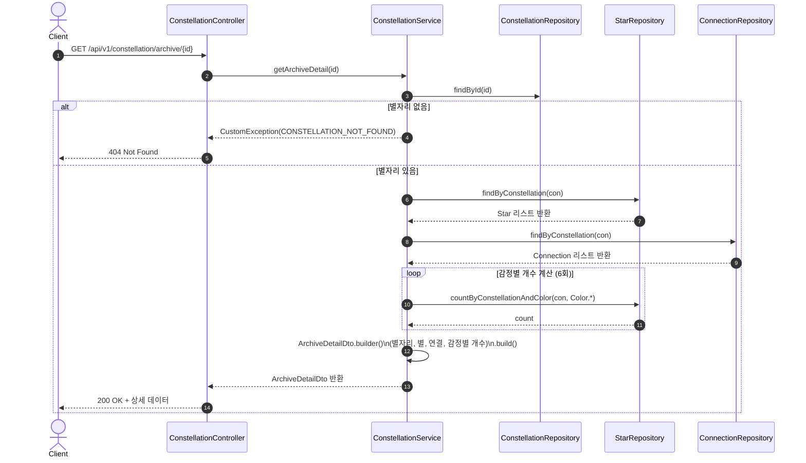

사용자가 **아카이브 목록에서 특정 별자리를 클릭했을 때**,  
해당 별자리의 세부 정보를 조회하는 단계이다.  
요청은 `GET /api/v1/constellation/archive/{id}` 이며,  
응답은 `ArchiveDetailDto` 로 반환되어 **별자리 정보, 포함된 별, 연결 정보, 감정별 별 개수** 등을 포함한다.  

서버 측 흐름은 다음과 같다:
- **Controller → Service** : `getArchiveDetail(id)` 호출  
- **Service → ConstellationRepository** : `findById(id)` 로 별자리 조회  
- **미존재 시** : `CustomException(CONSTELLATION_NOT_FOUND)` → 404 응답  
- **Service → StarRepository** : `findByConstellation(con)` 으로 별 리스트 조회  
- **Service → ConnectionRepository** : `findByConstellation(con)` 으로 연결 리스트 조회  
- **Service → StarRepository** : Color 6종(YELLOW, ORANGE, GREEN, PURPLE, RED, BLUE)에 대해 각각 countByConstellationAndColor 호출  
- **Service 내부** : `ArchiveDetailDto` 생성 및 빌드  
- **Controller → Client** : 200 OK + `ArchiveDetailDto` 반환  

**흐름요약**  
1. **Client → ConstellationController** : `GET /api/v1/constellation/archive/{id}` 요청  
2. **Controller → ConstellationService** : `getArchiveDetail(id)` 호출  
3. **Service → ConstellationRepository** : `findById(id)` 조회  
4. **미존재 시** : `CONSTELLATION_NOT_FOUND` → 404  
5. **존재 시** : `StarRepository` & `ConnectionRepository` 로 관련 데이터 조회  
6. **Service 내부** : `countByConstellationAndColor()` 로 감정별 통계 계산. 색상별 count 6회 호출출
7. **Controller → Client** : 200 OK + `ArchiveDetailDto` 응답  

<br>

### SD-4.6.8 대표 별자리 설정  

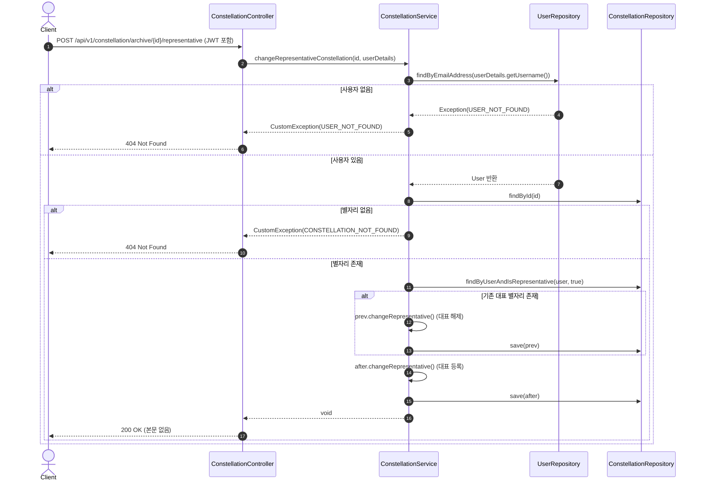

사용자가 **특정 별자리를 대표로 지정하거나 해제**하는 단계이다.  
요청은 `POST /api/v1/constellation/archive/{id}/representative` 이며,  
이미 대표 별자리가 존재하는 경우 해당 별자리의 대표 플래그를 해제하고  
새로운 별자리를 대표로 설정한다.  

서버 측 흐름은 다음과 같다:  
- Controller → Service : `changeRepresentativeConstellation(id, userDetails)` 호출  
- Service → UserRepository : `findByEmailAddress()` 로 사용자 조회  
- 사용자 미존재 시 : `CustomException(USER_NOT_FOUND)` → 404  
- Service → ConstellationRepository : `findById(id)` 로 대상 별자리 조회  
- 대상 미존재 시 : `CustomException(CONSTELLATION_NOT_FOUND)` → 404  
- Service → ConstellationRepository : `findByUserAndIsRepresentative(user, true)` 로 이전 대표 별자리 확인  
- 기존 대표 별자리 존재 시 : `prev.changeRepresentative()` → 대표 해제 후 저장  
- 새 별자리 : `after.changeRepresentative()` → 대표 설정 후 저장  
- Controller → Client : 200 OK (본문 없음)  

**흐름요약** 
1. Client → ConstellationController : `POST /api/v1/constellation/archive/{id}/representative` 요청  
2. Controller → ConstellationService : `changeRepresentativeConstellation(id, userDetails)` 호출  
3. Service → UserRepository : 사용자 검증 (`USER_NOT_FOUND`)  
4. Service → ConstellationRepository : 대상 별자리 조회 (`CONSTELLATION_NOT_FOUND`)  
5. Service → ConstellationRepository : 기존 대표 별자리 확인 (`findByUserAndIsRepresentative`)  
6. 기존 대표 존재 시 : `changeRepresentative()` → 대표 해제 후 저장  
7. 새 별자리 : 대표 설정 후 저장  
8. Controller → Client : 200 OK (본문 없음)  

<br>

### SD-4.6.9 별자리 위치 재배치  

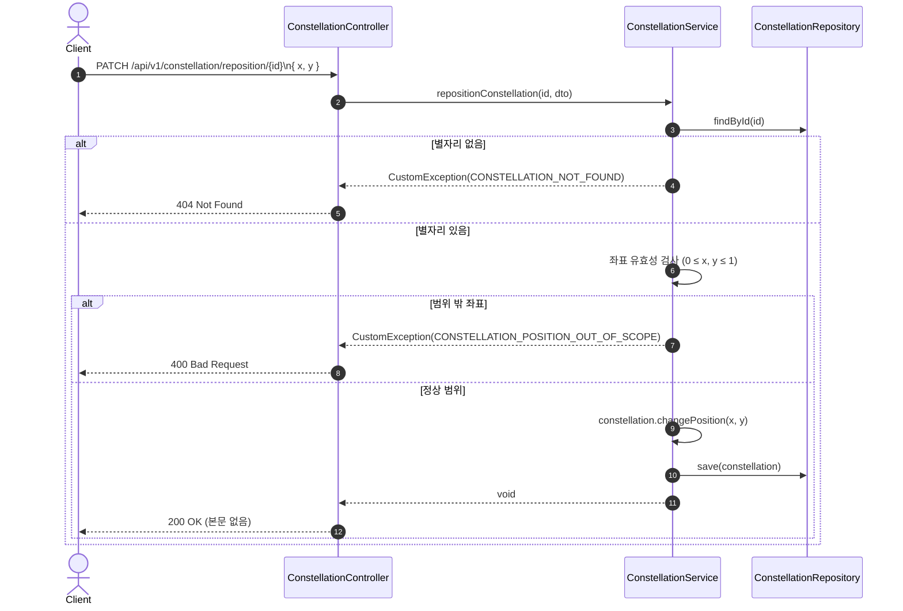

사용자가 **밤하늘 화면에서 별자리를 드래그하여 이동**했을 때  
새로운 위치 좌표(`x`, `y`)를 서버에 갱신하는 단계이다.  
요청은 `PATCH /api/v1/constellation/reposition/{id}` 이며,  
요청 본문(`ConstellationPositionDto`)에는 `x`, `y` 값이 포함된다.  

서버 측 흐름은 다음과 같다:  
- Controller → Service : `repositionConstellation(id, dto)` 호출  
- Service → ConstellationRepository : `findById(id)` 로 별자리 존재 확인  
- 존재하지 않으면 : `CustomException(CONSTELLATION_NOT_FOUND)` → 404 응답  
- 좌표 범위 검증 (0 ≤ x, y ≤ 1), 이 범위를 벗어나면 CONSTELLATION_POSITION_OUT_OF_SCOPE 예외 발생
- 정상 범위라면, 실제 저장은 0.25 < x < 0.75 및 0.25 < y < 0.75 범위 안에 있을 때만 수행됨. 이 추가 조건을 만족하지 못하면 예외 없이 단순히 저장하지 않고 종료됨
- Controller → Client : 200 OK (본문 없음)  

**흐름요약**  
1. **Client → ConstellationController** : `PATCH /api/v1/constellation/reposition/{id}` (`x`, `y`)  
2. **ConstellationController → ConstellationService** : `repositionConstellation(id, dto)` 호출  
3. **ConstellationService → ConstellationRepository** : `findById(id)`  
4. **미존재 시** : `CONSTELLATION_NOT_FOUND` → 404  
5. **좌표 유효성 검사 실패 시** : `CONSTELLATION_POSITION_OUT_OF_SCOPE` → 400  
6. **정상 시** : 좌표가 0 ≤ x,y ≤ 1 이고, 추가로 0.25 < x < 0.75 및 0.25 < y < 0.75 인 경우에만 changePosition() 후 save()  
7. **Controller → Client** : 200 OK (본문 없음)  

<br>

현재 코드상 Connection은 별자리(Consetellation) 흐름 안에서만 생성/조회되고, 별도 Controller/API는 없으니 “연결만 단독으로”는 시퀀스가 없고, 다음 두 지점에서만 등장한다. 
1. 별자리 생성 중 연결 저장
2. 조회 시 연결 포함 반환 <br>
해당 내용에 관련된 Connection 전용 서브 시퀀스 2개를 정리해서 C1, C2로 정리하였다.

### SD-4.6.C1 연결 저장 (별자리 생성 중)  

```mermaid
sequenceDiagram
    autonumber
    actor Client as Client
    participant CC as ConstellationController
    participant CS as ConstellationService
    participant SR as StarRepository
    participant CN as ConnectionRepository

    Client->>CC: POST /api/v1/constellation\n{ name, description, stars[], connections[] }
    CC->>CS: createConstellation(userDetails, dto)

    loop 연결 저장 (dto.connections)
        CS->>SR: findById(startStarId)
        SR-->>CS: Start Star
        CS->>SR: findById(endStarId)
        SR-->>CS: End Star
        CS->>CN: save(Connection.builder()\n  .constellation(constellation)\n  .start(startStar)\n  .end(endStar)\n  .build())
    end

    CS-->>CC: void
    CC-->>Client: 200 OK (본문 없음)
```

사용자가 별자리를 생성할 때, **선(연결)을 저장**하는 단계만 분리한 시퀀스다.  
각 `ConnectionDto(startStarId, endStarId)`에 대해 시작/종료 별을 조회하고,  
`connectionRepository.save()` 로 연결을 저장한다.

서버 측 흐름은 다음과 같다:  
- Controller → Service : `createConstellation(userDetails, dto)`  
- Service → StarRepository : `findById()` 로 시작/종료 별 조회  
- Service → ConnectionRepository : `save(Connection)` 호출  
- Controller → Client : 200 OK (본문 없음)

**흐름요약**  
1. Client → ConstellationController : `POST /api/v1/constellation`  
2. Controller → ConstellationService : `createConstellation(userDetails, dto)`  
3. Service → StarRepository : `findById(start)`, `findById(end)`  
4. Service → ConnectionRepository : `save()`  
5. Controller → Client : 200 OK (본문 없음)

<br>

### SD-4.6.C2 연결 조회 (밤하늘/아카이브/상세)  

```mermaid
sequenceDiagram
    autonumber
    actor Client as Client
    participant CS as ConstellationService
    participant CR as ConstellationRepository
    participant CN as ConnectionRepository

    Client->>CS: (예) GET /api/v1/constellation/archive
    CS->>CR: findByUser(user) 또는 findById(id) / belongDate 기간 조회 등
    CR-->>CS: Constellation 리스트 또는 단건

    loop 각 Constellation
        CS->>CN: findByConstellation(con)
        CN-->>CS: Connection 리스트
        CS->>CS: ConnectionDto / StarryNightConnectionDto 로 매핑
    end

    CS-->>Client: 200 OK + 연결 포함 응답
```

**밤하늘/아카이브/상세 조회에서 연결을 함께 반환**하는 공통 패턴이다.  
`connectionRepository.findByConstellation(con)` 으로 선 목록을 가져오고,  
응답 DTO(`ConnectionDto` 또는 `StarryNightConnectionDto`)로 매핑한다.

서버 측 흐름은 다음과 같다:  
- Service → ConstellationRepository : 대상 별자리(들) 조회  
- Service → ConnectionRepository : `findByConstellation(con)` 로 연결 목록 조회  
- Service 내부 : DTO 매핑 (`ConnectionDto` / `StarryNightConnectionDto`)  
- Service → Client : 200 OK + 연결 포함 응답

**흐름요약**  
1. Client → ConstellationService : 별자리(들) 조회 요청  
2. Service → ConstellationRepository : 대상 별자리(들) 조회  
3. Service → ConnectionRepository : `findByConstellation(con)`  
4. Service 내부 : 연결 DTO 매핑  
5. Service → Client : 200 OK + 연결 포함 응답

<br>

---

## SD-4.7 S3 Sequence diagram

### SD-4.7.1 파일 업로드 Presigned URL 발급  

```mermaid
sequenceDiagram
    autonumber
    actor Client as Client
    participant SC as S3Controller
    participant UR as UserRepository
    participant SS as S3StorageService
    participant SP as S3Presigner

    Client->>SC: POST /api/v1/s3/image/tempUrl\n{ contentType }
    SC->>UR: findByEmailAddress(userDetails.getUsername())
    alt 사용자 없음
        UR-->>SC: empty
        SC-->>Client: 404 Not Found\n(USER_NOT_FOUND)
    else 사용자 있음
        UR-->>SC: User(id)
        SC->>SC: key = "uploads/users/{userId}/{uuid}.png"
        SC->>SS: createUploadUrl(key, contentType)
        SS->>SS: contentType.startsWith("image/") 검증 (실패 시 IllegalArgumentException)
        SS->>SP: presignPutObject(bucket, key, contentType, 10분 유효)
        SP-->>SS: Presigned URL 반환
        SS-->>SC: URL 반환
        SC-->>Client: 200 OK + S3tempResDto{ presignedUrl, tempKey }
    end
```

이 단계는 사용자가 **이미지 업로드를 위해 S3 Presigned URL을 요청**하는 과정이다.  
요청은 `POST /api/v1/s3/image/tempUrl` 이며, `contentType`(예: `image/png`)을 전달한다.  
서버는 로그인 사용자의 `userId`로 업로드 경로(`uploads/users/{userId}/{uuid}.png`)를 생성하고,  
10분간 유효한 **S3 PUT Presigned URL**을 생성하여 응답한다.  

서버 측 흐름은 다음과 같다:  
- Controller → UserRepository : `findByEmailAddress()` 로 사용자 조회  
- Controller → S3StorageService : publishProfile(userId, tempKey) 호출
- Controller → S3StorageService : `createUploadUrl(key, contentType)` 호출  
- Service 내부 : contentType 검증 (`image/` 로 시작하지 않으면 IllegalArgumentException 발생)  
- Service → S3Presigner : `presignPutObject` 실행 (10분 유효)  
- Service → Controller : URL 반환  
- Controller → Client : 200 OK + `S3tempResDto{ presignedUrl, tempKey }`  

**흐름요약**  
1. **Client → S3Controller** : `POST /api/v1/s3/image/tempUrl` 요청 (`contentType`)  
2. **S3Controller → UserRepository** : 사용자 조회  
3. **S3Controller 내부** : `tempKey` 생성 (`uploads/users/{userId}/{uuid}.png`)  
4. **S3Controller → S3StorageService** : `createUploadUrl(key, contentType)` 호출  
5. **S3StorageService → S3Presigner** : `presignPutObject`(10분 유효)  
6. **S3StorageService → S3Controller** : URL 반환  
7. **S3Controller → Client** : 200 OK + `presignedUrl`, `tempKey` 반환  

<br>

### SD-4.7.2 파일 업로드 완료 처리 (uploads → public 전환)

```mermaid
sequenceDiagram
    autonumber
    actor Client as Client
    participant UC as UserController (MyPage)
    participant UR as UserRepository
    participant SS as S3StorageService

    Client->>UC: POST /api/v1/mypage/profile-image/publish\n{ tempKey }
    UC->>UR: findByEmailAddress(userDetails.getUsername())
    alt 사용자 없음
        UR-->>UC: empty
        UC-->>Client: 404 Not Found (USER_NOT_FOUND)
    else 사용자 있음
        UR-->>UC: User(id)
        UC->>SS: publishProfile(user.id, tempKey)
        SS-->>UC: finalUrl (https://{bucket}.s3.{region}.amazonaws.com/public/users/{id}/profile.png)
        %% (선택) UC->>UR: 사용자 프로필 URL 저장 (필드 제공 시)
        UC-->>Client: 200 OK + S3uploadResDto{ imageUrl: finalUrl }
    end
```

이 단계는 사용자가 **업로드를 마친 임시 객체**를 **공개 경로로 승격**하는 과정이다.  
요청은 `POST /api/v1/mypage/profile-image/publish` 이고, 본문은 `{ tempKey }` 형식이다.  
서비스 레벨에서는 `S3StorageService.publishProfile(userId, tempKey)` 를 호출하여  
`uploads/users/{userId}/...` → `public/users/{userId}/profile.png` 로 복사하고 최종 URL을 반환한다.

서버 측 흐름은 다음과 같다:
- Controller → UserRepository : `findByEmailAddress()` 로 사용자 조회 (없으면 404)
- Controller → S3StorageService : `publishProfile(userId, tempKey)` 호출
- Service 내부 : 
     - tempKey == "defaults" 인 경우 기본 프로필 키(public/defaults/profileDefault.png)에 대한 URL만 생성하여 반환
     - 그 외에는 tempKey 널/공백 및 Prefix(uploads/users/{userId}/) 검증 실패 시 IllegalArgumentException → 400 Bad Request
     - 검증 통과 시 copyObject 를 통해 uploads/... → public/users/{userId}/profile.png 복사
- Service → Controller : PublishedObject(publicKey, url) 반환
- Controller → Client : 200 OK + `S3uploadResDto{ imageUrl }`

**흐름요약**  
1. **Client → UserController** : `POST /api/v1/mypage/profile-image/publish` (`tempKey`)  
2. **UserController → UserRepository** : 사용자 조회 (`USER_NOT_FOUND` 시 404)  
3. **UserController → S3StorageService** : `publishProfile(userId, tempKey)`  
4. **S3StorageService 내부** : tempKey == "defaults" → 기본 프로필 키로 URL 반환 (copy 없음), 그 외에는 tempKey 널/공백 및 Prefix 검증 후, 통과 시 copyObject 수행
5. **UserController → Client** : 200 OK + `S3uploadResDto`(최종 URL)  

<br>

---

## SD-4.8 Mypage Sequence diagram

### SD-4.8.1 마이페이지 요약 조회 (업데이트: totalStars/totalConstellations 포함)

```mermaid
sequenceDiagram
    autonumber
    actor Client as Client
    participant AF as AuthFilter
    participant MPC as MyPageController
    participant MPS as MyPageService
    participant UR as UserRepository
    participant SR as StarRepository
    participant CR as ConstellationRepository
    participant DR as DiaryRepository
    participant FR as FriendRepository
    participant S3 as S3StorageService

    Client->>AF: GET /api/v1/mypage/summary?year=YYYY&month=MM (JWT 포함)
    AF->>AF: AccessToken 검증
    alt 토큰 유효하지 않음
        AF-->>Client: 401 Unauthorized
    else 유효함
        AF-->>MPC: userId 주입
        MPC->>MPS: getSummary(userId, year, month)
        MPS->>MPS: now = LocalDate.now()\n y = (year == null ? now.year : year)\n m = (month == null ? now.month : month)
        note over MPS: 내부에서 5개의 하위 조회 메서드 호출\n(getUserSummary, getLevel, getRepresentativeConstellation,\n getMonthlyCount, getEmotionCount)

        par 사용자 요약 정보 조회 (getUserSummary)
            MPS->>UR: findById(userId)
            UR-->>MPS: User
            MPS->>SR: countByUser(user)        # totalStars
            MPS->>CR: countByUser(user)        # totalConstellations
            MPS->>FR: countAcceptedFriendsByUserId(userId)
            MPS->>S3: convertToUrl(user.profilePhotoUrl)
            MPS-->>MPS: UserSummaryResDto 생성
        and 레벨 정보 조회 (getLevel)
            MPS->>UR: findById(userId)
            UR-->>MPS: User
            MPS->>SR: countByUser(user)
            MPS-->>MPS: LevelResDto 생성 (LevelPolicy.resolve)
        and 대표 별자리 조회 (getRepresentativeConstellation)
            MPS->>UR: findById(userId)
            UR-->>MPS: User
            MPS->>CR: findByUserAndIsRepresentative(user, true)
            CR-->>MPS: Optional<Constellation>
            MPS-->>MPS: StarryNightConstellationDto 또는 null
        and 연간 월별 별자리 수 조회 (getMonthlyCount)
            MPS->>UR: findById(userId)
            UR-->>MPS: User
            MPS->>CR: findAllByUserAndCreateAtBetween(user, {year}-01-01, {year}-12-31)
            CR-->>MPS: Constellation 리스트
            MPS-->>MPS: List<MonthlyCountResDto> 생성
        and 해당 월 감정 통계 조회 (getEmotionCount)
            MPS->>UR: findById(userId)
            UR-->>MPS: User
            MPS->>DR: findAllByUserAndCreateAtBetween(user, startOfMonth(y,m), endOfMonth(y,m))
            DR-->>MPS: Diary 리스트
            MPS-->>MPS: List<EmotionCountResDto> 생성
        end

        MPS-->>MPC: MyPageSummaryResDto.of(profile, level, repConstellation, monthlyCount, emotionCount)
        MPC-->>Client: 200 OK + MyPageSummaryResDto
    end
```

이 단계는 사용자가 **마이페이지에 진입**했을 때,
**프로필 정보 + 레벨 정보 + 대표 별자리 + 연간 별자리 통계 + 해당 월 감정 통계**를
**한 번에 조회**하는 요약 API 흐름이다.
요청은 `GET /api/v1/mypage/summary?year=YYYY&month=MM` 이며, `year`, `month` 둘 다 `null`이면
**현재 날짜 기준 연도/월**로 조회한다.

서버 측 흐름은 다음과 같다:  
1. **Controller → Service**
getSummary(userId, year, month)
2. **Service 내부 처리**
- getUserSummary(userId)
     → 프로필, totalStars, totalConstellations, 친구 수
- getLevel(userId)
     → 별 개수 기반 레벨 계산
- getRepresentativeConstellation(userId)
     → 대표 별자리 조회
- getMonthlyCount(userId, year)
     → 연간 월별 별자리 생성 수 통계
- getEmotionCount(userId, year, month)
    → 해당 월 감정별 일기 개수 통계
3. **Service → Controller**
MyPageSummaryResDto 생성하여 반환
4. **Controller → Client**
200 OK + summary 응답
<br>


### SD-4.8.2 사용자 정보 조회  

```mermaid
sequenceDiagram
    autonumber
    actor Client as Client
    participant AF as AuthFilter
    participant UC as UserController
    participant US as UserService
    participant UR as UserRepository

    Client->>AF: GET /api/v1/users/me (JWT)
    AF->>AF: 토큰 검증
    alt 실패
        AF-->>Client: 401 Unauthorized
    else 성공
        AF-->>UC: userId 전달
        UC->>US: getUserProfile(userId)
        US->>UR: findById(userId)
        alt 없음
            US-->>UC: CustomException(USER_NOT_FOUND)
            UC-->>Client: 404 Not Found
        else 있음
            UR-->>US: User
            US-->>UC: UserProfileResponseDto
            UC-->>Client: 200 OK + DTO
        end
    end

```

사용자가 마이페이지의 프로필 정보를 조회할 때 실행되는 흐름이다.
JWT가 먼저 필터에서 검증되고, 유효한 경우 userId가 컨트롤러에 전달된다.
컨트롤러는 서비스 레이어의 getUserProfile()을 호출하여 사용자 정보를 조회하며,
DB에 사용자가 존재하지 않으면 USER_NOT_FOUND 예외를 발생시켜 404를 반환한다.
정상적으로 조회되면 사용자 엔티티를 DTO로 변환하여 클라이언트에게 200 OK로 응답한다.

**흐름 요약** <br>
1. **Client → AuthFilter** : JWT 포함하여 /api/v1/users/me 요청
2. **AuthFilter** :
- AccessToken 유효성 검증
- 실패 시 즉시 401 반환
3. **AuthFilter → UserController** : 검증 성공 시 userId를 컨트롤러에 전달
4. **UserController → UserService**: getUserProfile(userId) 호출
5. **UserService → UserRepository** : findById(userId)
6. **UserRepository** :
- 사용자가 없으면 Optional.empty() 반환
- 존재하면 User 엔티티 반환
7. **UserService** :
- 없으면 CustomException(USER_NOT_FOUND)
- 있으면 User 정보를 기반으로 UserProfileResponseDto 생성
8. **UserController → Client** : 200 OK + 사용자 정보 DTO 반환
<br>

### SD-4.8.3 감정 통계 조회  

```mermaid
sequenceDiagram
    autonumber
    actor Client as Client
    participant AF as AuthFilter
    participant DC as DiaryController
    participant DS as DiaryService
    participant DR as DiaryRepository

    Client->>AF: GET /api/v1/calendar/diary/statistics?year=YYYY&month=MM (JWT)
    AF->>AF: 토큰 검증
    alt 실패
        AF-->>Client: 401 Unauthorized
    else 성공
        AF-->>DC: userId 전달
        DC->>DS: getEmotionStatistics(userId, year, month)
        DS->>DS: from/to 기간 계산
        DS->>DR: findAllByUser_IdAndCreateAtBetween(userId, from, to)
        DR-->>DS: Diary 리스트
        DS->>DS: 감정별 개수 및 비율 계산
        DS-->>DC: EmotionStatisticDto
        DC-->>Client: 200 OK + DTO
    end

```

사용자가 특정 연도·월의 감정 통계를 조회할 때 호출된다.  
JWT 인증을 통과한 사용자만 접근할 수 있다.
서비스 레이어에서는 전달받은 year/month 값을 기반으로 해당 월의 시작일과 마지막 날짜를 계산한 후,
해당 기간의 일기 데이터를 모두 조회한다.  
조회된 Diary 목록을 Emotion 값 기준으로 그룹화하여 감정별 비율을 계산한다.
일기가 한 건도 없거나 특정 감정이 없는 경우, 해당 감정의 비율은 0.0으로 반환된다.
최종 응답은 EmotionStatisticDto 형태로 전달된다.

**흐름요약**  
1. **Client → AuthFilter** : JWT 검증  
2. **AuthFilter → DiaryController** : userId 주입  
3. **DiaryController → DiaryService** : `getEmotionStatistics(userId, year, month)` 호출  
4. **DiaryService 내부** :
- YearMonth 기반 from/to 계산
- DiaryRepository로 해당 기간의 Diary 조회
- 감정별 카운트 및 비율 계산
5. **DiaryController → Client** : 200 OK + EmotionStatisticDto 반환  
<br>

### SD-4.8.4 대표 별자리 표시  

```mermaid
sequenceDiagram
    autonumber
    actor Client as Client
    participant AF as AuthFilter
    participant MPC as MyPageController
    participant MPS as MyPageService
    participant CR as ConstellationRepository

    Client->>AF: GET /api/v1/mypage/representative (JWT 포함)
    AF->>AF: AccessToken 검증
    alt 토큰 유효하지 않음
        AF-->>Client: 401 Unauthorized
    else 유효함
        AF-->>MPC: userId 주입
        MPC->>MPS: getRepresentativeConstellation(userId)
        MPS->>CR: findByUserAndIsRepresentative(user, true)
        alt 대표 별자리 없음
            CR-->>MPS: Optional.empty()
            MPS-->>MPC: null
            MPC-->>Client: Client: 204 No Content
        else 대표 별자리 존재
            CR-->>MPS: Constellation 반환
            MPS-->>MPC: StarryNightConstellationDto
            MPC-->>Client: 200 OK + StarryNightConstellationDto
        end
    end
```

이 API는 마이페이지에서 대표 별자리 영역을 그릴 때 사용된다.
JWT 인증이 완료되면, 서비스에서
`findByUserAndIsRepresentative(user, true)`로 대표 별자리를 조회한다.
- 대표 별자리가 있을 경우: `StarryNightConstellationDto`로 변환해 반환
- 대표 별자리가 없을 경우: **204 No Content**하고,
  "대표 별자리가 없습니다" 문구는 프론트엔드에서 처리한다.


**흐름요약**  
1. **Client → AuthFilter** : `GET /api/v1/mypage/representative` 요청, JWT 검증
- 실패: 401 Unauthorized
- 성공: userId 주입
2. **MyPageController → MyPageService** : `getRepresentativeConstellation(userId)` 호출
3. **MyPageService → ConstellationRepository** : `findByUserAndIsRepresentative(user, true)` 실행
4. 대표 별자리 없음 : 204 No Content
5. 대표 별자리 존재
- Repository: Constellation 엔티티 반환
- Service: StarryNightConstellationDto 로 매핑
- Controller: 200 OK + DTO 응답

<br>

### SD-4.8.5 연간 월별 별자리 수 조회  

```mermaid
sequenceDiagram
    autonumber
    actor Client as Client
    participant AF as AuthFilter
    participant MPC as MyPageController
    participant MPS as MyPageService
    participant UR as UserRepository
    participant CR as ConstellationRepository

    Client->>AF: GET /api/v1/mypage/year?year=YYYY (JWT 포함)
    AF->>AF: AccessToken 검증
    alt 토큰 유효하지 않음
        AF-->>Client: 401 Unauthorized
    else 유효함
        AF-->>MPC: userId 주입
        MPC->>MPS: **getMonthlyCount(userId, year)**
        MPS->>UR: findById(userId)
        UR-->>MPS: User
        MPS->>MPS: start = LocalDate.of(year, 1, 1), end = LocalDate.of(year, 12, 31)
        MPS->>CR: **findAllByUserAndCreateAtBetween(user, start, end)**
        CR-->>MPS: Constellation 리스트
        MPS->>MPS: 월별 그룹화 및 정렬 (1..12 중 존재하는 월만)
        MPS-->>MPC: **List<MonthlyCountResDto>(month, count)**
        MPC-->>Client: 200 OK + [{month:1,count:n}, ...]
    end

```

이 단계는 사용자가 특정 연도에 생성한 별자리 개수를 월별로 집계해 마이페이지 통계(차트 등)에 사용하는 흐름이다.
별자리의 기준 날짜는 belongDate가 아니라 createAt 이고, 실제로 존재하는 월만 응답 리스트에 포함된다(없는 달을 0으로 채우지 않음).

**흐름요약**  
1. **Client → AuthFilter** : JWT 검증  
2. **AuthFilter → MyPageController** : userId 주입  
3. **MyPageController → MyPageService** : `getMonthlyConstellationCounts(userId, year)`  
4. **MyPageService → UserRepository** : 사용자 조회  
5. **MyPageService → ConstellationRepository** : 연간 범위 내 별자리 조회  
6. **MyPageService 내부** : createAt 기준으로 월별 그룹화 → List<MonthlyCountResDto> 생성(존재하는 월만 포함)
7. **MyPageController → Client** : 200 OK + {month, count} 응답

<br>

### SD-4.8.6 프로필 이미지 업로드 (임시 URL 발급)  

```mermaid
sequenceDiagram
    autonumber
    actor Client as Client
    participant AF as AuthFilter
    participant S3C as S3Controller
    participant UR as UserRepository
    participant S3S as S3StorageService
    participant SP as S3Presigner

    Client->>AF: POST /api/v1/s3/image/tempUrl (JWT, contentType 포함)
    AF->>AF: AccessToken 검증
    alt 토큰 유효하지 않음
        AF-->>Client: 401 Unauthorized
    else 유효함
        AF-->>S3C: userDetails 주입
        S3C->>UR: findByEmailAddress(userDetails.getUsername())
        alt 사용자 없음
            UR-->>S3C: Optional.empty()
            S3C-->>Client: 404 Not Found (USER_NOT_FOUND)
        else 사용자 있음
            UR-->>S3C: User(id)
            S3C->>S3C: tempKey = "uploads/users/{id}/{uuid}.png"
            S3C->>S3S: createUploadUrl(tempKey, contentType)
            S3S->>S3S: contentType.startsWith("image/") 검증<br/>(실패 시 IllegalArgumentException)
            S3S->>SP: presignPutObject(bucket, tempKey, contentType, 10분 유효)
            SP-->>S3S: Presigned URL
            S3S-->>S3C: URL
            S3C-->>Client: 200 OK + { presignedUrl, tempKey }
        end
    end

```

사용자가 마이페이지에서 **프로필 사진을 새로 올리기 전에**, S3에 직접 PUT 할 수 있는 **임시 업로드 URL(presigned URL)** 을 받는 단계다.
JWT로 인증된 사용자의 userId를 기준으로 uploads/users/{userId}/{uuid}.png 형식의 tempKey를 만들고, S3StorageService.createUploadUrl(tempKey, contentType)에서 이미지 MIME 타입만 허용한 뒤 10분 유효한 Presigned URL을 생성해 반환한다.

**흐름요약**  
1. **Client → AuthFilter** : JWT 검증  
2. **AuthFilter → S3Controller** : userId 주입  
3. **S3Controller → UserRepository** : `findByEmailAddress(userDetails.getUsername())`
- 사용자 없음 → 404 USER_NOT_FOUND 응답
- 사용자 있음 → tempKey = "uploads/users/{id}/{uuid}.png" 생성 
4. **S3Controller → S3StorageService** : `createUploadUrl(tempKey, contentType)`
5. **S3StorageService 내부** : `contentType.startsWith("image/")` 검증 후 `S3Presigner.presignPutObject(...)` 호출
6. **S3Controller → Client** : 200 OK + URL, { presignedUrl, tempKey } 반환

<br>

### SD-4.8.7 닉네임 중복 검사 (프로필 수정 시)  

```mermaid
sequenceDiagram
    autonumber
    actor Client as Client
    participant AF as AuthFilter
    participant MPC as MyPageController
    participant MPS as MyPageService
    participant UR as UserRepository
    participant MS as ModerationService

    Client->>AF: GET /api/v1/mypage/available?newNickname={nickname} (JWT 포함)
    AF->>AF: AccessToken 검증
    alt 토큰 유효하지 않음
        AF-->>Client: 401 Unauthorized
    else 유효함
        AF-->>MPC: userDetails 주입
        MPC->>MPC: resolveUserId(userDetails) → userId
        MPC->>MPS: checkNickname(userId, newNickname)

        MPS->>UR: findById(userId)
        alt 사용자 없음
            UR-->>MPS: Optional.empty()
            MPS-->>MPC: CustomException(USER_NOT_FOUND)
            MPC-->>Client: 404 Not Found
        else 사용자 존재
            UR-->>MPS: User
            MPS->>MPS: 닉네임 정규화 + 길이검증(2~10)
            alt invalid nickname
                MPS-->>MPC: CustomException(INVALID_NICKNAME)
                MPC-->>Client: 400 Bad Request
            else 유효한 닉네임
                alt 본인 닉네임과 동일
                    MPS-->>MPC: OK (검사만 통과)
                    MPC-->>Client: 200 OK
                else 새 닉네임
                    MPS->>UR: existsByNicknameAndIdNot(nickname, userId)
                    alt 중복 존재
                        UR-->>MPS: true
                        MPS-->>MPC: CustomException(NICKNAME_CONFLICT)
                        MPC-->>Client: 409 Conflict
                    else 사용 가능
                        UR-->>MPS: false
                        MPS->>MS: moderate(nickname)
                        MS-->>MPS: Moderation 결과
                        alt 모더레이션 응답 없음
                            MPS-->>MPC: CustomException(OPENAI_SERVER_ERROR)
                            MPC-->>Client: 500 Internal Server Error
                        else 응답 정상
                            alt 부적절한 닉네임
                                MPS-->>MPC: CustomException(INAPPROPRIATE_CONTENT)
                                MPC-->>Client: 400 Bad Request
                            else 통과
                                MPS-->>MPC: OK
                                MPC-->>Client: 200 OK
                            end
                        end
                    end
                end
            end
        end
    end

```

이 단계는 마이페이지에서 **새 닉네임을 입력했을 때, 저장 전에 사용 가능 여부를 검증하는 과정**이다.
요청은 GET /api/v1/mypage/available?newNickname={nickname} 이고,
서버는 로그인 사용자의 ID를 기준으로 **본인 제외 중복 여부 + 길이 검증(2~6자) + OpenAI 모더레이션 검사**를 수행한다.
본인 닉네임과 동일하면 그대로 통과(200 OK),
다른 사용자와 중복이면 NICKNAME_CONFLICT(409),
형식 오류나 부적절한 표현이면 400 Bad Request,
모더레이션 서버 오류 시 500 으로 응답한다.

**흐름요약**  
1. **Client → AuthFilter** : JWT 검증  
2. **AuthFilter → UserController** : userId 주입  
3. **UserController → UserService** : `checkNickname(userId, nickname)`  
4. **UserService → UserRepository** : 사용자 존재 확인
5. **MyPageService 내부** :
- normalizeAndValidateNickname() 으로 공백 제거 + 길이(2~10) 검증 (INVALID_NICKNAME 시 400)
- 현재 닉네임과 같으면 바로 통과 (200 OK)
- existsByNicknameAndIdNot(nickname, userId) 로 타 사용자 중복 검사 (NICKNAME_CONFLICT 시 409)
- moderate(nickname) 으로 모더레이션 검사
     - 응답 없음 → OPENAI_SERVER_ERROR(500)
     - 플래그됨 → INAPPROPRIATE_CONTENT(400)
6. **MyPageController → Client** : 최종적으로 200 / 400 / 404 / 409 / 500 중 하나로 응답

<br>

### SD-4.8.8 닉네임 저장

```mermaid
sequenceDiagram
    autonumber
    actor Client as Client
    participant AF as AuthFilter
    participant MPC as MyPageController
    participant MPS as MyPageService
    participant UR as UserRepository

    Client->>AF: PATCH /api/v1/mypage/nickname\n{ nickname } (JWT 포함)
    AF->>AF: AccessToken 검증
    alt 토큰 유효하지 않음
        AF-->>Client: 401 Unauthorized
    else 유효함
        AF-->>MPC: userDetails 주입
        MPC->>MPC: resolveUserId(userDetails) → userId
        MPC->>MPS: updateNickname(userId, nickname)

        MPS->>UR: findById(userId)
        alt 사용자 없음
            UR-->>MPS: Optional.empty()
            MPS-->>MPC: CustomException(USER_NOT_FOUND)
            MPC-->>Client: 404 Not Found
        else 사용자 존재
            UR-->>MPS: User
            MPS->>MPS: normalizeAndValidateNickname(rawNickname)\n(공백 제거, 길이 2~10자 검증)
            alt 닉네임 형식 오류
                MPS-->>MPC: CustomException(INVALID_NICKNAME)
                MPC-->>Client: 400 Bad Request
            else 형식 정상
                alt 기존 닉네임과 동일
                    MPS-->>MPC: UpdateNicknameResDto(기존 닉네임)
                    MPC-->>Client: 200 OK + DTO
                else 새 닉네임
                    MPS->>MPS: checkNickname(userId, nickname)\n(본인 제외 중복 + 모더레이션 검사)
                    alt 중복/부적절/오류
                        MPS-->>MPC: CustomException(NICKNAME_CONFLICT/INAPPROPRIATE_CONTENT/OPENAI_SERVER_ERROR)
                        MPC-->>Client: 적절한 에러 상태 코드 반환
                    else 사용 가능 닉네임
                        MPS->>MPS: user.changeNickname(nickname)
                        MPS-->>MPC: UpdateNicknameResDto(변경된 닉네임)
                        MPC-->>Client: 200 OK + DTO
                    end
                end
            end
        end
    end


```

이 단계는 마이페이지에서 “닉네임 저장” 버튼을 눌렀을 때,
PATCH /api/v1/mypage/nickname 으로 닉네임만 변경하는 최종 저장 로직이다.
이미지 저장은 POST /api/v1/mypage/photo/confirm에서 별도 API로 처리되며,
여기서는 닉네임 검증 + 중복/모더레이션 검사 + 변경까지만 수행한다.

**흐름요약**  
1. **Client → AuthFilter** : PATCH /api/v1/mypage/nickname { nickname } 요청, JWT 검증
2. **AuthFilter → MyPageController** : userDetails 전달 → resolveUserId()로 userId 조회
3. **MyPageController → MyPageService** : updateNickname(userId, nickname) 호출
4. **MyPageService → UserRepository** : findById(userId) → 사용자 없으면 USER_NOT_FOUND(404)
5. **MyPageService 내부**
- normalizeAndValidateNickname()으로 공백 제거 + 길이 2~10자 검증 (INVALID_NICKNAME 시 400)
- 기존 닉네임과 같으면 그대로 UpdateNicknameResDto 반환(변경 없음)
- 다르면 checkNickname(userId, nickname)으로
     - 본인 제외 중복 검사 (NICKNAME_CONFLICT 시 409)
     - OpenAI 모더레이션 검사 (INAPPROPRIATE_CONTENT 시 400, 응답 오류 시 500)
- 모든 검증 통과 시 user.changeNickname() 적용
6. **MyPageService → MyPageController** : UpdateNicknameResDto(최종 닉네임) 반환
7. **MyPageController → Client** : 200 OK + 변경된 닉네임 DTO 응답

<br>

## SD-4.9 Friends Sequence Diagram
### SD-4.9.1 친구 검색
```mermaid
sequenceDiagram
    autonumber
    actor Client as Client
    participant AF as AuthFilter
    participant FC as FriendController
    participant FS as FriendService
    participant UR as UserRepository
    participant FR as FriendRepository
    participant S3 as S3StorageService

    Client->>AF: GET /api/v1/friends/search?searchNickname=xxx (JWT)
    AF->>AF: AccessToken 검증
    alt 토큰 불가
        AF-->>Client: 401 Unauthorized
    else 정상
        AF-->>FC: userId 주입
        FC->>FS: searchFriend(userId, nickname)

        FS->>UR: findById(userId)
        UR-->>FS: me(User)

        FS->>UR: findByNickname(nickname)
        alt 대상 없음
            UR-->>FS: empty
            FS-->>FC: CustomException(USER_NOT_FOUND)
            FC-->>Client: 404 USER_NOT_FOUND
        else 존재
            UR-->>FS: target(User)
        end

        FS->>FS: me == target 검증
        alt 동일 사용자
            FS-->>FC: CustomException(CANNOT_SEARCH_SELF)
            FC-->>Client: 400 CANNOT_SEARCH_SELF
        end

        FS->>FR: findLatestBetween(me, target)
        FR-->>FS: Optional<Friend>

        FS->>S3: convertToUrl(target.profilePhotoUrl)
        S3-->>FS: fullProfileUrl

        alt 관계 없음
            FS-->>FC: FriendSearchResDto(NONE)
        else ACCEPTED
            FS-->>FC: FriendSearchResDto(ACCEPTED)
        else PENDING + notExpired
            FS-->>FC: FriendSearchResDto(PENDING, remainingSeconds)
        else PENDING but expired
            FS-->>FC: FriendSearchResDto(NONE)
        end

        FC-->>Client: 200 OK + FriendSearchResDto
    end
```
사용자가 닉네임으로 다른 유저를 검색할 때 실행되는 흐름.
서비스는 본인 검색 예외, 대상 사용자 조회, 가장 최근 친구 관계 조회(findLatestBetween) 로 상태를 결정한다.
상태는 NONE / PENDING / ACCEPTED 중 하나이며, PENDING이면 남은 시간도 함께 포함한다.
프로필 이미지 URL은 S3StorageService.convertToUrl() 로 처리된다.

**흐름요약** <br>
1. Client → AuthFilter : JWT 검증
2. AuthFilter → FriendController : userId 주입
3. FriendController → FriendService : searchFriend(userId, nickname)
4. FriendService → UserRepository : 검색자 및 대상 사용자 조회
5. 본인 검색 시 → CANNOT_SEARCH_SELF
6. FriendService → FriendRepository : 최신 친구 관계 조회
7. FriendService → S3StorageService : 프로필 URL 변환
8. FriendService → Controller : FriendSearchResDto 반환
9. Controller → Client : 200 OK

### SD-4.9.2 친구 요청
```mermaid
sequenceDiagram
    autonumber
    actor Client as Client
    participant AF as AuthFilter
    participant FC as FriendController
    participant FS as FriendService
    participant UR as UserRepository
    participant FR as FriendRepository
    participant FE as FriendEmailService

    Client->>AF: POST /api/v1/friends/request { receiverNickname } (JWT)
    AF->>AF: AccessToken 검증
    alt 토큰 불가
        AF-->>Client: 401 Unauthorized
    else 정상
        AF-->>FC: userId 주입
        FC->>FS: requestFriend(userId, receiverNickname)

        FS->>UR: findById(requesterId)
        UR-->>FS: requester

        FS->>UR: findByNickname(receiverNickname)
        alt 대상 없음
            UR-->>FS: empty
            FS-->>FC: CustomException(USER_NOT_FOUND)
            FC-->>Client: 404 USER_NOT_FOUND
        else 존재
            UR-->>FS: receiver
        end

        FS->>FS: self 요청 여부 검사
        alt 자기 자신
            FS-->>FC: CustomException(CANNOT_REQUEST_SELF)
            FC-->>Client: 400 CANNOT_REQUEST_SELF
        end

        FS->>FR: findLatestBetween(requester, receiver)
        FR-->>FS: Optional<Friend>

        alt 이미 친구
            FS-->>FC: CustomException(FRIEND_ALREADY_EXIST)
            FC-->>Client: 400 FRIEND_ALREADY_EXIST
        else PENDING + notExpired
            FS-->>FC: CustomException(FRIEND_REQUEST_ALREADY_PENDING)
            FC-->>Client: 400 FRIEND_REQUEST_ALREADY_PENDING
        else 새 요청 가능
            FS->>FS: expiredAt = now + 3 days
            FS->>FR: save(Friend.createPending(..., expiredAt))
            FR-->>FS: saved Friend
            FS->>FE: sendFriendRequestMail(requester, receiver, request)
            FE-->>FS: 완료
            FS-->>FC: void
            FC-->>Client: 200 OK + { "message": "친구 요청을 보냈습니다." }
        end
    end
```
요청자 / 수신자를 조회하고, 자기 자신, 이미 친구, PENDING 유효 요청을 모두 막는다.
통과 시 Friend.createPending(...) + 유효기간 3일 설정 후 저장, 친구요청 메일 발송.

**흐름요약** <br>
1. Client → AuthFilter : JWT 검증
2. FriendController → FriendService : requestFriend(requesterId, receiverNickname)
3. FriendService → UserRepository : requester / receiver 조회 + self 체크
4. FriendService → FriendRepository : findLatestBetween() 로 기존 관계 검사
5. 이미 친구 / PENDING 유효 → 예외 발생
6. 새 요청 생성(만료 3일) 저장 + 메일 전송
7. Controller → Client : 200 OK + 메시지

### SD-4.9.3 친구 요청 수락
```mermaid
sequenceDiagram
    autonumber
    actor Client as Client
    participant AF as AuthFilter
    participant FC as FriendController
    participant FS as FriendService
    participant UR as UserRepository
    participant FR as FriendRepository
    participant FE as FriendEmailService

    Client->>AF: POST /api/v1/friends/accept { friendId } (JWT)
    AF->>AF: AccessToken 검증
    alt 토큰 불가
        AF-->>Client: 401 Unauthorized
    else 정상
        AF-->>FC: userId 주입
        FC->>FS: acceptFriend(userId, friendId)

        FS->>UR: findById(receiverId)
        UR-->>FS: receiver

        FS->>FR: findById(friendId)
        alt 요청 없음
            FR-->>FS: empty
            FS-->>FC: CustomException(FRIEND_REQUEST_NOT_FOUND)
            FC-->>Client: 404 FRIEND_REQUEST_NOT_FOUND
        else 존재
            FR-->>FS: request(Friend)
        end

        FS->>FS: 요청 수신자 == 현재 사용자 검증
        alt 불일치
            FS-->>FC: CustomException(FORBIDDEN)
            FC-->>Client: 403 FORBIDDEN
        end

        FS->>FS: 상태 == PENDING 여부 확인
        alt PENDING 아님
            FS-->>FC: CustomException(FRIEND_REQUEST_NOT_FOUND)
            FC-->>Client: 404 FRIEND_REQUEST_NOT_FOUND
        end

        FS->>FS: isPendingAndNotExpired()
        alt 만료됨
            FS-->>FC: CustomException(FRIEND_REQUEST_EXPIRED)
            FC-->>Client: 400 FRIEND_REQUEST_EXPIRED
        else 유효
            FS->>FS: request.accept()
            FS->>FE: sendFriendAcceptedMail(request.requester, receiver)
            FE-->>FS: 완료
            FS-->>FC: void
            FC-->>Client: 200 OK + { "message": "친구 요청을 수락했습니다." }
        end
    end
```
수신자 본인인지, 상태가 PENDING인지, 유효기간이 지나지 않았는지 모두 체크 후 accept() 호출.
성공 시 요청자에게 “친구 수락” 메일 발송.

**흐름요약** <br>
1. Controller → Service : acceptFriend(receiverId, friendId)
2. Service → UserRepository / FriendRepository : receiver, request 조회
3. receiver 일치 여부 / 상태 PENDING / 만료 여부 검증
4. 통과 시 request.accept() + 메일 발송
5. Controller → Client : 200 OK + 메시지

### SD-4.9.4 친구 요청 거절
```mermaid
sequenceDiagram
    autonumber
    actor Client as Client
    participant AF as AuthFilter
    participant FC as FriendController
    participant FS as FriendService
    participant UR as UserRepository
    participant FR as FriendRepository

    Client->>AF: DELETE /api/v1/friends/reject { friendId } (JWT)
    AF->>AF: AccessToken 검증
    alt 토큰 불가
        AF-->>Client: 401 Unauthorized
    else 정상
        AF-->>FC: userId 주입
        FC->>FS: rejectFriend(userId, friendId)

        FS->>UR: findById(receiverId)
        UR-->>FS: receiver

        FS->>FR: findById(friendId)
        alt 요청 없음
            FR-->>FS: empty
            FS-->>FC: CustomException(FRIEND_REQUEST_NOT_FOUND)
            FC-->>Client: 404 FRIEND_REQUEST_NOT_FOUND
        else 존재
            FR-->>FS: request(Friend)
        end

        FS->>FS: 요청 수신자 == 현재 사용자 검증
        alt 불일치
            FS-->>FC: CustomException(FORBIDDEN)
            FC-->>Client: 403 FORBIDDEN
        end

        FS->>FS: 상태 == PENDING 여부 확인
        alt PENDING 아님
            FS-->>FC: CustomException(FRIEND_REQUEST_NOT_FOUND)
            FC-->>Client: 404 FRIEND_REQUEST_NOT_FOUND
        end

        FS->>FS: isPendingAndNotExpired()
        alt 만료됨
            FS-->>FC: CustomException(FRIEND_REQUEST_EXPIRED)
            FC-->>Client: 400 FRIEND_REQUEST_EXPIRED
        else 유효
            FS->>FR: delete(request)
            FR-->>FS: 완료
            FS-->>FC: void
            FC-->>Client: 200 OK + { "message": "친구 요청을 거절했습니다." }
        end
    end
```
수락과 거의 동일 로직 + 마지막에 delete 로 제거. 나에게 온 PENDING + 유효한 요청만 거절 가능.

**흐름요약**<br>
1. rejectFriend(userId, friendId) 호출
2. receiver / request 조회 → 수신자·상태·만료 검증
3. 통과 시 friendRepository.delete(request)
4. 200 OK + "거절했습니다."

### SD-4.9.5 친구 목록 조회
```mermaid
sequenceDiagram
    autonumber
    actor Client as Client
    participant AF as AuthFilter
    participant FC as FriendController
    participant FS as FriendService
    participant UR as UserRepository
    participant FR as FriendRepository
    participant SR as StarRepository
    participant CR as ConstellationRepository
    participant S3 as S3StorageService

    Client->>AF: GET /api/v1/friends/list (JWT)
    AF->>AF: AccessToken 검증
    alt 토큰 불가
        AF-->>Client: 401 Unauthorized
    else 정상
        AF-->>FC: userId 주입
        FC->>FS: getMyFriends(userId)

        FS->>UR: findById(userId)
        UR-->>FS: me(User)

        FS->>FR: findAllByStatusAndRequesterOrStatusAndReceiver(ACCEPTED, me, ACCEPTED, me)
        FR-->>FS: Friend 관계 리스트

        loop 각 Friend 관계
            FS->>FS: friend = (me가 requester면 receiver, 아니면 requester)

            FS->>SR: countByUser(friend)
            SR-->>FS: totalStars

            FS->>CR: countByUser(friend)
            CR-->>FS: totalConstellations

            FS->>FS: LevelPolicy.resolve(totalStars) → levelName

            FS->>S3: convertToUrl(friend.profilePhotoUrl)
            S3-->>FS: profileUrl

            FS->>FS: FriendListItemResDto.of(...)
        end

        FS-->>FC: List<FriendListItemResDto>
        FC-->>Client: 200 OK + 친구 목록
    end
```
ACCEPTED 상태인 모든 관계를 가져와서, 각 row마다
친구 User, 별 개수, 별자리 개수, 레벨, 프로필 URL 계산해서 내려줌.

**흐름요약** <br>

1. Controller → Service : getMyFriends(userId)
2. Service → UserRepository : me 조회
3. Service → FriendRepository : 나 포함된 ACCEPTED 관계 전체 조회
4. 각 관계에 대해 친구 User 판별 → 별/별자리 수 + 레벨 + 프로필 URL 계산
5. FriendListItemResDto 리스트 반환

### SD-4.9.6 받은 친구 요청 목록 조회
```mermaid
sequenceDiagram
    autonumber
    actor Client as Client
    participant AF as AuthFilter
    participant FC as FriendController
    participant FS as FriendService
    participant UR as UserRepository
    participant FR as FriendRepository
    participant S3 as S3StorageService

    Client->>AF: GET /api/v1/friends/requests (JWT)
    AF->>AF: AccessToken 검증
    alt 토큰 불가
        AF-->>Client: 401 Unauthorized
    else 정상
        AF-->>FC: userId 주입
        FC->>FS: getMyFriendRequests(userId)

        FS->>UR: findById(userId)
        UR-->>FS: me(User)

        FS->>FR: findAllByReceiverAndStatusOrderByCreatedAtDesc(me, PENDING)
        FR-->>FS: PENDING 요청 리스트

        FS->>FS: now = LocalDateTime.now()

        loop 각 요청
            FS->>FS: f.isPendingAndNotExpired() 필터
            alt 유효
                FS->>FS: remainingSeconds = f.getRemainingSeconds()
                FS->>FS: dDayLabel = toDDayLabel(now, f.expiredAt)

                FS->>S3: convertToUrl(f.requester.profilePhotoUrl)
                S3-->>FS: profileUrl

                FS->>FS: FriendReqItemResDto.of(friendId, requesterNickname, profileUrl, remainingSeconds, dDayLabel)
            else 만료 or 무효
                FS->>FS: 제외
            end
        end

        FS-->>FC: List<FriendReqItemResDto>
        FC-->>Client: 200 OK + 요청 목록
    end
```
나를 receiver로 하는 PENDING 요청들 중, 아직 만료되지 않은 것만 필터링해서
남은 시간 / D-DAY 라벨 / 신청자 프로필 URL과 함께 내려줌.

**흐름요약** <br>
1. getMyFriendRequests(userId) 호출
2. receiver(me) 조회 후, 나에게 온 PENDING 요청 목록 조회
3. isPendingAndNotExpired() 로 필터
4. remainingSeconds, D-Day, 프로필 URL 계산 → DTO 매핑
5. 200 OK + FriendReqItemResDto 리스트

### SD-4.9.7 친구 삭제
```mermaid
sequenceDiagram
    autonumber
    actor Client as Client
    participant AF as AuthFilter
    participant FC as FriendController
    participant FS as FriendService
    participant UR as UserRepository
    participant FR as FriendRepository

    Client->>AF: DELETE /api/v1/friends/{friendId} (JWT)
    AF->>AF: AccessToken 검증
    alt 토큰 불가
        AF-->>Client: 401 Unauthorized
    else 정상
        AF-->>FC: userId 주입
        FC->>FS: deleteFriend(userId, friendId)

        FS->>UR: findById(userId)
        UR-->>FS: me(User)

        FS->>FR: findById(friendId)
        alt 관계 없음
            FR-->>FS: empty
            FS-->>FC: CustomException(FRIEND_NOT_FOUND)
            FC-->>Client: 404 FRIEND_NOT_FOUND
        else 존재
            FR-->>FS: relation(Friend)
        end

        FS->>FS: me가 requester 또는 receiver인지 확인
        alt 참여자 아님
            FS-->>FC: CustomException(FORBIDDEN)
            FC-->>Client: 403 FORBIDDEN
        end

        FS->>FS: status == ACCEPTED 확인
        alt ACCEPTED 아님
            FS-->>FC: CustomException(FRIEND_NOT_FOUND)
            FC-->>Client: 404 FRIEND_NOT_FOUND
        else 정상
            FS->>FR: delete(relation)
            FR-->>FS: 완료
            FS-->>FC: void
            FC-->>Client: 200 OK + { "message": "친구를 삭제했습니다." }
        end
    end
```
나와 상관없는 Friend row / ACCEPTED 아닌 상태는 삭제 불가.
나(요청자/수신자) + ACCEPTED 상태일 때만 삭제.

**흐름요약** <br>
1. Controller → Service : deleteFriend(userId, friendId)
2. me, relation 조회
3. relation이 나와 관련 있는지 + ACCEPTED 인지 확인
4. 통과 시 friendRepository.delete(relation)
5. 200 OK + "친구를 삭제했습니다."

### SD-4.9.8 만료된 친구 요청 정리 배치
```mermaid
sequenceDiagram
    autonumber
    participant FCS as FriendCleanupService
    participant FR as FriendRepository

    FCS->>FCS: @Scheduled(cron = "0 0 3 * * *") 매일 새벽 3시 실행
    FCS->>FR: deleteByStatusAndExpiredAtBefore(PENDING, now)
    FR-->>FCS: 삭제된 row 수
```

매일 새벽 3시에 만료된 PENDING 친구 요청을 일괄 삭제하는 배치.
서비스 로직에서 isPendingAndNotExpired()로 이미 필터링하지만,
오래된 쓰레기 데이터를 DB에서 정리하는 역할.

**흐름요약** <br>
1. Spring Scheduler가 매일 03:00에 deleteExpiredPendingFriends() 호출
2. FriendRepository에서 status=PENDING 이면서 expiredAt < now 인 row 삭제
