# Starlet: 소프트웨어 설계 명세서 (SDS)

## 4. Sequence Diagram

이 장에서는 STARLET 서비스의 주요 기능별 Sequence Diagram과 그에 대한 설명을 제공한다.  
각 다이어그램은 해당 기능의 Use Case 시나리오 에 따라 설계되었으며,  
시스템 내 객체 간의 상호작용과 데이터 흐름을 시간 순서에 따라 시각적으로 표현한다.

본 장의 목적은 기능 단위의 동적 행위를 명확히 정의함으로써,  
시스템 구현 시 컴포넌트 간 연계 구조와 메시지 교환 절차를 명확히 파악하는 데 있다.

---

### 작성 및 고려 사항

1. **모든 Sequence Diagram은 특정 Use Case와 1:1 대응된다.**  
   각 Diagram은 SRS 문서의 기능 명세와 직접적으로 연결되며, Use Case를 기준으로 구성하였다.  
   예를 들어, “회원가입”의 경우 정상 플로우와 형식 검증 실패를 별도의 Diagram으로 세분화하여 표현하였다.

2. **모든 Sequence Diagram은 실제 API 흐름과 동일한 순서를 따른다.**  
   각 Diagram의 메시지 흐름은 Controller → Service → Repository → Domain 구조를 기준으로,  
   실제 소스코드의 로직 호출 순서 및 트랜잭션 범위와 일치하도록 설계하였다.  
   외부 연동이 포함될 경우, 해당 객체를 Lifeline으로 추가하여 상호 메시지 교환 과정을 명시하였다.

3. **메시지를 주고받는 모든 클래스는 Class Diagram에서 정의된 관계를 기반으로 한다.**  
   Sequence Diagram의 참여자는 [3. Class Diagram]에 명시된 컴포넌트, 엔티티(Entity), 서비스(Service), 외부 모듈 등의 인스턴스로 구성되며,  
   각 메시지는 그 관계에 따라 정방향으로 표현된다.

4. **Diagram은 Use Case의 시간적 순서와 논리적 일관성을 유지한다.**  
   메시지 호출의 순서, 조건 분기, 병렬 흐름 등은 UML 표준 표기법을 따른다.  
   또한 Transaction 범위는 `critical` 블록으로 구분하여 명시하였다.

5. **흐름 묘사는 단순 시각적 표현에 그치지 않고, 텍스트 설명과 병행한다.**  
   각 Diagram은 시나리오 이해를 돕기 위한 글 형태의 기술과 함께 제시되며,  
   Sequence Diagram만으로 이해되지 않는 비즈니스 로직, 예외처리 조건, 외부 연계 동작 등은 설명 단락에서 보완적으로 작성하였다.

6. **공통 모듈은 별도의 공용 Sequence Diagram으로 분리하여 표현하였다.**  
   JWT 인증, 예외 처리, Validation, S3 업로드 등은 여러 기능에서 공통적으로 호출되는 흐름이므로  
   개별 Diagram으로 정의하였다. 이를 통해 중복을 제거하고 시스템 전체의 구조적 일관성을 유지하였다.

7. **각 Diagram은 SDS 내 식별자(SD-4.x.x)로 관리된다.**  
   예시:
   - SD-4.1.1 회원가입  
   - SD-4.1.2 로그인  

   각 기능 단위로 고유 번호를 부여하여 추적성과 관리 용이성을 확보하였다.

---

### 구성 체계

본 장의 Sequence Diagram은 **도메인별로 구분**되며,  
각 도메인 내에서 API 단위 또는 세부 시나리오 단위로 세분화하였다.

| 구분 | 도메인 | 주요 내용 |
|------|---------|-----------|
| **SD-4.1** | User | 회원가입, 로그인, 로그아웃, 탈퇴 등의 사용자 관리 기능 |
| **SD-4.2** | Email | 인증 메일 발송, 확인, 비밀번호 재설정 |
| **SD-4.3** | Verify | 이메일 인증 검증 및 비밀번호 재설정 절차 |
| **SD-4.4** | Diary | 감정 일기 작성, 수정, 조회 및 별 생성 연계 |
| **SD-4.5** | Star | 별 생성, 조회, 좌표 수정, 삭제 |
| **SD-4.6** | Constellation | 별자리 생성, 수정, 아카이브, 대표 설정 |
| **SD-4.7** | S3 | 프로필 이미지 업로드, Presigned URL 발급, 최종 이미지 확정 |
| **SD-4.8** | MyPage | 사용자 요약 정보, 감정별 통계, 대표 별자리 조회 등 |

---

## 4.1 User Sequence diagram
### SD-4.1.1 회원가입(입력 검증)


사용자가 회원가입을 시도할 때, 서버는 입력된 **이메일, 닉네임, 비밀번호의 유효성 검증**을 수행한다.  
이 단계에서는 실제 사용자 생성은 이루어지지 않으며, 클라이언트에서 전달된 정보가 형식적 조건을 충족하는지 확인한다.  
검증은 `UserController`에서 DTO 단위의 Bean Validation(`@NotBlank`, `@Email`, `@Length` 등)을 통해 수행되며,  
검증 실패 시 `GlobalExceptionHandler`에 의해 `400 BAD_REQUEST` 응답이 반환된다.  
또한 이메일 또는 닉네임이 이미 사용 중인지 확인하여 중복 예외(`EMAIL_CONFLICT`, `NICKNAME_CONFLICT`)를 발생시킨다.


**흐름 요약**
1. **Client → UserController** : `POST /api/v1/user/signup` 요청 (SignUpDto)
2. **UserController** : DTO 유효성 검사(Bean Validation) 수행
3. **GlobalExceptionHandler** : 유효성 실패 시 `400 BAD_REQUEST` 반환
4. **UserService** : `EmailService.existsEmailAddress()` 및 `UserRepository.existsByNickname()` 호출
5. **중복 시 예외 발생** → `EMAIL_CONFLICT` 또는 `NICKNAME_CONFLICT`
6. **모든 검증 통과 시** 다음 단계(`SD-4.1.2 회원가입(이메일 인증 포함)`)로 진입
<br>

### SD-4.1.2 회원가입(이메일 인증 포함)


이 기능은 이메일 인증이 완료된 사용자가 실제로 회원가입을 완료하는 단계이다.  
사용자가 입력한 이메일·닉네임·비밀번호 정보를 기반으로  
`UserController.signup()` → `UserService.signUp()` 순서로 호출된다.

`UserService.signUp()`은 먼저 `EmailService.findEmailByAddress()`를 통해  
해당 이메일이 존재하는지 확인하고,  
그 이메일의 `VerifyType`이 `VERIFY` 상태인지 검증한다.  
만약 인증이 완료되지 않았거나(`NOT_VERIFY_USER`),  
존재하지 않는 이메일(`EMAIL_NOT_FOUND`),  
닉네임이 중복(`NICKNAME_CONFLICT`)된 경우에는 예외를 발생시킨다.  

모든 검증이 통과하면 비밀번호를 암호화하여 `UserRepository.save()`로 사용자 정보를 저장하고,  
201 Created 응답과 함께 신규 사용자 URI(`/api/v1/user/{id}`)를 반환한다.

**흐름 요약**
1. **Client → UserController** : `POST /api/v1/user/signup` (요청 본문: `SignUpDto`)
2. **UserController → UserService** : `signUp(dto)` 호출
3. **UserService → EmailService** : `findEmailByAddress(dto.email)`  
   - 이메일 존재 확인 (`EmailRepository.findByAddress()`)
4. **EmailService → UserService** : 이메일 엔티티 반환  
   - 인증 상태(`VerifyType`) 검사
5. **UserService → UserRepository** : 닉네임 중복 검사 (`existsByNickname`)
6. **조건 분기**  
   - `NOT_VERIFY_USER` → 이메일 인증 미완료  
   - `NICKNAME_CONFLICT` → 닉네임 중복  
   - `EMAIL_NOT_FOUND` → 이메일 존재하지 않음
7. **UserService → PasswordEncoder** : 비밀번호 암호화 수행  
8. **UserService → UserRepository** : 신규 사용자 저장 (`save(User)`)
9. **UserController → Client** : `201 Created` 응답 + Location Header(`/api/v1/user/{id}`)
<br>

### SD-4.1.3 닉네임 중복 확인


회원가입 단계에서 입력된 닉네임이 이미 사용 중인지 확인하는 기능이다.  
`UserController.existNickname()`이 `UserService.existNickname()`을 호출하여,  
해당 닉네임이 DB에 존재하는지 여부를 검사한다.  
이미 존재하는 닉네임일 경우 `CustomException(ErrorCode.NICKNAME_CONFLICT)`를 발생시켜  
`409 CONFLICT` 응답을 반환하며, 사용 가능한 닉네임일 경우 `200 OK` 응답을 반환한다.  

이 기능은 회원가입 입력 검증 단계(`SD-4.1.1`)와 동일한 검증 로직을 수행하지만,  
**별도의 단일 API**로 분리되어 프론트엔드에서 실시간 중복 체크용으로 사용된다.

**흐름요약**
1. **Client → UserController** : `GET /api/v1/user/signup/nickname_available?nickname={nickname}`
2. **UserController → UserService** : `existNickname(nickname)` 호출
3. **UserService → UserRepository** : `existsByNickname(nickname)` 실행
4. **UserRepository → UserService** : `true`(중복) / `false`(미중복)
5. **중복 시** : `CustomException(NICKNAME_CONFLICT)` → `409 CONFLICT`
6. **중복이 아닐 시** : `ResponseEntity.ok().build()` → `200 OK`
<br>

### SD-4.1.4 이메일 중복 확인


회원가입 과정에서 입력된 이메일 주소가 이미 존재하는지 확인하는 기능이다.  
`EmailController.checkDuplication()`이 `EmailService.existsEmailAddress()`를 호출하여,  
해당 이메일이 DB에 등록되어 있는지 여부를 검사한다.  
이미 존재하는 이메일일 경우 `CustomException(ErrorCode.EMAIL_CONFLICT)`를 발생시켜  
`409 CONFLICT` 응답을 반환하며, 사용 가능한 이메일일 경우 `200 OK` 응답을 반환한다.  

이 기능은 회원가입 입력 검증 단계(`SD-4.1.1`)와 동일한 검증 로직을 수행하지만,  
**별도의 단일 API**로 분리되어 프론트엔드에서 실시간 중복 체크용으로 사용된다.

**흐름요약**
1. **Client → EmailController** : `GET /api/v1/email/check-duplication?address={email}`
2. **EmailController → EmailService** : `existsEmailAddress(address)` 호출
3. **EmailService → EmailRepository** : `existsByAddress(address)` 실행
4. **EmailRepository → EmailService** : `true`(중복) / `false`(미중복)
5. **중복 시** : `CustomException(EMAIL_CONFLICT)` → `409 CONFLICT`
6. **중복이 아닐 시** : `ResponseEntity.ok().build()` → `200 OK`
<br>

---

## 4.2 Email Sequence diagram
### SD-4.2.1 이메일 인증 상태 조회


이메일 주소를 기반으로 현재 인증 상태(가입 인증, 비밀번호 재설정 요청, 인증 완료 등)를 조회하는 기능이다.  
`EmailController.getVerificationStatus()`가 `EmailService.getVerificationStatus()`를 호출하며,  
이 서비스는 내부적으로 `findEmailByAddress()`를 통해 이메일 객체를 조회하고,  
해당 이메일과 연결된 `Verify` 객체의 인증 타입(`VerifyType`) 및 만료 시간(`expireTime`)을 반환한다.  

해당 이메일이 존재하지 않을 경우 `CustomException(ErrorCode.EMAIL_NOT_FOUND)`가 발생하여  
`404 NOT_FOUND` 응답을 반환한다.  
정상 조회 시에는 `EmailInfoDto`(`emailId`, `emailAddress`, `verifyType`, `verifyExpireAt`)를 포함한  
`200 OK` 응답을 반환한다.

**흐름요약**
1. **Client → EmailController** : `GET /api/v1/email/verification-status?address={email}`
2. **EmailController → EmailService** : `getVerificationStatus(address)` 호출
3. **EmailService → EmailRepository** : `findByAddress(address)` 실행
4. **EmailRepository → EmailService** : `Email` 객체 반환
5. **EmailService → Verify(연관객체)** : `getType(), getExpireTime()` 조회
6. **EmailService → EmailInfoDto** : 이메일 상태 정보 매핑
7. **정상 응답 시** : `200 OK` + 인증 상태 정보 반환
8. **이메일 미존재 시** : `CustomException(EMAIL_NOT_FOUND)` → `404 NOT_FOUND`
<br>

### SD-4.2.2 초기 이메일 인증 전송


사용 가능한 이메일 주소에 대해 **가입 인증 메일을 최초 발송 또는 재전송**하는 기능이다.  
`EmailController.initEmail()`이 `EmailService.initEmail(dto)`를 호출하며, 이메일 존재 여부에 따라 분기한다.  
이미 해당 이메일로 **가입된 사용자**가 존재하면 `USER_ALREADY_EXIST` 예외로 방어하고,  
이메일은 존재하지만 가입이 완료되지 않은 경우에는 기존 `Verify`를 조회하여 **토큰/만료시간(8시간)** 을 갱신한 뒤 메일을 재전송한다.  
처음 시도하는 이메일이면 `VerifyService.createVerify()`로 인증 객체를 생성하고, `createEmail(address, verify)`로 이메일 엔티티를 만든 후 인증 메일을 발송한다.  
정상 처리 시 `200 OK`를 반환한다.

**흐름요약**
1. **Client → EmailController** : `POST /api/v1/email/init` (Body: `EmailAddressDto{ email }`)
2. **EmailController → EmailService** : `initEmail(dto)` 호출
3. **EmailService → EmailRepository** : `existsByAddress(email)` 실행
4. **[분기 A: 이메일 존재]**
   - **EmailService → UserRepository** : `existsByEmailAddress(email)` → 존재 시 `USER_ALREADY_EXIST`
   - **EmailService → VerifyRepository** : `findByEmail_Address(email)` → 없으면 `VERIFY_NOT_FOUND`
   - **EmailService** : `verify.updateStatus(verifyService.createToken(), EMAIL_VERIFICATION, now+8h)`
   - **EmailService → VerifyRepository** : `save(verify)`
   - **EmailService** : `findEmailByAddress(email)` 로 `Email` 조회
   - **EmailService** : `sendVerificationEmail(email, verify.token)` (실패 시 `EMAIL_SEND_FAILED`)
5. **[분기 B: 이메일 최초]**
   - **EmailService → VerifyService** : `createVerify()` (type=EMAIL_VERIFICATION, expire=now+8h)
   - **EmailService** : `createEmail(address, verify)` 저장
   - **EmailService** : `sendVerificationEmail(email, verify.token)` (실패 시 `EMAIL_SEND_FAILED`)
6. **정상 응답** : `200 OK`
<br>

### SD-4.2.3 이메일 인증 확인

사용자가 이메일로 받은 인증 링크를 클릭하면, 해당 링크에 포함된 `token`을 통해 인증을 완료하는 기능이다.  
`VerifyService.emailVerification(token)`이 호출되어 토큰의 유효성과 타입을 검증한 뒤,  
인증 상태(`VerifyType.VERIFY`)로 업데이트한다.  
토큰이 존재하지 않거나 타입이 일치하지 않으면 각각 `VERIFY_NOT_FOUND`, `VERIFY_TYPE_NOT_MATCHED` 예외가 발생한다.  
정상적으로 인증이 완료되면 사용자의 이메일이 “인증 완료 상태”로 전환되며, 프론트엔드에서 완료 페이지를 표시한다.

**흐름요약**
1. **Client → VerifyController (또는 View 요청)** : `GET /view/v1/verify/init?token={token}`
2. **Controller → VerifyService** : `emailVerification(token)` 호출
3. **VerifyService → VerifyRepository** : `findByToken(token)` 실행
4. **토큰 없음** : `VERIFY_NOT_FOUND` → `404 NOT_FOUND`
5. **타입 불일치** : `VERIFY_TYPE_NOT_MATCHED` → `400 BAD_REQUEST`
6. **정상 흐름**
   - `verify.updateStatus(null, VERIFY, null)`  
   - `verifyRepository.save(verify)`
7. **정상 응답** : `200 OK`
<br>

### SD-4.2.3 이메일 인증 확인


사용자가 이메일로 받은 인증 링크를 클릭하면, 해당 링크에 포함된 `token`을 통해 인증을 완료하는 기능이다.  
`VerifyService.emailVerification(token)`이 호출되어 토큰의 유효성과 타입을 검증한 뒤,  
인증 상태(`VerifyType.VERIFY`)로 업데이트한다.  
토큰이 존재하지 않거나 타입이 일치하지 않으면 각각 `VERIFY_NOT_FOUND`, `VERIFY_TYPE_NOT_MATCHED` 예외가 발생한다.  
정상적으로 인증이 완료되면 사용자의 이메일이 “인증 완료 상태”로 전환되며, 프론트엔드에서 완료 페이지를 표시한다.

**흐름요약**
1. **Client → VerifyController (또는 View 요청)** : `GET /view/v1/verify/init?token={token}`
2. **Controller → VerifyService** : `emailVerification(token)` 호출
3. **VerifyService → VerifyRepository** : `findByToken(token)` 실행
4. **토큰 없음** : `VERIFY_NOT_FOUND` → `404 NOT_FOUND`
5. **타입 불일치** : `VERIFY_TYPE_NOT_MATCHED` → `400 BAD_REQUEST`
6. **정상 흐름**
   - `verify.updateStatus(null, VERIFY, null)`  
   - `verifyRepository.save(verify)`
7. **정상 응답** : `200 OK`
<br>

### SD-4.2.4 비밀번호 재설정 요청  


사용자가 비밀번호를 잊은 경우, 가입된 이메일로 비밀번호 재설정 링크를 전송하는 기능이다.  
`EmailController.requestPasswordReset()`이 `EmailService.requestPasswordReset(dto)`를 호출하며,  
서비스는 (1) 가입 사용자 존재 여부를 `UserRepository.findByEmailAddress()`로 확인하고,  
(2) 이메일 엔티티를 `findEmailByAddress()`로 조회한다.  
이후 `VerifyService.passwordResetRequestStatus(email)`에서 인증 상태를  
`REQUEST_PASSWORD_RESET`으로 전환하고(토큰 재발급 + 24시간 만료 설정),  
`sendPasswordResetEmail(email, token)`으로 메일을 발송한다.  
가입 사용자가 없으면 `USER_NOT_FOUND`, Email 엔티티가 없으면 `EMAIL_NOT_FOUND`,  
인증 상태가 가입 미완(EMAIL_VERIFICATION)일 경우 `VERIFY_TYPE_NOT_MATCHED` 예외가 발생한다.  
정상 처리 시 `200 OK`를 반환한다.

**흐름요약**  
1. **Client → EmailController** : `POST /api/v1/email/password-reset/request` (EmailAddressDto{ email })  
2. **EmailController → EmailService** : `requestPasswordReset(dto)` 호출  
3. **EmailService → UserRepository** : `findByEmailAddress(email)` → 없으면 `USER_NOT_FOUND`  
4. **EmailService → EmailRepository** : `findByAddress(email)` → 없으면 `EMAIL_NOT_FOUND`  
5. **EmailService → VerifyService** : `passwordResetRequestStatus(email)`  
   - 상태 검증 (가입 미완이면 `VERIFY_TYPE_NOT_MATCHED`)  
   - `token=UUID`, `type=REQUEST_PASSWORD_RESET`, `expire=now+24h` 로 업데이트 및 저장  
6. **EmailService → JavaMailSender** : `sendPasswordResetEmail(email, token)` 실행  
7. **정상 응답** : `200 OK`  
<br>

### SD-4.2.5 비밀번호 재설정 완료  


사용자가 비밀번호 재설정 허용 링크를 통해 페이지에 진입한 뒤,  
새로운 비밀번호를 입력하면 서버는 해당 계정의 비밀번호를 암호화하여 저장하고  
인증 상태를 정상(`VERIFY`)으로 되돌린다.  

`VerifyController.confirmChangePassword()`가  
`VerifyService.updatePassword(dto)`를 호출하며,  
서비스는 다음 순서로 로직을 수행한다.  
1. `EmailRepository.findByAddress()`로 이메일 존재 여부 확인  
2. `email.verify.type == CHANGING_PASSWORD` 검증  
3. `UserRepository.findByEmailAddress()`로 사용자 존재 여부 확인  
4. `PasswordEncoder`로 새 비밀번호 암호화 후 저장  
5. 인증정보(`Verify`)를 `VERIFY` 상태로 복원  
모든 절차가 완료되면 `200 OK`를 반환한다.  

예외 상황:
- 이메일이 없으면 `EMAIL_NOT_FOUND`  
- 인증 상태가 `CHANGING_PASSWORD`가 아니면 `VERIFY_TYPE_NOT_MATCHED`  
- 사용자가 없으면 `USER_NOT_FOUND`

**흐름요약**  
1. **Client → VerifyController** : `POST /api/v1/verify/password-reset/new-password` (PasswordResetConfirmDto{ email, newPassword })  
2. **VerifyController → VerifyService** : `updatePassword(dto)` 호출  
3. **VerifyService → EmailRepository** : `findByAddress(dto.email)` → 없으면 `EMAIL_NOT_FOUND`  
4. **VerifyService** : `email.verify.type == CHANGING_PASSWORD` 검증 → 아니면 `VERIFY_TYPE_NOT_MATCHED`  
5. **VerifyService → UserRepository** : `findByEmailAddress(dto.email)` → 없으면 `USER_NOT_FOUND`  
6. **VerifyService** : `PasswordEncoder.encode(newPassword)` → `user.changePassword(encoded)` → 저장  
7. **VerifyService** : `verify.updateStatus(null, VERIFY, null)` → 저장  
8. **정상 응답** : `200 OK`  
<br>

---

## 4.3 Verify Sequence diagram
### SD-4.3.1 인증 링크 확인  


회원가입 시 사용자에게 발송된 인증 링크(`GET /view/v1/verify/init?token={token}`)를 사용자가 클릭하면,  
`VerifyViewController.emailVerification(token)`이 `VerifyService.emailVerification(token)`을 호출하여  
해당 **토큰의 존재 여부와 타입 일치 여부**를 검증한다.  

인증 객체가 존재하고 타입이 `EMAIL_VERIFICATION`일 경우,  
인증 상태를 `VERIFY`로 전환하여 최종 인증 완료 처리를 수행한다.  

성공 시 `verification-success` 템플릿을 반환하고,  
예외(`VERIFY_NOT_FOUND`, `VERIFY_TYPE_NOT_MATCHED`) 발생 시  
에러 메시지를 담아 `verification-error` 템플릿을 반환한다.  

**흐름요약**  
1. **Client → VerifyViewController** : `GET /view/v1/verify/init?token={token}`  
2. **VerifyViewController → VerifyService** : `emailVerification(token)` 호출  
3. **VerifyService → VerifyRepository** : `findByToken(token)` → 없으면 `VERIFY_NOT_FOUND`  
4. **VerifyService** : `verify.type == EMAIL_VERIFICATION` 검증 → 아니면 `VERIFY_TYPE_NOT_MATCHED`  
5. **VerifyService** : `verify.updateStatus(null, VERIFY, null)` → `verifyRepository.save(verify)`  
6. **성공 시** : `model.addAttribute(title, message)` → `verification-success.html` 반환  
7. **실패 시** : `CustomException` catch → `model.addAttribute(message)` → `verification-error.html` 반환  
<br>

### SD-4.3.2 인증 성공 처리  


이 기능은 이메일 인증 완료 후 내부적으로 인증 객체(`Verify`)의 상태를  
최종적으로 `VERIFY`로 업데이트하는 과정이다.  

`VerifyService.emailVerification(token)`이 호출되면  
`validateToken(token, EMAIL_VERIFICATION)`을 통해 토큰 유효성 검증을 수행하고,  
성공 시 `verify.updateStatus(null, VERIFY, null)`로 상태를 갱신한 뒤 DB에 반영한다.  

컨트롤러 단에서 JSON 응답 대신 **200 OK**만 반환하며,  
이 로직은 뷰 렌더링(`SD-4.3.1`)에서도 동일하게 내부적으로 호출되어  
인증 완료 처리를 담당한다.  

**흐름요약**  
1. **Client → VerifyController** : `POST /api/v1/verify/email-confirm?token={token}` (가정 경로)  
2. **VerifyController → VerifyService** : `emailVerification(token)` 호출  
3. **VerifyService → VerifyRepository** : `findByToken(token)`  
4. **VerifyService** : `verify.type == EMAIL_VERIFICATION` 검증  
5. **VerifyService** : `verify.updateStatus(null, VERIFY, null)`  
6. **VerifyRepository → DB** : `save(verify)`  
7. **성공 시** : `ResponseEntity.ok().build()` (200 OK)  
8. **실패 시** : `CustomException` → GlobalExceptionHandler 변환 후 404/400 응답  
<br>

### SD-4.3.3 비밀번호 재설정 링크 검증  


비밀번호 재설정 이메일을 받은 사용자가 링크(`GET /view/v1/verify/password-reset/confirm?token={token}`)를 클릭하면,  
`VerifyViewController.passwordResetVerification(token)`이 호출되어  
`VerifyService.passwordResetVerification(token)`을 통해 토큰의 유효성을 검증하고,  
정상적인 요청일 경우 인증 상태를 `CHANGING_PASSWORD`로 변경한다.  

이 과정을 통해 사용자는 새 비밀번호를 입력할 수 있는 상태로 전환되며,  
성공 시 `password-reset-success` 뷰가 렌더링되고  
토큰이 유효하지 않거나 만료된 경우 `verification-error` 페이지로 이동한다.  

**흐름요약**  
1. **Client → VerifyViewController** : `GET /view/v1/verify/password-reset/confirm?token={token}`  
2. **VerifyViewController → VerifyService** : `passwordResetVerification(token)` 호출  
3. **VerifyService → VerifyRepository** : `findByToken(token)` 수행  
4. **토큰 없음** → `VERIFY_NOT_FOUND` 예외 발생  
5. **타입 불일치 (`type != REQUEST_PASSWORD_RESET`)** → `VERIFY_TYPE_NOT_MATCHED` 예외 발생  
6. **정상 토큰** → `verify.updateStatus(null, CHANGING_PASSWORD, null)`  
7. **VerifyRepository → DB** : `save(verify)`  
8. **성공 시** : `password-reset-success.html` 반환  
9. **실패 시** : `verification-error.html` 반환  
<br>

### SD-4.3.4 비밀번호 변경 완료  


사용자가 새 비밀번호를 제출하면  
`VerifyController.confirmChangePassword()`가 `VerifyService.updatePassword(dto)`를 호출하여  
해당 이메일의 인증 상태가 `CHANGING_PASSWORD`인지 확인한 뒤,  
`PasswordEncoder`로 새 비밀번호를 암호화해 저장하고 인증 상태를 `VERIFY`로 복원한다.  

예외 상황:  
- `EMAIL_NOT_FOUND` : 이메일 엔티티가 없음  
- `VERIFY_TYPE_NOT_MATCHED` : 인증 상태가 `CHANGING_PASSWORD`가 아님  
- `USER_NOT_FOUND` : 이메일에 해당하는 사용자가 없음  

**흐름요약**  
1. **Client → VerifyController** : `POST /api/v1/verify/password-reset/new-password` (PasswordResetConfirmDto{ email, newPassword })  
2. **VerifyController → VerifyService** : `updatePassword(dto)` 호출  
3. **VerifyService → EmailRepository** : `findByAddress(dto.email)` → 없으면 `EMAIL_NOT_FOUND`  
4. **VerifyService** : `email.verify.type == CHANGING_PASSWORD` 검증 → 아니면 `VERIFY_TYPE_NOT_MATCHED`  
5. **VerifyService → UserRepository** : `findByEmailAddress(dto.email)` → 없으면 `USER_NOT_FOUND`  
6. **VerifyService** : `PasswordEncoder.encode(newPassword)` → `user.changePassword(encoded)` → `userRepository.save(user)`  
7. **VerifyService** : `verify.updateStatus(null, VERIFY, null)` → `verifyRepository.save(verify)`  
8. **정상 응답** : `200 OK`  
<br>

---

## SD-4.4 Diary Sequence diagram
### SD-4.4.1 감정 선택 단계  

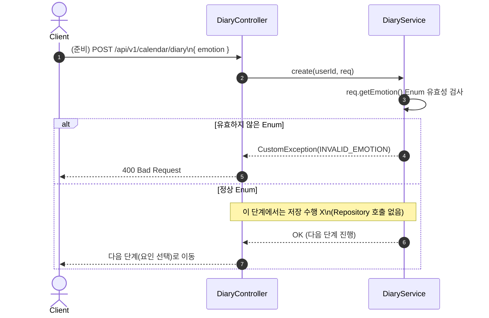
```mermaid
sequenceDiagram
    autonumber
    actor Client as Client
    participant DC as DiaryController
    participant DS as DiaryService

    Client->>DC: (준비) POST /api/v1/calendar/diary\n{ emotion }
    DC->>DS: create(userId, req)
    DS->>DS: req.getEmotion() Enum 유효성 검사

    alt 유효하지 않은 Enum
        DS-->>DC: CustomException(INVALID_EMOTION)
        DC-->>Client: 400 Bad Request
    else 정상 Enum
        note over DS,DC: 이 단계에서는 저장 수행 X\n(Repository 호출 없음)
        DS-->>DC: OK (다음 단계 진행)
        DC-->>Client: 다음 단계(요인 선택)로 이동
    end
```
사용자가 감정 일기를 작성하기 전에 자신의 감정을 선택하는 초기 단계이다.  
프론트엔드에서는 `Emotion Enum` 값 중 하나(`HAPPINESS`, `FUNNY`, `NEUTRAL`, `SURPRISING`, `ANGER`, `SADNESS`)를 선택하며,  
선택된 감정은 `DiaryCreateReqDto`의 `emotion` 필드로 전달되어 최종 `/api/v1/calendar/diary` 요청에 포함된다.  

이 단계에서 서버는 별도의 DB 저장을 수행하지 않으며,  
단지 선택된 감정 값이 **유효한 Enum 값인지 검증**하는 수준의 검증만 수행한다.  
실제 저장은 일기 작성 완료(`SD-4.4.4 일기 저장`) 단계에서 이루어진다.  

**흐름요약**  
1. **Client → DiaryController** : 감정 선택 값(`Emotion Enum`)을 포함한 `/api/v1/calendar/diary` 요청 준비  
2. **DiaryController → DiaryService** : `create(userId, req)` 호출  
3. **DiaryService** : `req.getEmotion()` 값 검증 (Enum 값 유효성 체크)  
4. **DiaryService** : `Diary.builder().emotion(req.getEmotion())` 로 객체 생성  
5. **DiaryRepository** : 저장 호출은 아직 발생하지 않음 (이 단계는 선택 로직만 담당)  
6. **정상 감정 Enum** : 다음 단계(요인 선택 단계)로 이동  
7. **유효하지 않은 Enum 값** : `CustomException(ErrorCode.INVALID_EMOTION)` 발생  

<br>

### SD-4.4.2 요인 선택 단계  

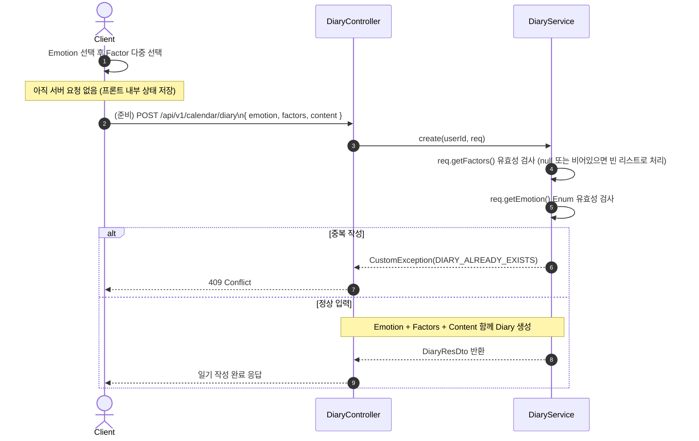
```mermaid
sequenceDiagram
    autonumber
    actor Client as Client
    participant DC as DiaryController
    participant DS as DiaryService

    Client->>Client: Emotion 선택 후 Factor 다중 선택
    note over Client: 아직 서버 요청 없음 (프론트 내부 상태 저장)

    Client->>DC: (준비) POST /api/v1/calendar/diary\n{ emotion, factors, content }
    DC->>DS: create(userId, req)
    DS->>DS: req.getFactors() 유효성 검사 (null 또는 비어있으면 빈 리스트로 처리)
    DS->>DS: req.getEmotion() Enum 유효성 검사

    alt 중복 작성
        DS-->>DC: CustomException(DIARY_ALREADY_EXISTS)
        DC-->>Client: 409 Conflict
    else 정상 입력
        note over DS,DC: Emotion + Factors + Content 함께 Diary 생성
        DS-->>DC: DiaryResDto 반환
        DC-->>Client: 일기 작성 완료 응답
    end
```
사용자가 감정 선택 이후, 그 감정의 **원인(Factor)** 을 선택하는 단계이다.  
이 단계는 **프론트엔드에서만 일어나는 중간 입력 과정**이며, 서버로는 아직 요청이 전송되지 않는다.  
선택된 요인은 `DiaryCreateReqDto`의 `factors` 필드(`List<Factor>`)에 포함되어  
최종 `/api/v1/calendar/diary` 요청 시 함께 전달된다.  

`DiaryService.create()` 내부에서는 `safeFactors()` 메서드를 통해  
`null` 또는 비어 있는 리스트를 안전하게 처리하고,  
감정(`emotion`), 요인(`factors`), 메모(`content`)를 함께 받아 `Diary` 및 `Star`를 생성한다.  
요인 선택만으로는 DB 저장이 이루어지지 않는다.  

**흐름요약**  
1. **Client** : 감정 선택 후, 여러 요인(`Factor`)을 선택 (아직 서버 요청 없음)  
2. **Client → DiaryController** : `/api/v1/calendar/diary` 요청 준비 (`emotion + factors + content` 포함)  
3. **DiaryController → DiaryService** : `create(userId, req)` 호출  
4. **DiaryService** : `req.getFactors()` → `safeFactors()` 로 변환 (`null` 방지)  
5. **DiaryService** : `req.getEmotion()` Enum 유효성 검증  
6. **정상 입력 시** : Emotion + Factors + Content 기반 `Diary` 및 `Star` 생성  
7. **중복 작성 시** : `CustomException(ErrorCode.DIARY_ALREADY_EXISTS)` 발생  
8. **요인 선택 단계 자체에서는 DB 저장 없음**  

<br>

### SD-4.4.3 메모 입력 단계  
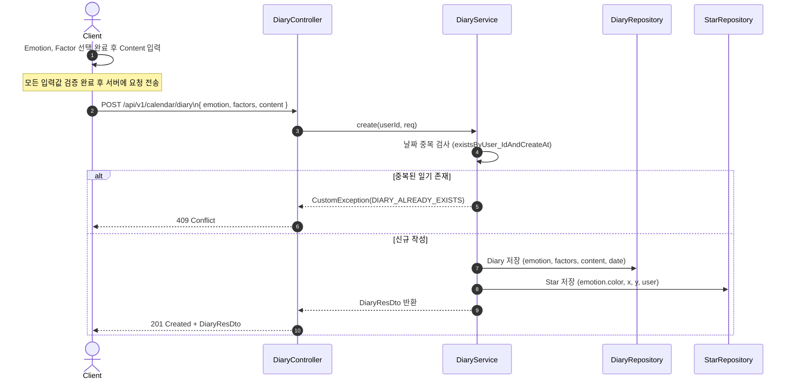
```mermaid
sequenceDiagram
    autonumber
    actor Client as Client
    participant DC as DiaryController
    participant DS as DiaryService
    participant DR as DiaryRepository
    participant SR as StarRepository

    Client->>Client: Emotion, Factor 선택 완료 후 Content 입력
    note over Client: 모든 입력값 검증 완료 후 서버에 요청 전송

    Client->>DC: POST /api/v1/calendar/diary\n{ emotion, factors, content }
    DC->>DS: create(userId, req)
    DS->>DS: 날짜 중복 검사 (existsByUser_IdAndCreateAt)
    alt 중복된 일기 존재
        DS-->>DC: CustomException(DIARY_ALREADY_EXISTS)
        DC-->>Client: 409 Conflict
    else 신규 작성
        DS->>DR: Diary 저장 (emotion, factors, content, date)
        DS->>SR: Star 저장 (emotion.color, x, y, user)
        DS-->>DC: DiaryResDto 반환
        DC-->>Client: 201 Created + DiaryResDto
    end
```
사용자가 감정과 요인 선택을 완료한 뒤, **메모(content)** 를 작성하여 서버에 최종 요청을 전송하는 단계이다.  
이 시점에서 `/api/v1/calendar/diary` 요청이 실제로 발생하며, 서버는  
감정(`emotion`), 요인(`factors`), 메모(`content`)를 모두 포함한 `DiaryCreateReqDto`를 전달받는다.  

`DiaryService.create()` 내부에서는 동일 사용자·날짜의 일기가 이미 존재하는지  
`existsByUser_IdAndCreateAt()`으로 검사하고, 중복 시 `CustomException(ErrorCode.DIARY_ALREADY_EXISTS)`를 발생시킨다.  

정상 요청일 경우,  
- `DiaryRepository.save()` 를 통해 Diary가 저장되고,  
- 동시에 `StarRepository.save()` 를 통해 Emotion에 해당하는 색상의 별이 생성된다.  

결과로 `DiaryResDto`가 반환되어 클라이언트는 **작성 완료 화면**으로 이동한다.  

**흐름요약**  
1. **Client** : Emotion, Factor 선택 완료 후 Content 입력  
2. **Client → DiaryController** : `/api/v1/calendar/diary` 요청 (emotion + factors + content 포함)  
3. **DiaryController → DiaryService** : `create(userId, req)` 호출  
4. **DiaryService** : `existsByUser_IdAndCreateAt()` 중복 검사  
5. **중복 시** : `CustomException(ErrorCode.DIARY_ALREADY_EXISTS)` 발생 → 409 응답  
6. **정상 시** : `DiaryRepository.save()` 로 Diary 저장  
7. **StarRepository.save()** : Emotion 기반 Star 생성  
8. **Controller → Client** : `DiaryResDto` 반환 (201 Created)  

<br>

### SD-4.4.4 일기 저장 단계  

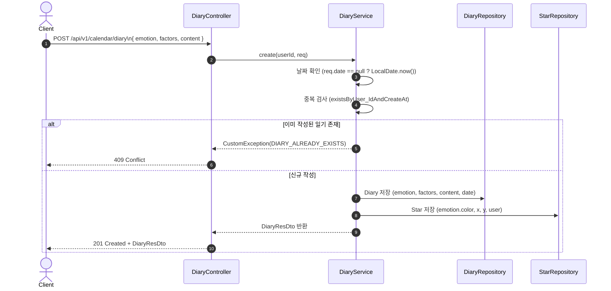
```mermaid
sequenceDiagram
    autonumber
    actor Client as Client
    participant DC as DiaryController
    participant DS as DiaryService
    participant DR as DiaryRepository
    participant SR as StarRepository

    Client->>DC: POST /api/v1/calendar/diary\n{ emotion, factors, content }
    DC->>DS: create(userId, req)
    DS->>DS: 날짜 확인 (req.date == null ? LocalDate.now())
    DS->>DS: 중복 검사 (existsByUser_IdAndCreateAt)
    alt 이미 작성된 일기 존재
        DS-->>DC: CustomException(DIARY_ALREADY_EXISTS)
        DC-->>Client: 409 Conflict
    else 신규 작성
        DS->>DR: Diary 저장 (emotion, factors, content, date)
        DS->>SR: Star 저장 (emotion.color, x, y, user)
        DS-->>DC: DiaryResDto 반환
        DC-->>Client: 201 Created + DiaryResDto
    end
```
이 단계는 사용자가 입력한 감정(`emotion`), 요인(`factors`), 메모(`content`)를 서버로 전송하고,  
서버에서 실제로 **Diary와 Star를 DB에 저장하는 핵심 단계**이다.  

요청은 `POST /api/v1/calendar/diary` 엔드포인트로 전달되며,  
`DiaryCreateReqDto`에는 감정, 요인, 메모, 날짜 정보가 포함된다.  
`DiaryService.create()`는 내부적으로 다음 과정을 수행한다.

1. 요청의 `date` 값이 없을 경우 `LocalDate.now()`로 자동 설정  
2. 동일 사용자·날짜의 일기 존재 여부를 `existsByUser_IdAndCreateAt()`로 검사  
3. 이미 존재한다면 `CustomException(ErrorCode.DIARY_ALREADY_EXISTS)` 발생  
4. 존재하지 않을 경우 `DiaryRepository.save()`로 Diary 저장  
5. 저장된 Diary를 기반으로 `StarRepository.save()` 호출 (Emotion 색상 기반 Star 생성)  
6. 최종적으로 `DiaryResDto`를 반환하여 작성 완료 응답 전송  

**흐름요약**  
1. **Client → DiaryController** : `/api/v1/calendar/diary` 요청 (`emotion`, `factors`, `content`, `date`)  
2. **DiaryController → DiaryService** : `create(userId, req)` 호출  
3. **DiaryService** : 날짜 기본값 설정 및 중복 검사  
4. **중복 존재 시** : `CustomException(ErrorCode.DIARY_ALREADY_EXISTS)` → 409 응답  
5. **정상 생성 시** : Diary 저장 → Star 생성  
6. **Controller → Client** : `DiaryResDto` 반환 (201 Created)  

<br>

### SD-4.4.5 일기 수정 단계  
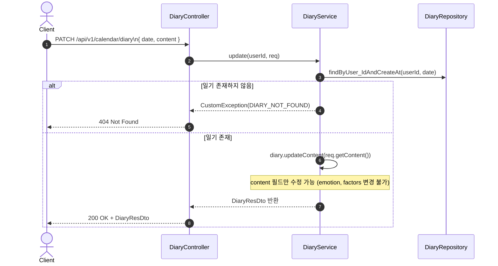
```mermaid
sequenceDiagram
autonumber
actor Client as Client
participant DC as DiaryController
participant DS as DiaryService
participant DR as DiaryRepository

Client->>DC: PATCH /api/v1/calendar/diary\n{ date, content }
DC->>DS: update(userId, req)
DS->>DR: findByUser_IdAndCreateAt(userId, date)
alt 일기 존재하지 않음
    DS-->>DC: CustomException(DIARY_NOT_FOUND)
    DC-->>Client: 404 Not Found
else 일기 존재
    DS->>DS: diary.updateContent(req.getContent())
    note over DS: content 필드만 수정 가능 (emotion, factors 변경 불가)
    DS-->>DC: DiaryResDto 반환
    DC-->>Client: 200 OK + DiaryResDto
end
```
이 단계는 이미 작성된 감정 일기를 **수정**하는 단계이다.  
수정 가능한 항목은 `content`(메모)이며, 감정(`emotion`)과 요인(`factors`)은 변경되지 않는다.  
프론트엔드에서는 수정할 일기의 날짜와 새 내용을 포함한 요청을  
`PATCH /api/v1/calendar/diary` 로 전송한다.  

`DiaryService.update()` 내부에서는  
1. `findByUser_IdAndCreateAt(userId, date)` 로 해당 사용자의 일기를 조회하고  
2. 존재하지 않으면 `CustomException(ErrorCode.DIARY_NOT_FOUND)` 발생  
3. 존재할 경우 `diary.updateContent(req.getContent())` 호출로 내용 수정  
4. 수정된 Diary는 JPA dirty checking으로 자동 반영된다.  

**흐름요약**  
1. **Client → DiaryController** : `/api/v1/calendar/diary` PATCH 요청 (`date`, `content`)  
2. **DiaryController → DiaryService** : `update(userId, req)` 호출  
3. **DiaryService → DiaryRepository** : `findByUser_IdAndCreateAt()` 조회  
4. **일기 미존재 시** : `CustomException(ErrorCode.DIARY_NOT_FOUND)` → 404 응답  
5. **일기 존재 시** : `updateContent()` 수행  
6. **Controller → Client** : `DiaryResDto` 반환 (200 OK)  

<br>

### SD-4.4.6 일기 조회(특정 날짜)
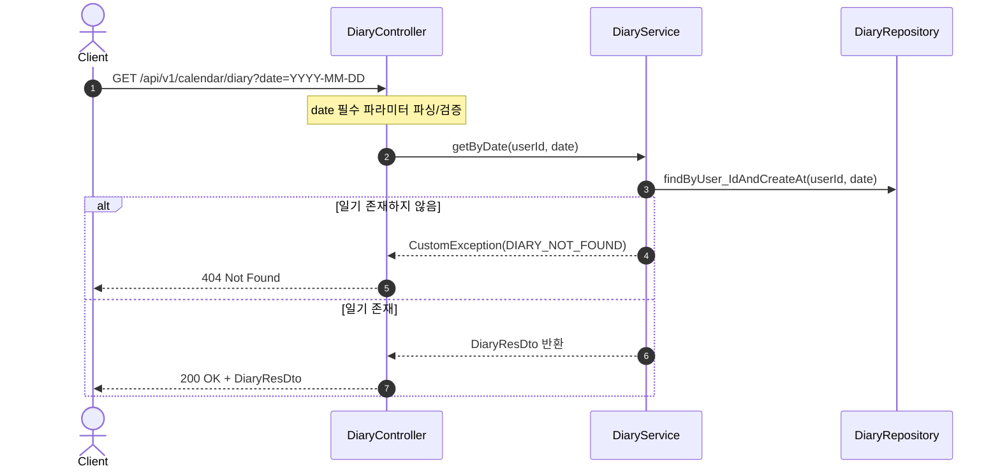
```mermaid
sequenceDiagram
autonumber
actor Client as Client
participant DC as DiaryController
participant DS as DiaryService
participant DR as DiaryRepository

Client->>DC: GET /api/v1/calendar/diary?date=YYYY-MM-DD
note over DC: date 필수 파라미터 파싱/검증

DC->>DS: getByDate(userId, date)
DS->>DR: findByUser_IdAndCreateAt(userId, date)
alt 일기 존재하지 않음
    DS-->>DC: CustomException(DIARY_NOT_FOUND)
    DC-->>Client: 404 Not Found
else 일기 존재
    DS-->>DC: DiaryResDto 반환
    DC-->>Client: 200 OK + DiaryResDto
end
```

사용자가 특정 날짜의 감정 일기를 **조회**하는 단계이다.  
클라이언트는 `date(YYYY-MM-DD)` 쿼리 파라미터를 포함해 `GET /api/v1/calendar/diary` 를 호출한다.  

서버 측 흐름은 다음과 같다.
- **Controller → Service** : `getByDate(userId, date)` 호출  
- **Service → Repository** : `findByUser_IdAndCreateAt(userId, date)` 조회  
- **미존재 시** : `CustomException(ErrorCode.DIARY_NOT_FOUND)` → 404 응답  
- **존재 시** : `DiaryResDto` 로 매핑하여 200 OK 응답  

**흐름요약**  
1. **Client → DiaryController** : `GET /api/v1/calendar/diary?date=YYYY-MM-DD`  
2. **DiaryController → DiaryService** : `getByDate(userId, date)`  
3. **DiaryService → DiaryRepository** : `findByUser_IdAndCreateAt(userId, date)`  
4. **일기 미존재 시** : `CustomException(DIARY_NOT_FOUND)` → 404  
5. **일기 존재 시** : `DiaryResDto` 반환 → 200 OK  

<br>

### SD-4.4.7 월별 별 조회 단계  

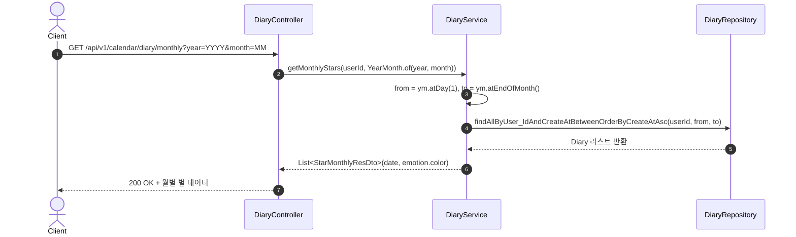
```mermaid
sequenceDiagram
    autonumber
    actor Client as Client
    participant DC as DiaryController
    participant DS as DiaryService
    participant DR as DiaryRepository

    Client->>DC: GET /api/v1/calendar/diary/monthly?year=YYYY&month=MM
    DC->>DS: getMonthlyStars(userId, YearMonth.of(year, month))
    DS->>DS: from = ym.atDay(1), to = ym.atEndOfMonth()
    DS->>DR: findAllByUser_IdAndCreateAtBetweenOrderByCreateAtAsc(userId, from, to)
    DR-->>DS: Diary 리스트 반환
    DS-->>DC: List<StarMonthlyResDto>(date, emotion.color)
    DC-->>Client: 200 OK + 월별 별 데이터
```

이 단계는 사용자가 특정 월의 **별(star)** 정보를 조회하는 과정이다.  
클라이언트는 연도와 월을 쿼리 파라미터로 전달하여  
`GET /api/v1/calendar/diary/monthly?year=YYYY&month=MM` 요청을 보낸다.  

`DiaryService.getMonthlyStars()`는  
1. `YearMonth` 객체를 생성하여 조회 범위를 계산 (`from = 1일`, `to = 말일`)  
2. `DiaryRepository.findAllByUser_IdAndCreateAtBetweenOrderByCreateAtAsc()` 호출로 해당 월 데이터 조회  
3. 각 Diary의 `emotion`을 기반으로 `color` 값을 추출해 `StarMonthlyResDto` 리스트로 변환한다.  

**흐름요약**  
1. **Client → DiaryController** : `/api/v1/calendar/diary/monthly?year&month` 요청  
2. **DiaryController → DiaryService** : `getMonthlyStars(userId, YearMonth ym)` 호출  
3. **DiaryService → DiaryRepository** : 월 범위(`from ~ to`) Diary 조회  
4. **Service 내부** : `emotion.color` 매핑 → `StarMonthlyResDto` 리스트 생성  
5. **Controller → Client** : 200 OK + 월별 별 정보 반환  

<br>

---

## SD-4.5 Star Sequence diagram

### SD-4.5.1 별 생성 (Diary 완료 시 자동 생성)

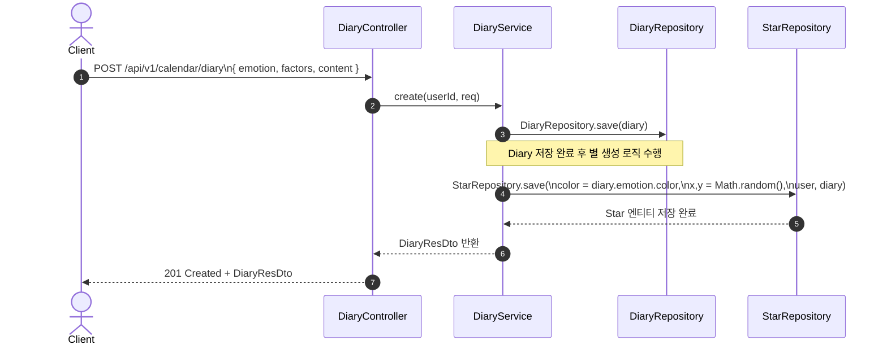
```mermaid
sequenceDiagram
autonumber
actor Client as Client
participant DC as DiaryController
participant DS as DiaryService
participant DR as DiaryRepository
participant SR as StarRepository

Client->>DC: POST /api/v1/calendar/diary\n{ emotion, factors, content }
DC->>DS: create(userId, req)
DS->>DR: DiaryRepository.save(diary)
note over DS,DR: Diary 저장 완료 후 별 생성 로직 수행
DS->>SR: StarRepository.save(\ncolor = diary.emotion.color,\nx,y = Math.random(),\nuser, diary)
SR-->>DS: Star 엔티티 저장 완료
DS-->>DC: DiaryResDto 반환
DC-->>Client: 201 Created + DiaryResDto


```
이 단계는 사용자가 일기를 작성 완료하면 **자동으로 Star 엔티티가 생성**되는 과정이다.  
별 생성 요청은 클라이언트에서 직접 일어나지 않고,  
`DiaryService.create()` 내부 로직을 통해 자동으로 실행된다.  

서버는 다음 과정을 거친다:
1. 일기(`Diary`)가 `DiaryRepository.save()`로 저장된다.  
2. 저장된 Diary의 감정(`Emotion`)을 기반으로 색상(`Color`) 결정.  
3. 무작위 좌표(`Math.random()`)를 생성하여 `Star` 빌더에 전달.  
4. `StarRepository.save()`로 Star 엔티티를 저장.  
5. 별과 일기가 연결(`@OneToOne`)되며, 결과로 `DiaryResDto` 반환.  

**흐름요약**  
1. **Client → DiaryController** : `/api/v1/calendar/diary` POST 요청 (emotion, factors, content)  
2. **DiaryController → DiaryService** : `create(userId, req)`  
3. **DiaryService → DiaryRepository** : `Diary` 저장  
4. **DiaryService → StarRepository** : `Star` 자동 생성 및 저장  
5. **DiaryService → DiaryController** : `DiaryResDto` 반환  
6. **Controller → Client** : 201 Created + Diary 정보 반환  

<br>

### SD-4.5.2 별 상세 조회  
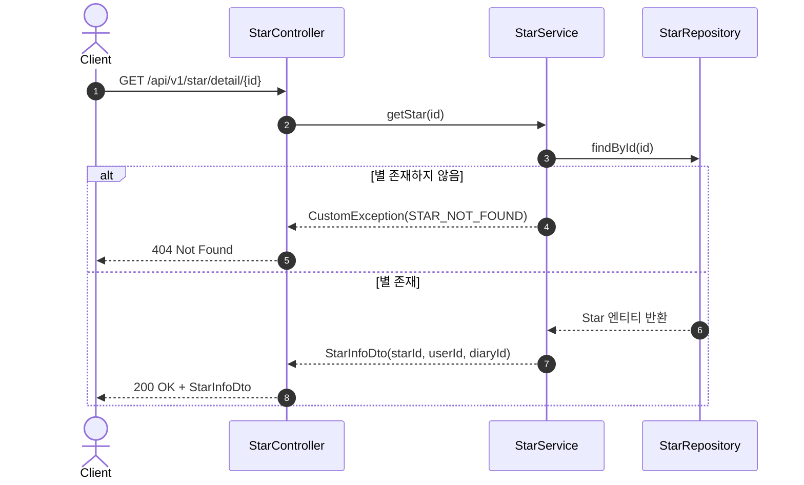
```mermaid
sequenceDiagram
autonumber
actor Client as Client
participant SC as StarController
participant SS as StarService
participant SR as StarRepository

Client->>SC: GET /api/v1/star/detail/{id}
SC->>SS: getStar(id)
SS->>SR: findById(id)
alt 별 존재하지 않음
    SS-->>SC: CustomException(STAR_NOT_FOUND)
    SC-->>Client: 404 Not Found
else 별 존재
    SR-->>SS: Star 엔티티 반환
    SS-->>SC: StarInfoDto(starId, userId, diaryId)
    SC-->>Client: 200 OK + StarInfoDto
end


```
이 단계는 사용자가 특정 별을 클릭했을 때,  
해당 별의 **기본 정보(별 ID, 사용자 ID, 일기 ID)** 를 조회하는 단계이다.  

요청은 `GET /api/v1/star/detail/{id}` 이며,  
컨트롤러는 `StarService.getStar(id)` 를 호출해 Star 엔티티를 조회한다.  
`StarRepository.findById()` 결과가 없으면 `CustomException(ErrorCode.STAR_NOT_FOUND)` 가 발생한다.  

서버 처리 흐름은 다음과 같다.
1. `StarController.getStar()` → `StarService.getStar(id)` 호출  
2. `StarRepository.findById(id)` 로 Star 검색  
3. 존재하지 않으면 404 반환  
4. 존재하면 `StarInfoDto` 로 변환하여 응답  

**흐름요약**  
1. **Client → StarController** : `GET /api/v1/star/detail/{id}` 요청  
2. **StarController → StarService** : `getStar(id)` 호출  
3. **StarService → StarRepository** : `findById(id)`  
4. **미존재 시** : `CustomException(STAR_NOT_FOUND)` → 404 응답  
5. **존재 시** : `StarInfoDto` 생성 후 200 OK 응답  

<br>

### SD-4.5.3 날짜별 별 리스트 조회  
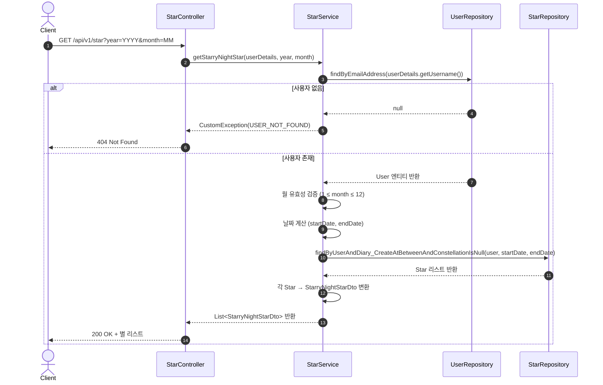
```mermaid
sequenceDiagram
autonumber
actor Client as Client
participant SC as StarController
participant SS as StarService
participant UR as UserRepository
participant SR as StarRepository

Client->>SC: GET /api/v1/star?year=YYYY&month=MM
SC->>SS: getStarryNightStar(userDetails, year, month)
SS->>UR: findByEmailAddress(userDetails.getUsername())
alt 사용자 없음
    UR-->>SS: null
    SS-->>SC: CustomException(USER_NOT_FOUND)
    SC-->>Client: 404 Not Found
else 사용자 존재
    UR-->>SS: User 엔티티 반환
    SS->>SS: 월 유효성 검증 (1 ≤ month ≤ 12)
    SS->>SS: 날짜 계산 (startDate, endDate)
    SS->>SR: findByUserAndDiary_CreateAtBetweenAndConstellationIsNull(user, startDate, endDate)
    SR-->>SS: Star 리스트 반환
    SS->>SS: 각 Star → StarryNightStarDto 변환
    SS-->>SC: List<StarryNightStarDto> 반환
    SC-->>Client: 200 OK + 별 리스트
end


```
이 단계는 **밤하늘 페이지** 진입 시 사용자의 별 데이터를 불러오는 단계이다.  
별자리에 속하지 않은 별들 중, 요청된 **2개월 범위 내의 별**을 조회한다.  

요청은 `GET /api/v1/star?year={YYYY}&month={MM}` 이며,  
StarController → StarService → StarRepository 순으로 처리된다.  

서버 흐름은 다음과 같다:
- 사용자 검증 (`UserRepository.findByEmailAddress()`)  
   - 존재하지 않으면 `USER_NOT_FOUND` 예외  
- 월(month) 유효성 검사 (`1 ≤ month ≤ 12`)  
   - 범위 초과 시 `DIARY_INVALID_MONTH` 발생  
- `startDate`, `endDate` 계산 (해당 월부터 2개월 범위)  
- `findByUserAndDiary_CreateAtBetweenAndConstellationIsNull()` 호출  
   - 별자리에 속하지 않은 Star만 조회  
- 결과를 `StarryNightStarDto` 리스트로 변환 후 반환  

**흐름요약**  
1. **Client → StarController** : `/api/v1/star?year&month` 요청  
2. **StarController → StarService** : `getStarryNightStar(userDetails, year, month)` 호출  
3. **StarService → UserRepository** : 사용자 검증  
4. **StarService → StarRepository** : 기간 내 별 조회 (별자리 소속 제외)  
5. **Service 내부** : Star → StarryNightStarDto 변환  
6. **Controller → Client** : 200 OK + 별 리스트 응답  

<br>

### SD-4.5.4 별 좌표 변경  

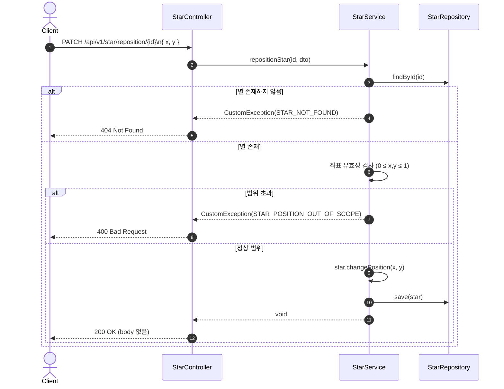
```mermaid
sequenceDiagram
autonumber
actor Client as Client
participant SC as StarController
participant SS as StarService
participant SR as StarRepository

Client->>SC: PATCH /api/v1/star/reposition/{id}\n{ x, y }
SC->>SS: repositionStar(id, dto)
SS->>SR: findById(id)
alt 별 존재하지 않음
    SS-->>SC: CustomException(STAR_NOT_FOUND)
    SC-->>Client: 404 Not Found
else 별 존재
    SS->>SS: 좌표 유효성 검사 (0 ≤ x,y ≤ 1)
    alt 범위 초과
        SS-->>SC: CustomException(STAR_POSITION_OUT_OF_SCOPE)
        SC-->>Client: 400 Bad Request
    else 정상 범위
        SS->>SS: star.changePosition(x, y)
        SS->>SR: save(star)
        SS-->>SC: void
        SC-->>Client: 200 OK (body 없음)
    end
end


```
이 단계는 밤하늘에서 사용자가 별을 **드래그하여 좌표를 변경**했을 때 호출되는 API의 흐름이다.  
요청은 `PATCH /api/v1/star/reposition/{id}` 이며,  
`StarPositionDto`에는 `x`, `y` 좌표값이 포함된다.  

서버의 처리 순서:  
1. `StarRepository.findById(id)` 로 별 존재 여부 확인  
   - 없으면 `STAR_NOT_FOUND` 예외  
2. 좌표 유효성 검사 (`0 ≤ x,y ≤ 1`)  
   - 벗어나면 `STAR_POSITION_OUT_OF_SCOPE` 예외  
3. 정상일 경우 `star.changePosition()` 호출  
4. 변경된 Star를 `save()`  
5. 반환은 `ResponseEntity.ok().build()` (본문 없음)  

**흐름요약**  
1. **Client → StarController** : `PATCH /api/v1/star/reposition/{id}` 요청 (`x`, `y`)  
2. **StarController → StarService** : `repositionStar(id, dto)` 호출  
3. **StarService → StarRepository** : `findById(id)` 로 별 조회  
4. **미존재 시** : `STAR_NOT_FOUND` → 404 응답  
5. **좌표 유효성 검사 실패 시** : `STAR_POSITION_OUT_OF_SCOPE` → 400 응답  
6. **정상 시** : `changePosition()` 후 `save()`  
7. **Controller → Client** : 200 OK + Body 없음  

<br>

---

## SD-4.6 Constellation Sequence diagram

### SD-4.6.1 밤하늘 진입  

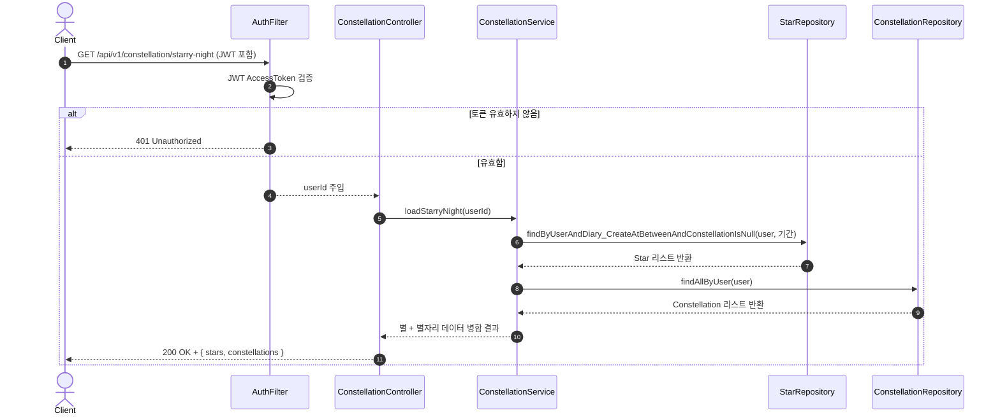
```mermaid
sequenceDiagram
    autonumber
    actor Client as Client
    participant AF as AuthFilter
    participant CC as ConstellationController
    participant CS as ConstellationService
    participant SR as StarRepository
    participant CR as ConstellationRepository

    Client->>AF: GET /api/v1/constellation/starry-night (JWT 포함)
    AF->>AF: JWT AccessToken 검증
    alt 토큰 유효하지 않음
        AF-->>Client: 401 Unauthorized
    else 유효함
        AF-->>CC: userId 주입
        CC->>CS: loadStarryNight(userId)
        CS->>SR: findByUserAndDiary_CreateAtBetweenAndConstellationIsNull(user, 기간)
        SR-->>CS: Star 리스트 반환
        CS->>CR: findAllByUser(user)
        CR-->>CS: Constellation 리스트 반환
        CS-->>CC: 별 + 별자리 데이터 병합 결과
        CC-->>Client: 200 OK + { stars, constellations }
    end
```

이 단계는 사용자가 **밤하늘 페이지에 진입**했을 때 수행되는 초기 데이터 로딩 과정이다.  
요청은 `GET /api/v1/constellation/starry-night` 이며,  
JWT 인증을 통해 사용자를 확인한 뒤, 해당 사용자의 **별 데이터와 별자리 데이터**를 함께 조회한다.  

서버의 처리 순서:  
1. `AuthFilter` 에서 JWT AccessToken 검증  
   - 유효하지 않으면 `401 Unauthorized` 반환  
   - 유효하면 `userId` 주입  
2. `ConstellationController.loadStarryNight(userId)` 호출  
3. `StarRepository.findByUserAndDiary_CreateAtBetweenAndConstellationIsNull()` 호출로 사용자의 별 데이터 조회  
4. `ConstellationRepository.findAllByUser(user)` 호출로 사용자의 별자리 목록 조회  
5. 결과 병합 후 Client로 반환  

**흐름요약**  
1. **Client → AuthFilter** : JWT 검증  
2. **AuthFilter → ConstellationController** : userId 주입  
3. **ConstellationController → ConstellationService** : `loadStarryNight(userId)` 호출  
4. **ConstellationService → StarRepository** : 사용자의 별 데이터 조회  
5. **ConstellationService → ConstellationRepository** : 별자리 목록 조회  
6. **Controller → Client** : 200 OK + `{ stars, constellations }` 반환  

<br>

### SD-4.6.2 별자리 생성 요청  

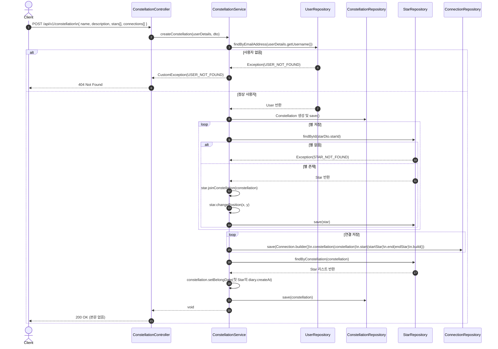
```mermaid
sequenceDiagram
    autonumber
    actor Client as Client
    participant CC as ConstellationController
    participant CS as ConstellationService
    participant UR as UserRepository
    participant CR as ConstellationRepository
    participant SR as StarRepository
    participant CN as ConnectionRepository

    Client->>CC: POST /api/v1/constellation\n{ name, description, stars[], connections[] }
    CC->>CS: createConstellation(userDetails, dto)

    CS->>UR: findByEmailAddress(userDetails.getUsername())
    alt 사용자 없음
        UR-->>CS: Exception(USER_NOT_FOUND)
        CS-->>CC: CustomException(USER_NOT_FOUND)
        CC-->>Client: 404 Not Found
    else 정상 사용자
        UR-->>CS: User 반환
        CS->>CR: Constellation 생성 및 save()
        loop 별 저장
            CS->>SR: findById(starDto.starId)
            alt 별 없음
                SR-->>CS: Exception(STAR_NOT_FOUND)
            else 별 존재
                SR-->>CS: Star 반환
                CS->>CS: star.joinConstellation(constellation)
                CS->>CS: star.changePosition(x, y)
                CS->>SR: save(star)
            end
        end

        loop 연결 저장
            CS->>CN: save(Connection.builder()\n.constellation(constellation)\n.start(startStar)\n.end(endStar)\n.build())
        end

        CS->>SR: findByConstellation(constellation)
        SR-->>CS: Star 리스트 반환
        CS->>CS: constellation.setBelongDate(첫 Star의 diary.createAt)
        CS->>CR: save(constellation)
        CS-->>CC: void
        CC-->>Client: 200 OK (본문 없음)
    end
```

이 단계는 사용자가 밤하늘에서 **7~14개의 별을 선택**하고,  
별자리 이름·설명과 함께 **새로운 Constellation을 생성**하는 과정이다.  
요청은 `POST /api/v1/constellation` 으로, `CreateConstellationDto`를 전달한다.  
(`name`, `description`, `stars`, `connections` 필드 포함)

서버의 처리 순서는 다음과 같다:  
- `UserRepository.findByEmailAddress()` 로 사용자 검증  
   - 없으면 `USER_NOT_FOUND` 예외  
- 새 `Constellation` 엔티티 생성 및 `save()`  
- `StarRepository.findById()` 로 각 별 검증 및 소속 설정 (`joinConstellation`)  
   - 이미 별자리에 속해 있다면 `ALREADY_BELONG_TO_CONSTELLATION` 예외  
   - 위치(`x`, `y`) 갱신 후 `save()`  
- `ConnectionRepository.save()` 로 선(Connection) 정보 저장  
- 별자리의 `belongDate` 설정 (`Star.diary.createAt`)  
- `ConstellationRepository.save()` 로 최종 반영  
- 응답은 `200 OK` (본문 없음)

**흐름요약**  
1. **Client → ConstellationController** : `POST /api/v1/constellation` 요청  
2. **Controller → Service** : `createConstellation(userDetails, dto)` 호출  
3. **Service → UserRepository** : 사용자 검증 (`USER_NOT_FOUND`)  
4. **Service → ConstellationRepository** : 새 별자리 생성  
5. **Service → StarRepository** : 별 존재 및 소속 검증 (`STAR_NOT_FOUND`, `ALREADY_BELONG_TO_CONSTELLATION`)  
6. **Service → ConnectionRepository** : 별 간 연결 저장  
7. **Service → ConstellationRepository** : `belongDate` 설정 후 저장  
8. **Controller → Client** : 200 OK 응답  

<br>

### SD-4.6.3 별자리 저장  

\```mermaid
sequenceDiagram
    autonumber
    actor Client as Client
    participant CC as ConstellationController
    participant CS as ConstellationService
    participant CR as ConstellationRepository
    participant SR as StarRepository

    Client->>CC: POST /api/v1/constellation\n{ name, description, stars[], connections[] }
    CC->>CS: createConstellation(userDetails, dto)
    CS->>CR: Constellation 저장
    CS->>SR: findByConstellation(constellation)
    SR-->>CS: Star 리스트 반환
    CS->>CS: constellation.setBelongDate(첫 Star의 diary.createAt)
    CS->>CR: save(constellation)
    CS-->>CC: void
    CC-->>Client: 200 OK (본문 없음)
\```

사용자가 새로 만든 별자리를 **DB에 저장**하는 단계이다.  
이 과정은 `createConstellation()` 내부의 마지막 부분으로,  
생성된 `Constellation` 객체에 **소속 날짜(`belongDate`)를 설정하고 최종 저장**하는 흐름이다.  
요청은 `POST /api/v1/constellation` 로 수행되며, `CreateConstellationDto` 의 데이터를 기반으로 한다.  

**서버 측 흐름은 다음과 같다.**  
- **Service → ConstellationRepository** : 생성된 `Constellation`을 임시 저장  
- **Service → StarRepository** : `findByConstellation(constellation)` 로 별 리스트 조회  
- **Service 내부** : 첫 번째 Star의 `diary.createAt` 값을 사용해 `belongDate` 설정  
- **Service → ConstellationRepository** : `save(constellation)` 으로 최종 반영  
- **Controller → Client** : 200 OK 응답 (본문 없음)  

**흐름요약**  
1. **Client → ConstellationController** : `POST /api/v1/constellation` 요청  
2. **Controller → Service** : `createConstellation(userDetails, dto)` 호출  
3. **Service → ConstellationRepository** : 새 별자리 임시 저장  
4. **Service → StarRepository** : 별 리스트 조회  
5. **Service 내부** : `belongDate` 설정  
6. **Service → ConstellationRepository** : 최종 저장  
7. **Controller → Client** : 200 OK 응답  

<br>

### SD-4.6.4 별자리 수정  

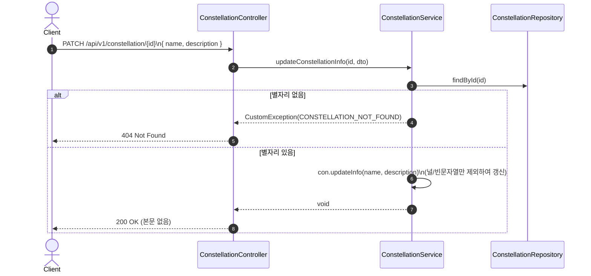
```mermaid
sequenceDiagram
    autonumber
    actor Client as Client
    participant CC as ConstellationController
    participant CS as ConstellationService
    participant CR as ConstellationRepository

    Client->>CC: PATCH /api/v1/constellation/{id}\n{ name, description }
    CC->>CS: updateConstellationInfo(id, dto)
    CS->>CR: findById(id)
    alt 별자리 없음
        CS-->>CC: CustomException(CONSTELLATION_NOT_FOUND)
        CC-->>Client: 404 Not Found
    else 별자리 있음
        CS->>CS: con.updateInfo(name, description)\n(널/빈문자열만 제외하여 갱신)
        CS-->>CC: void
        CC-->>Client: 200 OK (본문 없음)
    end
```

사용자가 **아카이브 화면에서 별자리의 이름과 설명을 수정**하는 단계이다.  
요청은 `PATCH /api/v1/constellation/{id}` 이며, `UpdateConstellationInfo { name, description }` 를 전달한다.  
서비스는 대상 별자리를 조회하고(`findById`), 없으면 `CustomException(CONSTELLATION_NOT_FOUND)` 를 던진다.  
있다면 `con.updateInfo(name, description)` 로 **널 또는 공백 문자열이 아닌 값만** 반영하고, 본문 없이 200 OK 를 반환한다.

서버 측 흐름은 다음과 같다:
- **Controller → Service** : `updateConstellationInfo(id, dto)` 호출  
- **Service → Repository** : `findById(id)` 조회  
- **미존재 시** : `CustomException(CONSTELLATION_NOT_FOUND)` → 404 응답  
- **존재 시** : `con.updateInfo(name, description)` (널/공백 제외 적용)  
- **Controller → Client** : 200 OK (본문 없음)  

**흐름요약**  
1. **Client → ConstellationController** : `PATCH /api/v1/constellation/{id}` (`name`, `description`)  
2. **ConstellationController → ConstellationService** : `updateConstellationInfo(id, dto)`  
3. **ConstellationService → ConstellationRepository** : `findById(id)`  
4. **미존재 시** : `CONSTELLATION_NOT_FOUND` → 404  
5. **존재 시** : `updateInfo(name, description)` 적용(널/공백 무시)  
6. **Controller → Client** : 200 OK (본문 없음)  

<br>

### SD-4.6.6 별자리 아카이브 목록 조회  

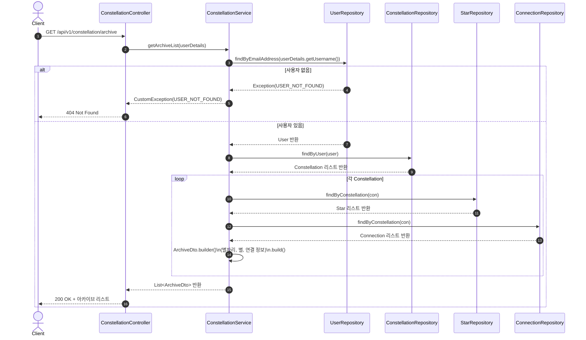
```mermaid
sequenceDiagram
    autonumber
    actor Client as Client
    participant CC as ConstellationController
    participant CS as ConstellationService
    participant UR as UserRepository
    participant CR as ConstellationRepository
    participant SR as StarRepository
    participant CN as ConnectionRepository

    Client->>CC: GET /api/v1/constellation/archive
    CC->>CS: getArchiveList(userDetails)

    CS->>UR: findByEmailAddress(userDetails.getUsername())
    alt 사용자 없음
        UR-->>CS: Exception(USER_NOT_FOUND)
        CS-->>CC: CustomException(USER_NOT_FOUND)
        CC-->>Client: 404 Not Found
    else 사용자 있음
        UR-->>CS: User 반환
        CS->>CR: findByUser(user)
        CR-->>CS: Constellation 리스트 반환

        loop 각 Constellation
            CS->>SR: findByConstellation(con)
            SR-->>CS: Star 리스트 반환
            CS->>CN: findByConstellation(con)
            CN-->>CS: Connection 리스트 반환
            CS->>CS: ArchiveDto.builder()\n(별자리, 별, 연결 정보)\n.build()
        end

        CS-->>CC: List<ArchiveDto> 반환
        CC-->>Client: 200 OK + 아카이브 리스트
    end
```

사용자가 자신의 **별자리 아카이브 목록을 조회**하는 단계이다.  
요청은 `GET /api/v1/constellation/archive` 로,  
로그인된 사용자의 모든 별자리(`Constellation`)와 해당 별(`Star`), 연결(`Connection`) 정보를 함께 반환한다.  
응답은 `List<ArchiveDto>` 형태로 구성되며, 페이징이나 정렬 기능은 현재 코드상 존재하지 않는다.  

서버 측 흐름은 다음과 같다:
- **Service → UserRepository** : 사용자 검증 (`USER_NOT_FOUND` 예외 가능)  
- **Service → ConstellationRepository** : 사용자의 모든 별자리 조회 (`findByUser(user)`)  
- **Service → StarRepository** : 각 별자리 내 별 목록 조회  
- **Service → ConnectionRepository** : 각 별자리 내 연결 목록 조회  
- **Service 내부** : `ArchiveDto.builder()` 로 별자리 요약 정보 생성  
- **Controller → Client** : `200 OK` + `List<ArchiveDto>` 응답  

**흐름요약**  
1. **Client → ConstellationController** : `GET /api/v1/constellation/archive` 요청  
2. **Controller → ConstellationService** : `getArchiveList(userDetails)` 호출  
3. **Service → UserRepository** : 사용자 검증 (`USER_NOT_FOUND`)  
4. **Service → ConstellationRepository** : 사용자별 별자리 전체 조회  
5. **Service → StarRepository / ConnectionRepository** : 각 별자리의 구성 정보 조회  
6. **Service 내부** : `ArchiveDto` 리스트 생성  
7. **Controller → Client** : 200 OK + `List<ArchiveDto>` 반환  

<br>

### SD-4.6.7 별자리 아카이브 상세 조회  

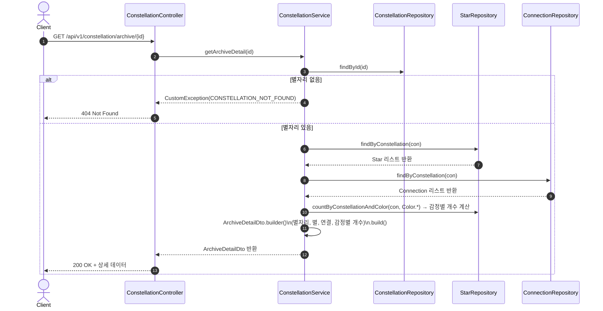
```mermaid
sequenceDiagram
    autonumber
    actor Client as Client
    participant CC as ConstellationController
    participant CS as ConstellationService
    participant CR as ConstellationRepository
    participant SR as StarRepository
    participant CN as ConnectionRepository

    Client->>CC: GET /api/v1/constellation/archive/{id}
    CC->>CS: getArchiveDetail(id)
    CS->>CR: findById(id)
    alt 별자리 없음
        CS-->>CC: CustomException(CONSTELLATION_NOT_FOUND)
        CC-->>Client: 404 Not Found
    else 별자리 있음
        CS->>SR: findByConstellation(con)
        SR-->>CS: Star 리스트 반환
        CS->>CN: findByConstellation(con)
        CN-->>CS: Connection 리스트 반환
        CS->>SR: countByConstellationAndColor(con, Color.*) → 감정별 개수 계산
        CS->>CS: ArchiveDetailDto.builder()\n(별자리, 별, 연결, 감정별 개수)\n.build()
        CS-->>CC: ArchiveDetailDto 반환
        CC-->>Client: 200 OK + 상세 데이터
    end
```

사용자가 **아카이브 목록에서 특정 별자리를 클릭했을 때**,  
해당 별자리의 세부 정보를 조회하는 단계이다.  
요청은 `GET /api/v1/constellation/archive/{id}` 이며,  
응답은 `ArchiveDetailDto` 로 반환되어 **별자리 기본정보, 연결 정보, 감정별 별 개수** 등을 포함한다.  

서버 측 흐름은 다음과 같다:
- **Controller → Service** : `getArchiveDetail(id)` 호출  
- **Service → ConstellationRepository** : `findById(id)` 로 별자리 조회  
- **미존재 시** : `CustomException(CONSTELLATION_NOT_FOUND)` → 404 응답  
- **Service → StarRepository** : `findByConstellation(con)` 으로 별 리스트 조회  
- **Service → ConnectionRepository** : `findByConstellation(con)` 으로 연결 리스트 조회  
- **Service → StarRepository** : `countByConstellationAndColor()` 로 감정별 별 개수 계산  
- **Service 내부** : `ArchiveDetailDto` 생성 및 빌드  
- **Controller → Client** : 200 OK + `ArchiveDetailDto` 반환  

**흐름요약**  
1. **Client → ConstellationController** : `GET /api/v1/constellation/archive/{id}` 요청  
2. **Controller → ConstellationService** : `getArchiveDetail(id)` 호출  
3. **Service → ConstellationRepository** : `findById(id)` 조회  
4. **미존재 시** : `CONSTELLATION_NOT_FOUND` → 404  
5. **존재 시** : `StarRepository` & `ConnectionRepository` 로 관련 데이터 조회  
6. **Service 내부** : `countByConstellationAndColor()` 로 감정별 통계 계산  
7. **Controller → Client** : 200 OK + `ArchiveDetailDto` 응답  

<br>

### SD-4.6.8 대표 별자리 설정  

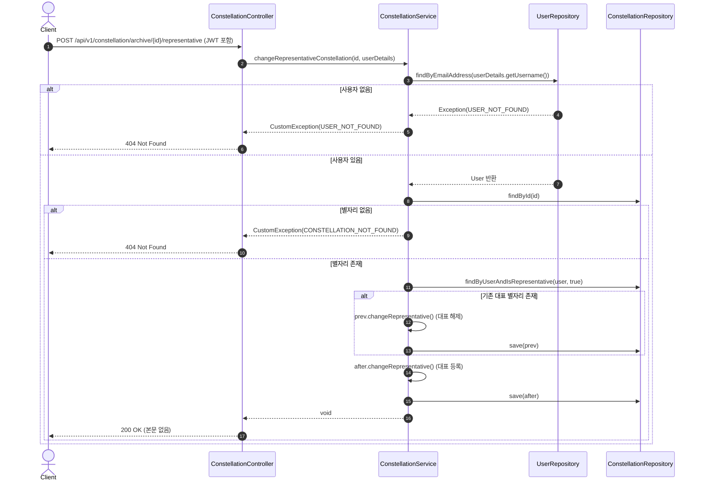
```mermaid
sequenceDiagram
    autonumber
    actor Client as Client
    participant CC as ConstellationController
    participant CS as ConstellationService
    participant UR as UserRepository
    participant CR as ConstellationRepository

    Client->>CC: POST /api/v1/constellation/archive/{id}/representative (JWT 포함)
    CC->>CS: changeRepresentativeConstellation(id, userDetails)
    CS->>UR: findByEmailAddress(userDetails.getUsername())
    alt 사용자 없음
        UR-->>CS: Exception(USER_NOT_FOUND)
        CS-->>CC: CustomException(USER_NOT_FOUND)
        CC-->>Client: 404 Not Found
    else 사용자 있음
        UR-->>CS: User 반환
        CS->>CR: findById(id)
        alt 별자리 없음
            CS-->>CC: CustomException(CONSTELLATION_NOT_FOUND)
            CC-->>Client: 404 Not Found
        else 별자리 존재
            CS->>CR: findByUserAndIsRepresentative(user, true)
            alt 기존 대표 별자리 존재
                CS->>CS: prev.changeRepresentative() (대표 해제)
                CS->>CR: save(prev)
            end
            CS->>CS: after.changeRepresentative() (대표 등록)
            CS->>CR: save(after)
            CS-->>CC: void
            CC-->>Client: 200 OK (본문 없음)
        end
    end
```

사용자가 **특정 별자리를 대표로 지정하거나 해제**하는 단계이다.  
요청은 `POST /api/v1/constellation/archive/{id}/representative` 이며,  
이미 대표 별자리가 존재하는 경우 해당 별자리의 대표 플래그를 해제하고  
새로운 별자리를 대표로 설정한다.  

서버 측 흐름은 다음과 같다:  
- Controller → Service : `changeRepresentativeConstellation(id, userDetails)` 호출  
- Service → UserRepository : `findByEmailAddress()` 로 사용자 조회  
- 사용자 미존재 시 : `CustomException(USER_NOT_FOUND)` → 404  
- Service → ConstellationRepository : `findById(id)` 로 대상 별자리 조회  
- 대상 미존재 시 : `CustomException(CONSTELLATION_NOT_FOUND)` → 404  
- Service → ConstellationRepository : `findByUserAndIsRepresentative(user, true)` 로 이전 대표 별자리 확인  
- 기존 대표 별자리 존재 시 : `prev.changeRepresentative()` → 대표 해제 후 저장  
- 새 별자리 : `after.changeRepresentative()` → 대표 설정 후 저장  
- Controller → Client : 200 OK (본문 없음)  

**흐름요약** 
1. Client → ConstellationController : `POST /api/v1/constellation/archive/{id}/representative` 요청  
2. Controller → ConstellationService : `changeRepresentativeConstellation(id, userDetails)` 호출  
3. Service → UserRepository : 사용자 검증 (`USER_NOT_FOUND`)  
4. Service → ConstellationRepository : 대상 별자리 조회 (`CONSTELLATION_NOT_FOUND`)  
5. Service → ConstellationRepository : 기존 대표 별자리 확인 (`findByUserAndIsRepresentative`)  
6. 기존 대표 존재 시 : `changeRepresentative()` → 대표 해제 후 저장  
7. 새 별자리 : 대표 설정 후 저장  
8. Controller → Client : 200 OK (본문 없음)  

<br>

### SD-4.6.9 별자리 위치 재배치  

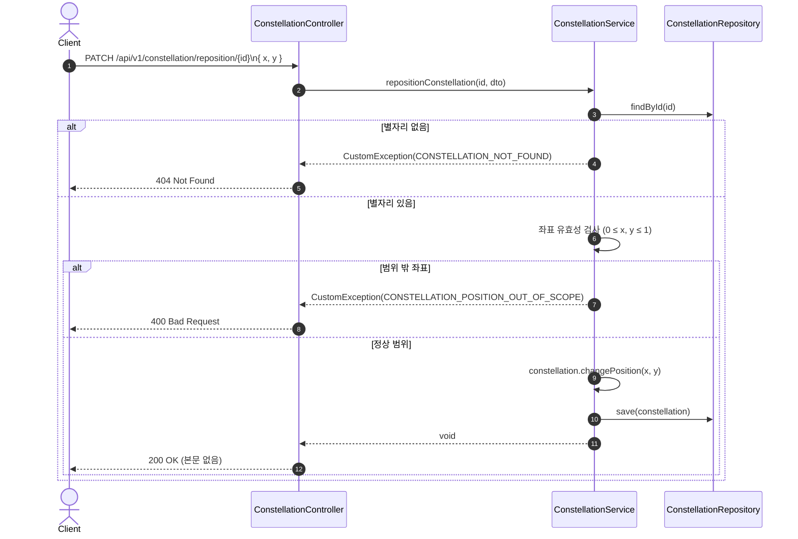
```mermaid
sequenceDiagram
    autonumber
    actor Client as Client
    participant CC as ConstellationController
    participant CS as ConstellationService
    participant CR as ConstellationRepository

    Client->>CC: PATCH /api/v1/constellation/reposition/{id}\n{ x, y }
    CC->>CS: repositionConstellation(id, dto)
    CS->>CR: findById(id)
    alt 별자리 없음
        CS-->>CC: CustomException(CONSTELLATION_NOT_FOUND)
        CC-->>Client: 404 Not Found
    else 별자리 있음
        CS->>CS: 좌표 유효성 검사 (0 ≤ x, y ≤ 1)
        alt 범위 밖 좌표
            CS-->>CC: CustomException(CONSTELLATION_POSITION_OUT_OF_SCOPE)
            CC-->>Client: 400 Bad Request
        else 정상 범위
            CS->>CS: constellation.changePosition(x, y)
            CS->>CR: save(constellation)
            CS-->>CC: void
            CC-->>Client: 200 OK (본문 없음)
        end
    end
```

사용자가 **밤하늘 화면에서 별자리를 드래그하여 이동**했을 때  
새로운 위치 좌표(`x`, `y`)를 서버에 갱신하는 단계이다.  
요청은 `PATCH /api/v1/constellation/reposition/{id}` 이며,  
요청 본문(`ConstellationPositionDto`)에는 `x`, `y` 값이 포함된다.  

서버 측 흐름은 다음과 같다:  
- Controller → Service : `repositionConstellation(id, dto)` 호출  
- Service → ConstellationRepository : `findById(id)` 로 별자리 존재 확인  
- 존재하지 않으면 : `CustomException(CONSTELLATION_NOT_FOUND)` → 404 응답  
- 좌표 범위 검증 (0 ≤ x, y ≤ 1)  
- 범위 밖 좌표일 경우 : `CustomException(CONSTELLATION_POSITION_OUT_OF_SCOPE)` → 400 응답  
- 정상 범위라면 : `constellation.changePosition(x, y)` 실행 후 저장  
- Controller → Client : 200 OK (본문 없음)  

**흐름요약**  
1. **Client → ConstellationController** : `PATCH /api/v1/constellation/reposition/{id}` (`x`, `y`)  
2. **ConstellationController → ConstellationService** : `repositionConstellation(id, dto)` 호출  
3. **ConstellationService → ConstellationRepository** : `findById(id)`  
4. **미존재 시** : `CONSTELLATION_NOT_FOUND` → 404  
5. **좌표 유효성 검사 실패 시** : `CONSTELLATION_POSITION_OUT_OF_SCOPE` → 400  
6. **정상 시** : `changePosition()` 후 `save()`  
7. **Controller → Client** : 200 OK (본문 없음)  

<br>

현재 코드상 Connection은 별자리(Consetellation) 흐름 안에서만 생성/조회되고, 별도 Controller/API는 없으니 “연결만 단독으로”는 시퀀스가 없고, 다음 두 지점에서만 등장한다. 
1. 별자리 생성 중 연결 저장
2. 조회 시 연결 포함 반환 <br>
해당 내용에 관련된 Connection 전용 서브 시퀀스 2개를 정리해서 C1, C2로 정리하였다.

### SD-4.6.C1 연결 저장 (별자리 생성 중)  

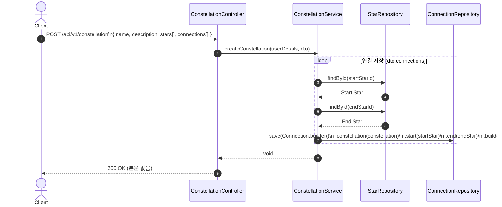
```mermaid
sequenceDiagram
    autonumber
    actor Client as Client
    participant CC as ConstellationController
    participant CS as ConstellationService
    participant SR as StarRepository
    participant CN as ConnectionRepository

    Client->>CC: POST /api/v1/constellation\n{ name, description, stars[], connections[] }
    CC->>CS: createConstellation(userDetails, dto)

    loop 연결 저장 (dto.connections)
        CS->>SR: findById(startStarId)
        SR-->>CS: Start Star
        CS->>SR: findById(endStarId)
        SR-->>CS: End Star
        CS->>CN: save(Connection.builder()\n  .constellation(constellation)\n  .start(startStar)\n  .end(endStar)\n  .build())
    end

    CS-->>CC: void
    CC-->>Client: 200 OK (본문 없음)
```

사용자가 별자리를 생성할 때, **선(연결)을 저장**하는 단계만 분리한 시퀀스다.  
각 `ConnectionDto(startStarId, endStarId)`에 대해 시작/종료 별을 조회하고,  
`connectionRepository.save()` 로 연결을 저장한다.

서버 측 흐름은 다음과 같다:  
- Controller → Service : `createConstellation(userDetails, dto)`  
- Service → StarRepository : `findById()` 로 시작/종료 별 조회  
- Service → ConnectionRepository : `save(Connection)` 호출  
- Controller → Client : 200 OK (본문 없음)

**흐름요약**  
1. Client → ConstellationController : `POST /api/v1/constellation`  
2. Controller → ConstellationService : `createConstellation(userDetails, dto)`  
3. Service → StarRepository : `findById(start)`, `findById(end)`  
4. Service → ConnectionRepository : `save()`  
5. Controller → Client : 200 OK (본문 없음)

<br>

### SD-4.6.C2 연결 조회 (밤하늘/아카이브/상세)  

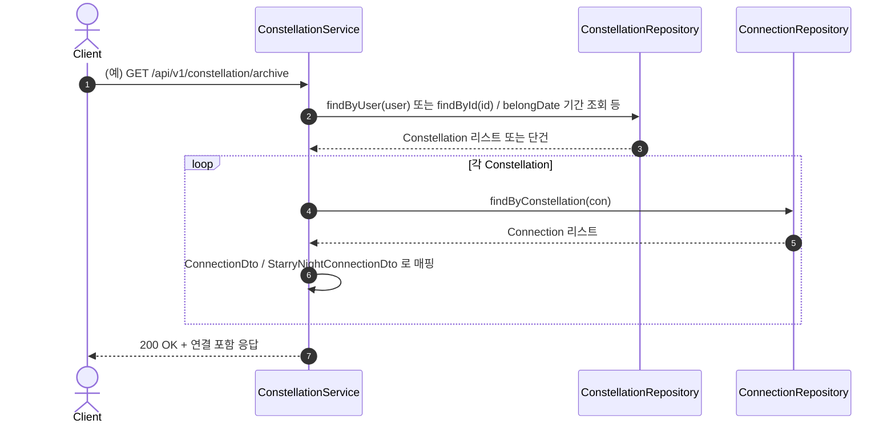
```mermaid
sequenceDiagram
    autonumber
    actor Client as Client
    participant CS as ConstellationService
    participant CR as ConstellationRepository
    participant CN as ConnectionRepository

    Client->>CS: (예) GET /api/v1/constellation/archive
    CS->>CR: findByUser(user) 또는 findById(id) / belongDate 기간 조회 등
    CR-->>CS: Constellation 리스트 또는 단건

    loop 각 Constellation
        CS->>CN: findByConstellation(con)
        CN-->>CS: Connection 리스트
        CS->>CS: ConnectionDto / StarryNightConnectionDto 로 매핑
    end

    CS-->>Client: 200 OK + 연결 포함 응답
```

**밤하늘/아카이브/상세 조회에서 연결을 함께 반환**하는 공통 패턴이다.  
`connectionRepository.findByConstellation(con)` 으로 선 목록을 가져오고,  
응답 DTO(`ConnectionDto` 또는 `StarryNightConnectionDto`)로 매핑한다.

서버 측 흐름은 다음과 같다:  
- Service → ConstellationRepository : 대상 별자리(들) 조회  
- Service → ConnectionRepository : `findByConstellation(con)` 로 연결 목록 조회  
- Service 내부 : DTO 매핑 (`ConnectionDto` / `StarryNightConnectionDto`)  
- Service → Client : 200 OK + 연결 포함 응답

**흐름요약**  
1. Client → ConstellationService : 별자리(들) 조회 요청  
2. Service → ConstellationRepository : 대상 별자리(들) 조회  
3. Service → ConnectionRepository : `findByConstellation(con)`  
4. Service 내부 : 연결 DTO 매핑  
5. Service → Client : 200 OK + 연결 포함 응답

<br>

---

## SD-4.7 S3 Sequence diagram

### SD-4.7.1 파일 업로드 Presigned URL 발급  

```mermaid
sequenceDiagram
    autonumber
    actor Client as Client
    participant SC as S3Controller
    participant UR as UserRepository
    participant SS as S3StorageService
    participant SP as S3Presigner

    Client->>SC: POST /api/v1/s3/image/tempUrl\n{ contentType }
    SC->>UR: findByEmailAddress(userDetails.getUsername())
    alt 사용자 없음
        UR-->>SC: empty
        SC-->>Client: 500 Internal Server Error\n(존재하지 않는 사용자)
    else 사용자 있음
        UR-->>SC: User(id)
        SC->>SC: key = "uploads/users/{userId}/{uuid}.png"
        SC->>SS: createUploadUrl(key, contentType)
        SS->>SS: contentType.startsWith("image/") 검증 (실패 시 IllegalArgumentException)
        SS->>SP: presignPutObject(bucket, key, contentType, 10분 유효)
        SP-->>SS: Presigned URL 반환
        SS-->>SC: URL 반환
        SC-->>Client: 200 OK + S3tempResDto{ presignedUrl, tempKey }
    end
```

이 단계는 사용자가 **이미지 업로드를 위해 S3 Presigned URL을 요청**하는 과정이다.  
요청은 `POST /api/v1/s3/image/tempUrl` 이며, `contentType`(예: `image/png`)을 전달한다.  
서버는 로그인 사용자의 `userId`로 업로드 경로(`uploads/users/{userId}/{uuid}.png`)를 생성하고,  
10분간 유효한 **S3 PUT Presigned URL**을 생성하여 응답한다.  

서버 측 흐름은 다음과 같다:  
- Controller → UserRepository : `findByEmailAddress()` 로 사용자 조회  
- Controller 내부 : 업로드 경로(`tempKey`) 생성  
- Controller → S3StorageService : `createUploadUrl(key, contentType)` 호출  
- Service 내부 : contentType 검증 (`image/` 로 시작하지 않으면 IllegalArgumentException 발생)  
- Service → S3Presigner : `presignPutObject` 실행 (10분 유효)  
- Service → Controller : URL 반환  
- Controller → Client : 200 OK + `S3tempResDto{ presignedUrl, tempKey }`  

**흐름요약**  
1. **Client → S3Controller** : `POST /api/v1/s3/image/tempUrl` 요청 (`contentType`)  
2. **S3Controller → UserRepository** : 사용자 조회  
3. **S3Controller 내부** : `tempKey` 생성 (`uploads/users/{userId}/{uuid}.png`)  
4. **S3Controller → S3StorageService** : `createUploadUrl(key, contentType)` 호출  
5. **S3StorageService → S3Presigner** : `presignPutObject`(10분 유효)  
6. **S3StorageService → S3Controller** : URL 반환  
7. **S3Controller → Client** : 200 OK + `presignedUrl`, `tempKey` 반환  

<br>

### SD-4.7.2 파일 업로드 완료 처리 (uploads → public 전환)

```mermaid
sequenceDiagram
    autonumber
    actor Client as Client
    participant UC as UserController (MyPage)
    participant UR as UserRepository
    participant SS as S3StorageService

    Client->>UC: POST /api/v1/mypage/profile-image/publish\n{ tempKey }
    UC->>UR: findByEmailAddress(userDetails.getUsername())
    alt 사용자 없음
        UR-->>UC: empty
        UC-->>Client: 404 Not Found (USER_NOT_FOUND)
    else 사용자 있음
        UR-->>UC: User(id)
        UC->>SS: publishProfile(user.id, tempKey)
        SS-->>UC: finalUrl (https://{bucket}.s3.{region}.amazonaws.com/public/users/{id}/profile.png)
        %% (선택) UC->>UR: 사용자 프로필 URL 저장 (필드 제공 시)
        UC-->>Client: 200 OK + S3uploadResDto{ imageUrl: finalUrl }
    end
```

이 단계는 사용자가 **업로드를 마친 임시 객체**를 **공개 경로로 승격**하는 과정이다.  
요청은 `POST /api/v1/mypage/profile-image/publish` 이고, 본문은 `{ tempKey }` 형식이다.  
서비스 레벨에서는 `S3StorageService.publishProfile(userId, tempKey)` 를 호출하여  
`uploads/users/{userId}/...` → `public/users/{userId}/profile.png` 로 복사하고 최종 URL을 반환한다.

서버 측 흐름은 다음과 같다:
- Controller → UserRepository : `findByEmailAddress()` 로 사용자 조회 (없으면 404)
- Controller → S3StorageService : `publishProfile(userId, tempKey)` 호출
- Service 내부 : tempKey Prefix 검증(`uploads/users/{userId}/`) 후 `copyObject`
- Service → Controller : 최종 공개 URL 반환
- Controller → Client : 200 OK + `S3uploadResDto{ imageUrl }`

**흐름요약**  
1. **Client → UserController** : `POST /api/v1/mypage/profile-image/publish` (`tempKey`)  
2. **UserController → UserRepository** : 사용자 조회 (`USER_NOT_FOUND` 시 404)  
3. **UserController → S3StorageService** : `publishProfile(userId, tempKey)`  
4. **S3StorageService 내부** : tempKey 검증 → `copyObject` 수행  
5. **UserController → Client** : 200 OK + `S3uploadResDto`(최종 URL)  

<br>

---

## SD-4.8 Mypage Sequence diagram

### SD-4.8.1 마이페이지 요약 조회 (업데이트: totalStars/totalConstellations 포함)

```mermaid
sequenceDiagram
    autonumber
    actor Client as Client
    participant AF as AuthFilter
    participant MPC as MyPageController
    participant MPS as MyPageService
    participant UR as UserRepository
    participant DR as DiaryRepository
    participant CR as ConstellationRepository

    Client->>AF: GET /api/v1/mypage/summary?year=YYYY&month=MM (JWT 포함, yearMonth 선택)
    AF->>AF: AccessToken 검증
    alt 토큰 유효하지 않음
        AF-->>Client: 401 Unauthorized
    else 유효함
        AF-->>MPC: userId 주입
        MPC->>MPS: getSummary(userId, yearMonth?)
        par 사용자 정보
            MPS->>UR: findById(userId)
            UR-->>MPS: User
        and 기간별 일기 조회 (별=일기 1:1)
            alt yearMonth 존재
                MPS->>DR: findAllByUser_IdAndCreateAtBetweenOrderByCreateAtAsc(userId, from, to)
            else 전체 기간
                MPS->>DR: findAllByUser_IdAndCreateAtBetweenOrderByCreateAtAsc(userId, MIN_DATE, NOW)
            end
            DR-->>MPS: Diary 리스트
            MPS->>MPS: totalStars = diaries.size()
            MPS->>MPS: Emotion 분포 집계(비율)
        and 전체 별자리 수
            MPS->>CR: findByUser(User)
            CR-->>MPS: Constellation 리스트
            MPS->>MPS: totalConstellations = constellations.size()
        and 대표 별자리
            MPS->>CR: findByUserAndIsRepresentative(user, true)
            CR-->>MPS: Optional<Constellation>
        end
        MPS-->>MPC: MyPageSummaryDto(user, stats{totalStars, emotionRatio, totalConstellations}, representative, scope)
        MPC-->>Client: 200 OK + MyPageSummaryDto
    end
```

이 단계는 사용자가 **마이페이지에 진입**할 때,  
사용자 정보 + 감정/별 통계 + **전체 별 개수(totalStars)** + **전체 별자리 수(totalConstellations)** + 대표 별자리를 **한 번에** 전달하는 요약 API 흐름이다.  

- **totalStars**: `Diary` 리스트 개수로 계산(도메인 규칙상 *1 Diary = 1 Star*).  
- **totalConstellations**: 사용자의 `Constellation` 리스트 개수로 계산.  
- `yearMonth`가 주어지면 해당 월 통계, 없으면 전체 기간 통계를 반환.  

서버 측 흐름은 다음과 같다:  
- Controller → Service : `getSummary(userId, yearMonth?)` 호출  
- Service → UserRepository : `findById(userId)`  
- Service → DiaryRepository : `findAllByUser_IdAndCreateAtBetweenOrderByCreateAtAsc(...)`  
- Service 내부 : `totalStars = diaries.size()`, Emotion 분포 계산  
- Service → ConstellationRepository : `findByUser(user)` → `totalConstellations = size()`  
- Service → ConstellationRepository : `findByUserAndIsRepresentative(user, true)`  
- Controller → Client : `MyPageSummaryDto` 반환 (200 OK)  

**흐름요약**  
1. **Client → AuthFilter** : JWT 검증  
2. **AuthFilter → MyPageController** : userId 주입  
3. **MyPageController → MyPageService** : `getSummary(userId, yearMonth?)`  
4. **MyPageService → UserRepository** : 사용자 조회  
5. **MyPageService → DiaryRepository** : 기간별 일기 조회 → **totalStars** 계산  
6. **MyPageService → ConstellationRepository** : 사용자 별자리 조회 → **totalConstellations** 계산  
7. **MyPageService → ConstellationRepository** : 대표 별자리 조회  
8. **MyPageController → Client** : 200 OK + MyPageSummaryDto

<br>


### SD-4.8.2 사용자 정보 조회  

```mermaid
sequenceDiagram
    autonumber
    actor Client as Client
    participant AF as AuthFilter
    participant UC as UserController
    participant US as UserService
    participant UR as UserRepository

    Client->>AF: GET /api/v1/users/me (JWT 포함)
    AF->>AF: AccessToken 검증
    alt 토큰 유효하지 않음
        AF-->>Client: 401 Unauthorized
    else 유효함
        AF-->>UC: userId 주입
        UC->>US: getUserProfile(userId)
        US->>UR: findById(userId)
        alt 사용자 없음
            UR-->>US: Optional.empty()
            US-->>UC: CustomException(USER_NOT_FOUND)
            UC-->>Client: 404 Not Found
        else 사용자 존재
            UR-->>US: User
            US-->>UC: UserProfileResponseDto(id, nickname, email, level, joinDate)
            UC-->>Client: 200 OK + UserProfileResponseDto
        end
    end
```

이 단계는 사용자가 **마이페이지 내 프로필 섹션**에서 자신의 정보를 조회할 때 실행되는 흐름이다.  
JWT AccessToken을 검증하여 인증된 사용자만 접근할 수 있으며,  
`UserRepository`를 통해 사용자 정보를 조회하고 `UserProfileResponseDto`로 응답한다.  

조회 대상에는 닉네임, 이메일, 가입일, 레벨(또는 점수 기반 등급)이 포함될 수 있다.  
존재하지 않는 사용자일 경우 `CustomException(USER_NOT_FOUND)`를 발생시켜 404 응답을 반환한다.  

서버 측 흐름은 다음과 같다:  
- Controller → Service : `getUserProfile(userId)` 호출  
- Service → Repository : `findById(userId)` 로 사용자 조회  
- 미존재 시 : `CustomException(USER_NOT_FOUND)` → 404  
- 존재 시 : `UserProfileResponseDto` 로 매핑 후 반환  
- Controller → Client : 200 OK + 프로필 정보  

**흐름요약**  
1. **Client → AuthFilter** : JWT 검증  
2. **AuthFilter → UserController** : userId 주입  
3. **UserController → UserService** : `getUserProfile(userId)` 호출  
4. **UserService → UserRepository** : 사용자 조회  
5. **미존재 시** : `CustomException(USER_NOT_FOUND)` → 404  
6. **존재 시** : `UserProfileResponseDto` 반환  
7. **UserController → Client** : 200 OK + 사용자 정보  

<br>

### SD-4.8.3 감정 통계 조회  

```mermaid
sequenceDiagram
    autonumber
    actor Client as Client
    participant AF as AuthFilter
    participant DC as DiaryController
    participant DS as DiaryService
    participant DR as DiaryRepository

    Client->>AF: GET /api/v1/calendar/diary/statistics?year=YYYY&month=MM (JWT 포함)
    AF->>AF: AccessToken 검증
    alt 토큰 유효하지 않음
        AF-->>Client: 401 Unauthorized
    else 유효함
        AF-->>DC: userId 주입
        DC->>DS: getEmotionStatistics(userId, year, month)
        DS->>DS: from = YearMonth.of(year, month).atDay(1)
        DS->>DS: to = from.atEndOfMonth()
        DS->>DR: findAllByUser_IdAndCreateAtBetweenOrderByCreateAtAsc(userId, from, to)
        DR-->>DS: Diary 리스트 반환
        DS->>DS: Emotion 그룹화 및 비율 계산
        DS-->>DC: EmotionStatisticDto(Map<Emotion, Double>)
        DC-->>Client: 200 OK + EmotionStatisticDto
    end
```

이 단계는 사용자가 **마이페이지 내 통계 섹션**에서 월별 감정 비율을 확인할 때 호출되는 API의 흐름이다.  
요청 시 연도(`year`)와 월(`month`)을 쿼리 파라미터로 전달하며,  
`DiaryRepository`에서 해당 기간의 모든 일기를 조회해 감정(`Emotion`) 필드를 기준으로 집계한다.  

감정별 카운트를 계산한 뒤 전체 일기 수로 나누어 비율을 산출하며,  
감정 데이터가 없는 경우 `0.0` 비율로 반환된다.  

서버 측 흐름은 다음과 같다:  
- Controller → Service : `getEmotionStatistics(userId, year, month)` 호출  
- Service 내부 : `YearMonth` 기반 날짜 계산 (from ~ to)  
- Service → Repository : `findAllByUser_IdAndCreateAtBetweenOrderByCreateAtAsc()` 호출  
- Service 내부 : Emotion 그룹화 및 비율 계산  
- Controller → Client : 200 OK + EmotionStatisticDto 반환  

**흐름요약**  
1. **Client → AuthFilter** : JWT 검증  
2. **AuthFilter → DiaryController** : userId 주입  
3. **DiaryController → DiaryService** : `getEmotionStatistics(userId, year, month)` 호출  
4. **DiaryService → DiaryRepository** : 해당 월의 일기 조회  
5. **DiaryService 내부** : Emotion 비율 계산  
6. **DiaryController → Client** : 200 OK + EmotionStatisticDto 반환  

<br>

### SD-4.8.4 대표 별자리 표시  

```mermaid
sequenceDiagram
    autonumber
    actor Client as Client
    participant AF as AuthFilter
    participant MPC as MyPageController
    participant MPS as MyPageService
    participant CR as ConstellationRepository

    Client->>AF: GET /api/v1/mypage/representative (JWT 포함)
    AF->>AF: AccessToken 검증
    alt 토큰 유효하지 않음
        AF-->>Client: 401 Unauthorized
    else 유효함
        AF-->>MPC: userId 주입
        MPC->>MPS: getRepresentativeConstellation(userId)
        MPS->>CR: findByUserAndIsRepresentative(user, true)
        alt 대표 별자리 없음
            CR-->>MPS: Optional.empty()
            MPS-->>MPC: 기본값(DefaultConstellationDto)
            MPC-->>Client: 200 OK + 기본값 (예: “대표 별자리가 없습니다.”)
        else 대표 별자리 존재
            CR-->>MPS: Constellation 반환
            MPS-->>MPC: RepresentativeConstellationDto(id, name, date)
            MPC-->>Client: 200 OK + RepresentativeConstellationDto
        end
    end
```

이 단계는 사용자가 **마이페이지 내 대표 별자리 영역**을 조회할 때 수행되는 흐름이다.  
JWT 인증 후 사용자를 식별하고,  
`ConstellationRepository.findByUserAndIsRepresentative(user, true)` 를 통해 대표 별자리를 조회한다.  
만약 설정된 대표 별자리가 없으면 “기본 문구 또는 기본 이미지”가 반환된다.  

서버 측 흐름은 다음과 같다:  
- Controller → Service : `getRepresentativeConstellation(userId)` 호출  
- Service → Repository : `findByUserAndIsRepresentative(user, true)` 실행  
- 대표 별자리 없을 시 기본 DTO 반환  
- 존재할 경우 `RepresentativeConstellationDto` 로 변환 후 반환  
- Controller → Client : 200 OK 응답  

**흐름요약**  
1. **Client → AuthFilter** : JWT 검증  
2. **AuthFilter → MyPageController** : userId 주입  
3. **MyPageController → MyPageService** : `getRepresentativeConstellation(userId)` 호출  
4. **MyPageService → ConstellationRepository** : 대표 별자리 조회  
5. **대표 없음** : 기본 DTO 반환  
6. **대표 존재 시** : 대표 별자리 정보 DTO 반환  
7. **MyPageController → Client** : 200 OK + 대표 별자리 정보  

<br>

### SD-4.8.5 연간 월별 별자리 수 조회  

```mermaid
sequenceDiagram
    autonumber
    actor Client as Client
    participant AF as AuthFilter
    participant MPC as MyPageController
    participant MPS as MyPageService
    participant UR as UserRepository
    participant CR as ConstellationRepository

    Client->>AF: GET /api/v1/mypage/statistics/constellations?year=YYYY (JWT 포함)
    AF->>AF: AccessToken 검증
    alt 토큰 유효하지 않음
        AF-->>Client: 401 Unauthorized
    else 유효함
        AF-->>MPC: userId 주입
        MPC->>MPS: getMonthlyConstellationCounts(userId, year)
        MPS->>UR: findById(userId)
        UR-->>MPS: User
        MPS->>MPS: from=LocalDate.of(year,1,1), to=LocalDate.of(year,12,31)
        MPS->>CR: findByUserAndBelongDateBetween(user, from, to)
        CR-->>MPS: Constellation 리스트
        MPS->>MPS: 월별 그룹화(1..12) 및 누락 월 0으로 채움
        MPS-->>MPC: List<MonthCountDto(month, count)>
        MPC-->>Client: 200 OK + [{month:1,count:n},...{month:12,count:m}]
    end
```

이 단계는 사용자의 **한 해(1~12월) 동안 생성된 별자리 수를 월별 시리즈**로 조회해  
마이페이지 라인차트에 사용하는 데이터 흐름이다. `belongDate`를 기준으로 집계한다.

서버 측 흐름은 다음과 같다:
- Controller → Service : `getMonthlyConstellationCounts(userId, year)` 호출  
- Service → UserRepository : `findById(userId)`  
- Service 내부 : `from=year-01-01`, `to=year-12-31` 계산  
- Service → ConstellationRepository : `findByUserAndBelongDateBetween(user, from, to)`  
- Service 내부 : 결과를 **월별 그룹화(1..12)**, 없는 월은 **0**으로 보정  
- Controller → Client : `[{month, count}]` 형태로 200 OK 반환  

**흐름요약**  
1. **Client → AuthFilter** : JWT 검증  
2. **AuthFilter → MyPageController** : userId 주입  
3. **MyPageController → MyPageService** : `getMonthlyConstellationCounts(userId, year)`  
4. **MyPageService → UserRepository** : 사용자 조회  
5. **MyPageService → ConstellationRepository** : 연간 범위 내 별자리 조회  
6. **MyPageService 내부** : 월별 그룹화 및 누락 월 0 채움  
7. **MyPageController → Client** : 200 OK + 월별 카운트 시리즈  

<br>

### SD-4.8.6 프로필 이미지 업로드 (임시 URL 발급)  

```mermaid
sequenceDiagram
    autonumber
    actor Client as Client
    participant AF as AuthFilter
    participant S3C as S3Controller
    participant S3S as S3StorageService
    participant UR as UserRepository

    Client->>AF: POST /api/v1/s3/image/tempUrl?contentType=image/png (JWT 포함)
    AF->>AF: AccessToken 검증
    alt 토큰 유효하지 않음
        AF-->>Client: 401 Unauthorized
    else 유효함
        AF-->>S3C: userId 주입
        S3C->>UR: findByEmailAddress(userDetails.username)
        UR-->>S3C: User(id)
        S3C->>S3S: createUploadUrl(key="uploads/users/{id}/{uuid}.png", contentType)
        S3S->>S3S: Presigned URL 생성 (10분 유효)
        S3S-->>S3C: URL 반환
        S3C-->>Client: 200 OK + {presignedUrl, tempKey}
    end
```

이 단계는 사용자가 **프로필 이미지를 업로드하기 전에**  
S3에 직접 업로드할 수 있는 **Presigned URL**을 발급받는 과정이다.  
JWT 인증 후 사용자 식별을 수행하고,  
`S3StorageService.createUploadUrl()`에서 AWS SDK의 `S3Presigner`로 10분 유효의 업로드 URL을 생성한다.

서버 측 흐름은 다음과 같다:
- Controller → UserRepository : 사용자 이메일로 조회 (`findByEmailAddress`)  
- Controller 내부 : key 생성 `"uploads/users/{userId}/{UUID}.png"`  
- Controller → Service : `createUploadUrl(key, contentType)`  
- Service 내부 : `S3Presigner.presignPutObject()` 호출로 URL 생성  
- Controller → Client : `{presignedUrl, tempKey}` 반환  

**흐름요약**  
1. **Client → AuthFilter** : JWT 검증  
2. **AuthFilter → S3Controller** : userId 주입  
3. **S3Controller → UserRepository** : 사용자 조회  
4. **S3Controller → S3StorageService** : `createUploadUrl(key, contentType)` 호출  
5. **S3StorageService 내부** : Presigned URL 생성  
6. **S3Controller → Client** : 200 OK + URL, tempKey 반환  

<br>

### SD-4.8.7 닉네임 중복 검사 (프로필 수정 시)  

```mermaid
sequenceDiagram
    autonumber
    actor Client as Client
    participant AF as AuthFilter
    participant UC as UserController
    participant US as UserService
    participant UR as UserRepository

    Client->>AF: GET /api/v1/users/check-nickname?nickname={nickname} (JWT 포함 가능)
    AF->>AF: AccessToken 검증 (필요 시)
    alt 토큰 유효하지 않음 (보호된 경우)
        AF-->>Client: 401 Unauthorized
    else 통과 또는 공개 엔드포인트
        AF-->>UC: (옵션) userId 주입
        UC->>US: checkNickname(nickname)
        US->>UR: 닉네임 존재 여부 조회
        alt 닉네임 존재
            UR-->>US: true
            US-->>UC: 중복(true)
            UC-->>Client: 409 Conflict (닉네임 중복)
        else 닉네임 미존재
            UR-->>US: false
            US-->>UC: 사용 가능(false)
            UC-->>Client: 200 OK (사용 가능)
        end
    end
```

사용자가 **마이페이지 프로필 편집**에서 닉네임 입력 후 **중복 여부를 확인**할 때 사용하는 기존 API 흐름이다.  
컨트롤러는 `UserService.checkNickname(nickname)`을 호출하고, 서비스는 `UserRepository`를 통해 **닉네임 존재 여부**를 조회한다.  
중복이면 `409 Conflict`, 사용 가능하면 `200 OK` 를 반환한다.

서버 측 흐름은 다음과 같다:  
- Controller → Service : `checkNickname(nickname)` 호출  
- Service → Repository : 닉네임 존재 여부 조회  
- 중복 시 : 409 Conflict 반환  
- 사용 가능 시 : 200 OK 반환  

**흐름요약**  
1. **Client → AuthFilter** : (필요 시) JWT 검증  
2. **AuthFilter → UserController** : (옵션) userId 주입  
3. **UserController → UserService** : `checkNickname(nickname)`  
4. **UserService → UserRepository** : 닉네임 존재 여부 조회  
5. **중복일 때** : 409 Conflict  
6. **사용 가능일 때** : 200 OK  

<br>

### SD-4.8.8 프로필 저장 (닉네임 + 이미지 확정)  

```mermaid
sequenceDiagram
    autonumber
    actor Client as Client
    participant AF as AuthFilter
    participant UC as UserController
    participant US as UserService
    participant UR as UserRepository
    participant S3S as S3StorageService

    Client->>AF: PATCH /api/v1/users/profile\n{ nickname, tempKey } (JWT 포함)
    AF->>AF: AccessToken 검증
    alt 토큰 유효하지 않음
        AF-->>Client: 401 Unauthorized
    else 유효함
        AF-->>UC: userId 주입
        UC->>US: updateProfile(userId, nickname, tempKey)
        US->>UR: findById(userId)
        UR-->>US: User 엔티티 반환
        alt tempKey 존재
            US->>S3S: publishProfile(userId, tempKey)
            S3S->>S3S: tempKey 검증 ("uploads/users/{userId}/" prefix)
            S3S->>S3S: S3 copyObject(tempKey → public/users/{userId}/profile.png)
            S3S-->>US: public 이미지 URL 반환
            US->>UR: 프로필 이미지 URL 및 닉네임 수정
            UR-->>US: 저장 완료
        else tempKey 없음 (닉네임만 수정)
            US->>UR: 닉네임만 수정
            UR-->>US: 저장 완료
        end
        US-->>UC: 업데이트 완료 응답
        UC-->>Client: 200 OK + UserProfileResDto
    end
```

이 단계는 사용자가 **마이페이지에서 닉네임 및 프로필 이미지를 수정 후 저장**할 때 수행되는 흐름이다.  
JWT 인증을 통과하면, 서버는 `nickname`과 `tempKey`를 받아  
`S3StorageService.publishProfile()`로 이미지를 확정 저장하고,  
`UserRepository`를 통해 사용자 엔티티를 갱신한다.

서버 측 흐름은 다음과 같다:  
- Controller → Service : `updateProfile(userId, nickname, tempKey)` 호출  
- Service → UserRepository : `findById(userId)`  
- Service 내부 :  
  - tempKey 존재 시 → `S3StorageService.publishProfile()` 실행 (S3 객체 복사 및 URL 반환)  
  - tempKey 미존재 시 → 닉네임만 업데이트  
- Service → Repository : 엔티티 갱신  
- Controller → Client : 200 OK + UserProfileResDto 반환  

**흐름요약**  
1. **Client → AuthFilter** : JWT 검증  
2. **AuthFilter → UserController** : userId 주입  
3. **UserController → UserService** : `updateProfile(userId, nickname, tempKey)`  
4. **UserService → UserRepository** : 사용자 조회  
5. **tempKey 존재 시** :  
   - `publishProfile()` 실행 → S3 객체 복사  
   - URL 반환 → User 엔티티 업데이트  
6. **tempKey 없음 시** : 닉네임만 수정  
7. **UserService → UserRepository** : 저장  
8. **UserController → Client** : 200 OK + UserProfileResDto  

<br>

