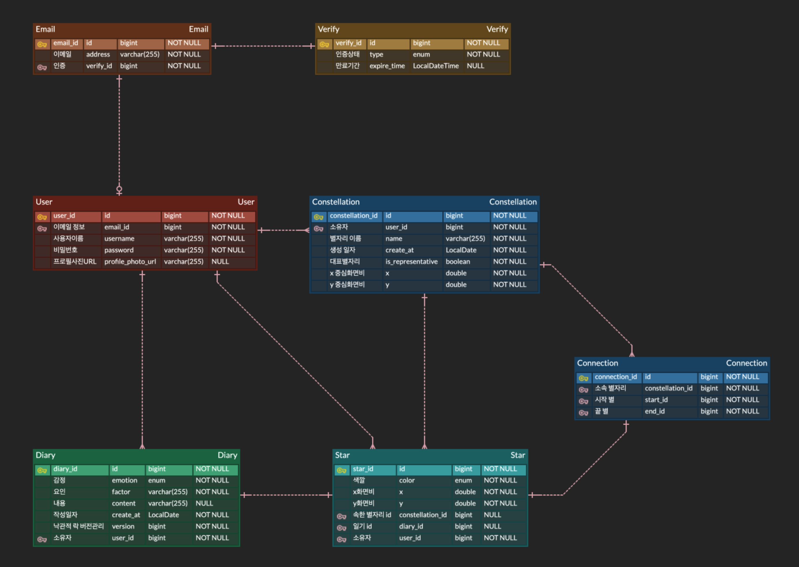

# Starlet_BE: 소프트웨어 설계 명세서 (SDS)

## Class Diagram (클래스 다이어그램)

이번 장은 Class diagram과 각각에 대한 설명을 기술한다.

본 프로젝트의 클래스 다이어그램은 '엔티티', '공통 모듈', '기능별' 관점으로 나누어 기술합니다.

### 3.1. 엔티티 클래스 다이어그램 (Entity Diagram)

프로젝트의 핵심 데이터 모델인 엔티티 간의 관계를 나타낸다.

### 3.2. 공통 단일 클래스 다이어그램 (Common Classes)

프로젝트 전반에서 사용되는 Enum, 공통 DTO, 유틸리티 클래스 등을 정의합니다.

- 열거형
- 예외처리

### 3.3. 공유 모듈 클래스 다이어그램 (Shared Modules)

여러 도메인(기능)에서 공통으로 의존하는 서비스 모듈입니다.

- security 패키지
- S3 패키지
- 예외처리 패키지

### 3.4. 기능별 클래스 다이어그램 (Functional Diagrams)

주요 도메인(기능)별로 Controller, Service, Repository, Command(DTO) 간의 관계를 상세히 기술합니다.

## 3.1 엔티티 클래스 다이어그램

3.4.1. 사용자 및 인증 (User & Auth)

주요 클래스:

UserController

UserService

UserRepository

EmailController

EmailService

VerifyService

SignUpDto, LoginDto, UserResDto

3.4.2. 일기 (Diary)

주요 클래스:

DiaryController

DiaryService

DiaryRepository

DiaryCreateReqDto, DiaryUpdateReqDto, DiaryResDto

3.4.3. 별 (Star)

주요 클래스:

StarController

StarService

StarRepository

StarPositionDto, StarInfoDto

3.4.4. 별자리 (Constellation & Connection)

주요 클래스:

ConstellationController

ConstellationService

ConstellationRepository

ConnectionRepository (연결은 별자리 도메인에 포함)

CreateConstellationDto, ConnectionDto

1. Sequence Diagram (시퀀스 다이어그램)

(이 섹션에서는 주요 유스케이스(2장)의 시나리오별 객체 상호작용을 다이어그램으로 기술합니다.)

4.1. 사용자 회원가입

(회원가입 시퀀스 다이어그램)

4.2. 일기 작성 및 별 생성

(일기 작성 시 DiaryController -> DiaryService -> DiaryRepository -> StarService -> StarRepository로 이어지는 흐름 기술)

5. State Machine Diagram (상태 머신 다이어그램)

(이 섹션에서는 상태 변화가 중요한 엔티티(예: User의 인증 상태, Verify의 VerifyType 상태 변화)를 다이어그램으로 기술합니다.)

5.1. 인증(Verify) 상태 변화

(VerifyType: EMAIL_VERIFICATION -> VERIFY -> REQUEST_PASSWORD_RESET -> CHANGING_PASSWORD -> VERIFY의 흐름)

6. User Interface Prototype (UI 프로토타입)

(백엔드 프로젝트이므로 이 섹션은 생략하거나, API 명세를 제공하는 Swagger UI 스크린샷으로 대체할 수 있습니다.)

본 프로젝트는 SwaggerConfig.java를 통해 API 명세를 자동으로 생성하며, API 테스트 및 프로토타이핑은 Swagger UI (http://localhost:8080/swagger-ui/index.html)를 통해 수행합니다.

7. Implementation Requirements (구현 요구사항)

7.1. H/W Platform Requirements (하드웨어)

(개발 및 배포 환경에 맞게 작성)

7.2. S/W Platform Requirements (소프트웨어)

OS: (개발 환경 OS)

Implement Language: Java 17

Framework: Spring Boot 3.x

Database: (application.yml을 참고하여 H2, MySQL, PostgreSQL 등 명시)

Build Tool: Gradle

Dependencies:

Spring Web

Spring Data JPA

Spring Security

JJWT (JWT 토큰)

Spring Mail (이메일 발송)

AWS SDK S3 (S3 파일 스토리지)

Validation

8. Glossary (용어 사전)

| 이름 | 설명 |
| Diary (일기) | 사용자의 감정(Emotion)과 요인(Factor)을 기록하는 데이터. |
| Star (별) | 일기(Diary) 1개가 생성될 때마다 매칭되어 생성되는 시각적 객체. |
| Constellation (별자리) | 사용자가 생성한 여러 개의 별(Star)들을 선(Connection)으로 연결한 집합. |
| Connection (연결) | 별과 별을 연결하는 선. |
| Verify (인증) | 사용자의 이메일 소유권이나 계정 상태를 관리하는 엔티티. |

9. References (참고 자료)

(프로젝트에 참고한 외부 자료나 문서를 링크합니다.)